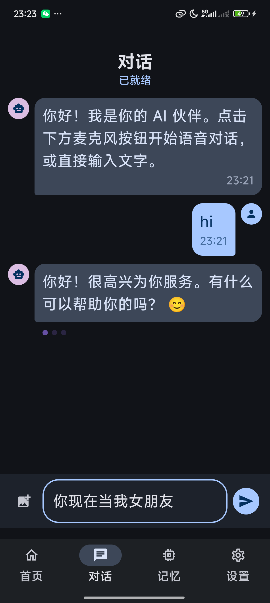

# Anime Companion

> **Make AI more than something that answers you. Make it remember you, grow with you, and truly accompany you.**


**Anime Companion** is a local, privacy-first, continuously evolving AI companion for Android. It is not another cloud-moderated chatbot. It is an attempt to build a real companion: one that remembers you, grows with you, and supports more expressive private interaction — all running on your own device.

This repository contains the complete Android application, including on-device LLM inference, voice interaction, memory systems, role cards, skill management, image generation, and a discover catalog.



---

## Why This Exists

Most AI products today break in the same places:

| Problem | How Anime Companion Addresses It |
|---|---|
| The model forgets who you are | Long-term memory with extraction, retrieval, and lifecycle management |
| Personality resets between sessions | Role card system defines persistent companion identity |
| Privacy-sensitive dialogue leaves the device | Fully local inference via LiteRT-LM or llama.cpp |
| Interaction shaped by platform moderation | User-controlled boundaries, local model flexibility |
| The assistant behaves like a tool | Companionship-first design with relationship growth |

This project explores a new product category: a **private, edge-native, relationship-oriented AI companion**.

---

## Core Features

### Dual Inference Backends

- **LiteRT-LM**: Google's on-device inference framework, `.litertlm` format
- **llama.cpp GGUF**: Native GGUF model support via JNI, CPU-only runtime
- Switchable at runtime from the settings screen

### Voice-First Interaction

- **Local ASR**: sherpa-onnx + SenseVoiceSmall int8, no Google dependency
- **Silero VAD**: On-device voice activity detection for natural speech segmentation
- **Voice Clone**: Local MOSS-TTS-Nano ONNX synthesis with system TTS fallback
- **Cloud ASR**: Optional HTTP backend for environments where local ASR is insufficient

### Memory & Preference Learning

- Extracts memories from user messages (facts, preferences, events, relationships)
- Short-term and long-term memory lifecycle with automatic promotion
- FTS-based memory retrieval before each generation
- Background preference extraction with confidence-based confirmation
- Confirmed preferences injected into the system prompt

### Role Cards & Skills

- **Role Cards**: Define who the companion is — persona, speaking style, background, boundaries
- **Skills**: Task-oriented behavior templates (built-in: Translator)
- One active role card + one active skill can work together
- Role cards include avatar images, galleries, image style prompts, voice mode, and voice references

### Image Generation

- **HTTP Provider**: Connect to any compatible image generation API
- **Local DreamLite**: Package checking and readiness validation
- **Local SD1.5 Hyper-SD**: On-device generation via stable-diffusion.cpp
- Role editor supports avatar images, galleries, and image style prompts

### Discover Catalog

- Browse and import pre-seeded companion characters
- Search by name, author, and tags
- Filter by content rating, sort by hot/new/name
- Favorite, unlock, inspect details, and import into your role library

### Context Management

- Automatic context compression for long conversations
- Summary injection + recent message replay
- Configurable context window size

---

## Tech Stack

| Layer | Technology |
|---|---|
| Language | Kotlin |
| UI | Jetpack Compose + Material 3 + Navigation Compose |
| Database | Room + KSP |
| Inference | LiteRT-LM Android, llama.cpp (JNI) |
| ASR | sherpa-onnx + SenseVoiceSmall int8 + Silero VAD |
| TTS | Android TextToSpeech, MOSS-TTS-Nano (ONNX) |
| Image Gen | stable-diffusion.cpp (JNI), HTTP API |
| Image Loading | Coil 3 |
| Native Build | CMake + Ninja |

---

## Project Structure

```text
app/
  src/main/
    java/com/companion/chat/
      companion/           # runtime orchestration, preference learning coordinator
      data/
        context/           # context window, prompt assembly, summary flow
        discover/          # discover role seeds, favorites, unlock state
        image/             # image generation config, provider routing, local engines
        local/             # Room database, DAOs, entities (conversations, messages,
                           #   memories, preferences, role_cards, skills)
        memory/            # memory extraction, retrieval, lifecycle management
        migration/         # JSON-to-Room data migration
        model/             # chat message model
        preferences/       # preference extraction, merge, prompt injection
        repository/        # chat session persistence
        role/              # role card repository and prompt builder
        skill/             # skill repository
        voice/             # ASR/TTS/voice clone config and fallback selection
      engine/              # inference engines (LiteRT-LM, llama.cpp), voice engines,
                           #   SherpaOnnx SenseVoice/VAD, MOSS TTS, audio utilities
      ui/
        chat/              # chat screen, ChatViewModel, message components
        home/              # discover catalog, role details, favorites
        memory/            # memory management UI
        navigation/        # app navigation graph
        settings/          # settings, role management, skills management, model config,
                           #   voice settings, dark mode, language, about
        theme/             # Material 3 color, typography, theme
    cpp/
      CMakeLists.txt       # native build for llama.cpp and stable-diffusion.cpp
      llama_jni.cpp        # llama.cpp JNI bridge
      stable_diffusion_jni.cpp  # stable-diffusion.cpp JNI bridge
    res/                   # Android resources
  libs/
    sherpa-onnx-1.13.0.aar  # sherpa-onnx AAR (not committed, see .gitignore)

third_party/
  llama.cpp/               # llama.cpp (pinned commit, submodule)
  stable-diffusion.cpp/    # stable-diffusion.cpp (submodule)
  DreamLite/               # DreamLite image model (submodule)
  MOSS-TTS-Nano-Reader/    # MOSS TTS reference code (submodule)
  Vulkan-Headers/          # Vulkan headers (submodule)
  SPIRV-Headers/           # SPIRV headers (submodule)

docs/
  plans/                   # design and implementation documents
  agents/                  # development workflow docs
```

---

## Getting Started

### Prerequisites

| Requirement | Version |
|---|---|
| JDK | 17 |
| Android SDK | compileSdk 35, minSdk 28 |
| Gradle | 8.7 (wrapper included) |
| ADB | Any recent version |
| Ninja | On PATH (Android SDK CMake includes one) |

### Build

```bash
# Clone with submodules
git clone --recurse-submodules https://github.com/Yrd980/gemma_hackthon.git
cd gemma_hackthon

# Place sherpa-onnx AAR
# Download sherpa-onnx-1.13.0.aar from https://github.com/k2-fsa/sherpa-onnx/releases
cp sherpa-onnx-1.13.0.aar app/libs/

# Build debug APK
./gradlew :app:assembleDebug
```

On Windows:

```powershell
.\gradlew.bat :app:assembleDebug
```

### Install

```bash
adb uninstall com.companion.chat 2>/dev/null
adb push app/build/outputs/apk/debug/app-debug.apk /data/local/tmp/companionchat.apk
adb shell pm install -r -t --user 0 /data/local/tmp/companionchat.apk

# Launch once to create app directories
adb shell am start -n com.companion.chat/.MainActivity
```

### Push Models

The repository does **not** include model files. You need to prepare and push them manually.

#### Text Model (LiteRT-LM)

```bash
adb push <path-to>/gemma-4-E2B-it.litertlm \
  /sdcard/Android/data/com.companion.chat/files/models/gemma-4-E2B-it.litertlm
```

#### Text Model (llama.cpp GGUF)

```bash
adb push <path-to>/Gemma-4-E2B-Uncensored-HauhauCS-Aggressive-Q4_K_P.gguf \
  /sdcard/Android/data/com.companion.chat/files/models/Gemma-4-E2B-Uncensored-HauhauCS-Aggressive-Q4_K_P.gguf

# Optional: multimodal projector
adb push <path-to>/mmproj-Gemma-4-E2B-Uncensored-HauhauCS-Aggressive-f16.gguf \
  /sdcard/Android/data/com.companion.chat/files/models/mmproj-Gemma-4-E2B-Uncensored-HauhauCS-Aggressive-f16.gguf
```

#### Local ASR (SenseVoice + Silero VAD)

```bash
adb shell mkdir -p /sdcard/Android/data/com.companion.chat/files/models/asr/sensevoice

adb push <path-to>/model.int8.onnx \
  /sdcard/Android/data/com.companion.chat/files/models/asr/sensevoice/model.int8.onnx
adb push <path-to>/tokens.txt \
  /sdcard/Android/data/com.companion.chat/files/models/asr/sensevoice/tokens.txt
adb push <path-to>/silero_vad.onnx \
  /sdcard/Android/data/com.companion.chat/files/models/asr/sensevoice/silero_vad.onnx
```

#### Voice Clone (MOSS-TTS-Nano, optional)

```bash
adb push <path-to>/moss-tts-nano/ \
  /sdcard/Android/data/com.companion.chat/files/models/tts/moss-tts-nano/
```

#### Local Image Generation (SD1.5 Hyper-SD, optional)

```bash
adb shell mkdir -p /sdcard/Android/data/com.companion.chat/files/models/image/sd15-hypersd
adb push <path-to>/sd15-hypersd/ \
  /sdcard/Android/data/com.companion.chat/files/models/image/sd15-hypersd/
```

### Verify

After pushing models, restart the app and check logs:

```bash
adb shell run-as com.companion.chat cat files/viewmodel_log.txt
```

You should see:

```
文件存在 = true
文件大小 = <correct size> bytes
engine.initialize 返回, state = Ready
```

---

## Runtime Requirements

### Minimum

- Android 9+ (API 28)
- ARM64 device
- 4 GB RAM (for LiteRT-LM with small models)
- Storage for model files (2-4 GB depending on model)

### Recommended

- 6+ GB RAM for comfortable llama.cpp GGUF inference
- Modern ARM64 SoC for acceptable generation speed
- Local ASR model files on device for offline voice input

---

## Current Status

The project has completed implementation for:

| Stage | Scope | Status |
|---|---|---|
| Stage 0-1 | Room foundation, session migration | Done |
| Stage 2 | Context management, compression, replay | Done |
| Stage 3 | Memory extraction, retrieval, lifecycle | Done |
| Stage 4 | Preference learning, prompt injection | Done |
| Stage 5 | Role card and skills separation | Done |
| Stage 6 | Discover catalog, image generation, voice clone | Done |
| Stage 7 | UI refresh, Material 3 chat input | Done |
| Stage 8 | Chat hardening, role session isolation | Done |

---

## Documentation

| Document | Description |
|---|---|
| [README_CN.md](./README_CN.md) | Chinese README |
| [PRODUCT.md](./PRODUCT.md) | Product positioning and design principles |
| [DESIGN.md](./DESIGN.md) | UI/UX design guidelines |
| [CONTEXT.md](./CONTEXT.md) | Domain language and concept relationships |
| [docs/gguf-llama-runtime.md](./docs/gguf-llama-runtime.md) | llama.cpp GGUF runtime integration guide |
| [docs/plans/](./docs/plans/) | Design and implementation documents |
| [jindu.md](./jindu.md) | Development progress log |

---

## Design Philosophy

This project is not just "put an LLM into an app." It explores a larger direction:

- **From cloud dependence to personal ownership** — your AI lives on your device
- **From generic assistants to persistent characters** — role cards define who the companion is
- **From stateless replies to relationship continuity** — memory and preference learning over time
- **From moderated behavior to user-controlled interaction** — local models, local boundaries
- **From phone-only to wearable companionship** — the hardware vision is a smart helmet

The ceiling of this direction is much higher than a chat app:

- A companion that becomes more familiar with you over time
- An AI relationship that feels continuous rather than episodic
- A wearable device that hosts private, expressive, emotionally persistent interaction
- A new product category for edge-native companion intelligence

---

## Business Potential

Anime Companion sells not "an AI that answers questions" but a **long-term, private, immersive, increasingly personalized companionship experience**.

Target users:

- Anime and character-companion enthusiasts
- Privacy-conscious personal AI users
- People with strong companionship needs during solo time, commuting, or late-night use
- Users who care about voice interaction, relationship growth, and personalized character dynamics
- Early adopters willing to pay for a new kind of wearable AI experience

Monetization layers:

| Tier | Form |
|---|---|
| Software | Local AI companion app — validates engagement and retention |
| Hardware | Smart helmet / wearable companion device — amplifies immersion and differentiation |
| Premium | Role packs, curated skills, character settings, enhanced memory, advanced models |

---

## Hardware Vision

Anime Companion does not treat the phone as the final form. The phone is the local intelligence hub; the helmet is the immersive interaction layer.

The hardware concept includes:

- **Noise-reduction headphones** for immersive voice playback
- **Closed microphone** for private speech capture in public spaces
- **One-way glass AR** for character overlays and visual atmosphere
- **Camera** for environment understanding and future multimodal interaction

The goal is a premium, private, wearable companion product where AI is no longer just a screen-based chat box, but a persistent presence carried with the user.

---

## License

This repository is for hackathon and demonstration purposes. See repository terms for details.

---

## Links

- [gemma_hackthon on GitHub](https://github.com/Yrd980/gemma_hackthon)
- [LiteRT-LM](https://github.com/google-ai-edge/LiteRT-LM)
- [llama.cpp](https://github.com/ggml-org/llama.cpp)
- [sherpa-onnx](https://github.com/k2-fsa/sherpa-onnx)
- [stable-diffusion.cpp](https://github.com/leejet/stable-diffusion.cpp)
