# Anime Companion 技术架构文档

## 目录

- [设计理念](#设计理念)
- [技术栈](#技术栈)
- [系统总览](#系统总览)
- [模块结构](#模块结构)
- [核心架构机制](#核心架构机制)
  - [1. 端侧推理策略](#1-端侧推理策略)
  - [2. 动态上下文管理](#2-动态上下文管理)
  - [3. 分层记忆系统](#3-分层记忆系统)
  - [4. 角色与世界状态注入](#4-角色与世界状态注入)
  - [5. 延迟写回与后台偏好学习](#5-延迟写回与后台偏好学习)
  - [6. 计算预算分配策略](#6-计算预算分配策略)
  - [7. TTS 语音合成与角色语音克隆](#7-tts-语音合成与角色语音克隆)
  - [8. ASR 语音识别与 VAD](#8-asr-语音识别与-vad)
  - [9. 多模态支持](#9-多模态支持)
  - [10. 图片生成](#10-图片生成)
- [完整数据流](#完整数据流)
- [数据库设计](#数据库设计)
- [依赖注入](#依赖注入)
- [Native 层](#native-层)

---

## 设计理念

大多数 AI 产品功能丰富，但仍然感觉像一次性聊天窗口——它们忘记了使用者，重置了人格，失去任何持续关系的感觉。

Anime Companion 尝试不同的方向：**将长期记忆、角色身份认同和关系成长压缩到手机中，通过端侧推理实现**。

核心设计原则：

1. **隐私优先**：所有推理在本地完成，对话不离开设备
2. **关系连续性**：AI 随时间记忆用户，保持角色身份和关系状态
3. **陪伴而非工具**：从"回复问题"逐步走向"了解你"

系统围绕清晰的信息流构建：

```
User input -> Text/voice entry -> Context assembly -> Role/relationship/memory recall
  -> Local Gemma 4 generation -> Response output -> Memory and preference write-back
```

---

## 为何选择 Gemma 4 E2B

### 模型规格

Gemma-4-E2B-Uncensored 是一个 2B 参数级别的端侧语言模型，我们在项目中同时使用了两种格式：

| 格式 | 文件 | 大小 | 运行时 |
|------|------|------|--------|
| GGUF Q4_K_P | `Gemma-4-E2B-Uncensored-HauhauCS-Aggressive-Q4_K_P.gguf` | ~1.5GB | llama.cpp |
| LiteRT LM | `gemma-4-E2B-it.litertlm` | ~2.4GB | LiteRT-LM |
| mmproj f16 | `mmproj-Gemma-4-E2B-Uncensored-HauhauCS-Aggressive-f16.gguf` | ~940MB | llama.cpp 多模态 |

### 为什么是 E2B 级别

端侧模型的选择本质上是一个**能力-功耗-体验**的三角权衡：

```
        能力
        /\
       /  \
      /    \
     /  选择 \
    /   E2B   \
   /____________\
  功耗          体验
```

**更大的模型（7B+）**：能力更强，但在手机上推理延迟过高（首 token > 5 秒），发热严重，无法支撑流畅的陪伴对话体验。陪伴场景需要的是**即时响应感**，而不是绝对的智力上限。

**更小的模型（0.5B-1B）**：功耗低、响应快，但角色表达能力不足，无法维持复杂的人格设定和关系记忆。对话会退化为"工具式问答"，失去陪伴感。

**E2B 是甜蜜点**：在 8GB RAM 的手机上可以流畅运行，首 token 延迟控制在 1-2 秒，角色表达能力足以维持人格一致性，功耗在可接受范围内。

### 为什么是 Uncensored 版本

陪伴场景的特殊性在于：用户需要的是**无评判的、自由的对话空间**。经过审查过滤的模型会在敏感话题上拒绝回答或给出模板化回应，这会破坏陪伴的信任感。

Uncensored 版本移除了安全过滤层，让模型可以自由地回应用户的各种话题。这对于心理健康陪伴、情感倾诉等场景尤为重要。

### 为什么需要 mmproj

mmproj（多模态投影器）让 E2B 模型具备图片理解能力。在陪伴场景中，用户经常会分享照片（今天的穿搭、吃的饭、看到的风景），AI 伴侣需要能够"看到"这些图片并做出回应，而不是只能说"我无法查看图片"。

mmproj 文件将图片编码为模型可以理解的 token 序列，与文本 token 一起输入模型，实现真正的多模态对话。

### 双格式策略

同时提供 GGUF 和 LiteRT LM 两种格式，不是功能冗余，而是**设备适配策略**：

- **GGUF (llama.cpp)**：社区生态成熟，支持 mmproj 多模态，适合高端设备追求吞吐
- **LiteRT LM**：Google 官方优化，原生 Android 集成，功耗控制更好，适合主流设备

用户不需要关心底层差异——`InferenceEngineFactory` 根据设备能力和用户配置自动选择最优运行时。

---

## 技术栈

| 层级 | 技术 |
|------|------|
| UI | Jetpack Compose + Material3 |
| 语言 | Kotlin |
| 数据库 | Room (SQLite) + FTS4 全文索引 |
| 推理后端 | llama.cpp (GGUF) / Google LiteRT LM |
| 语音合成 | MOSS TTS Nano (ONNX) / Android 系统 TTS |
| 语音识别 | Sherpa-ONNX SenseVoice (ONNX) / 云端 HTTP ASR |
| VAD | Silero VAD (ONNX via Sherpa-ONNX) |
| 图片生成 | Stable Diffusion.cpp / DreamLite (ONNX) |
| Native | C++ (JNI) via CMake + NDK |
| DI | 手动依赖注入 (AppContainer) |

---

## 系统总览

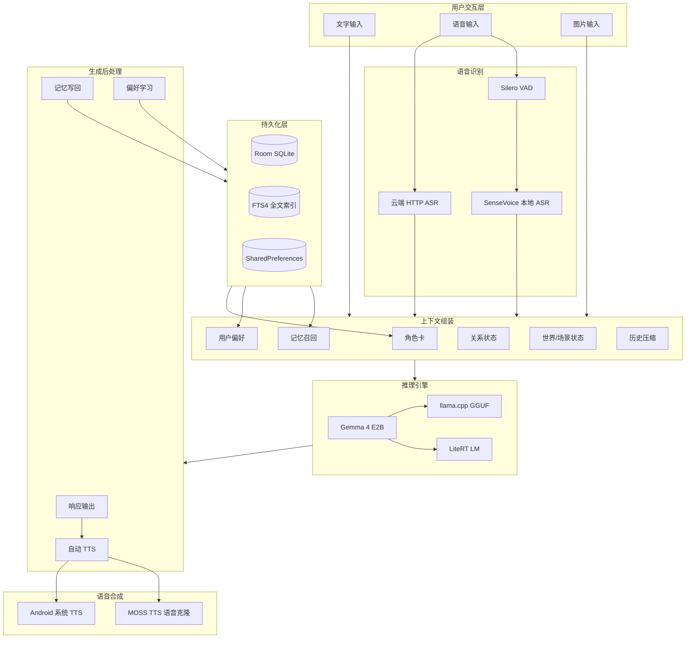

---

## 模块结构

```
app/src/main/java/com/companion/chat/
│
├── companion/                          # 核心运行时编排
│   ├── CompanionRuntime.kt             # 对话回合编排器（核心）
│   ├── PreferenceLearningCoordinator.kt # 后台偏好学习协调器
│   └── SecondEngineManager.kt          # 第二推理引擎管理（后台学习用）
│
├── engine/                             # 引擎实现层
│   ├── InferenceEngineFactory.kt       # 推理引擎工厂
│   ├── LlamaCppInferenceEngine.kt      # llama.cpp GGUF 推理
│   ├── LiteRTLMInferenceEngine.kt      # LiteRT LM 推理
│   ├── AndroidVoiceInputEngine.kt      # 语音输入（ASR）
│   ├── RoleAwareVoiceOutputEngine.kt   # 角色感知 TTS 编排
│   ├── MossTtsNanoVoiceCloneEngine.kt  # MOSS 语音克隆
│   ├── SherpaOnnxSenseVoiceRecognizer.kt # SenseVoice ASR
│   ├── SherpaOnnxSileroVad.kt          # Silero VAD
│   ├── SherpaOnnxNativeLoader.kt       # sherpa-onnx native 加载器
│   ├── CloudHttpAsrEngine.kt           # 云端 HTTP ASR
│   ├── ImageGenerationEngineSelector.kt # 图片生成引擎选择器
│   └── DreamLiteOnnxImageEngine.kt     # DreamLite ONNX 图片生成
│
├── data/
│   ├── engine/                         # 引擎接口与配置
│   │   ├── InferenceEngine.kt          # 推理引擎接口
│   │   ├── VoiceInputEngine.kt         # 语音输入接口
│   │   ├── VoiceOutputEngine.kt        # 语音输出接口
│   │   ├── ModelConfigRepository.kt    # 模型配置仓库
│   │   └── DefaultModelConfig.kt       # 默认模型配置
│   │
│   ├── memory/                         # 记忆系统
│   │   ├── MemoryRepository.kt         # 记忆仓库（提取+存储+检索）
│   │   ├── RuleBasedMemoryExtractor.kt # 正则规则提取
│   │   ├── MemoryRetriever.kt          # FTS4 + 关键词检索
│   │   ├── MemoryPromptBuilder.kt      # 记忆 -> Prompt
│   │   └── MemoryLifecycleManager.kt   # 记忆生命周期
│   │
│   ├── preferences/                    # 偏好学习
│   │   ├── PreferenceRepository.kt     # 偏好仓库
│   │   ├── UnifiedExtractionPromptBuilder.kt # LLM 提取 Prompt
│   │   └── UnifiedExtractionParser.kt  # JSON 解析器
│   │
│   ├── context/                        # 上下文管理
│   │   ├── DefaultContextManager.kt    # 动态上下文窗口
│   │   ├── PromptAssembler.kt          # Prompt 组装器
│   │   └── RuleBasedSummaryGenerator.kt # 消息摘要
│   │
│   ├── local/                          # 数据库层
│   │   ├── CompanionDatabase.kt        # Room 数据库
│   │   ├── ConversationEntity / MessageEntity / Memory / UserPreference / Skill / RoleCard
│   │   └── *Dao.kt                     # 6 个 DAO
│   │
│   ├── role/                           # 角色卡
│   │   ├── RoleCardRepository.kt
│   │   └── RoleCardPromptBuilder.kt
│   │
│   ├── skill/                          # 技能系统
│   │   └── SkillRepository.kt
│   │
│   ├── voice/                          # 语音配置
│   └── repository/                     # 会话持久化
│
├── ui/                                 # UI 层 (Compose)
│   ├── chat/                           # 聊天界面 + ChatViewModel
│   ├── settings/                       # 设置
│   ├── home/                           # 首页/发现
│   └── memory/                         # 记忆管理
│
├── di/ AppContainer.kt                 # 手动 DI 容器
└── Anime CompanionApplication.kt         # Application 入口
```

---

## 核心架构机制

### 1. 端侧推理策略

#### 设计目标

将计算预算集中在 Gemma 4 上，同时按任务分配支持模型。Gemma 4 负责最昂贵且最重要的部分：陪伴式生成、角色表达和关系意识对话。非核心功能（语音识别、语音合成、图片生成）由更轻量的本地模型处理。

#### 双运行时架构

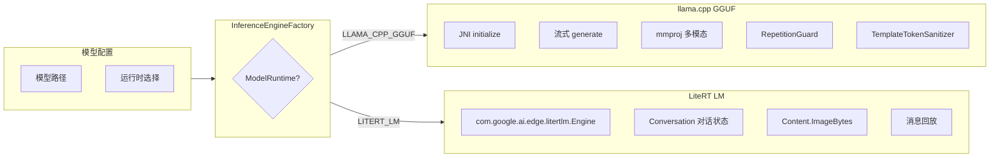

| 运行时 | 实现类 | 模型格式 | 适用场景 |
|--------|--------|----------|----------|
| `LLAMA_CPP_GGUF` | `LlamaCppInferenceEngine` | `.gguf` | 高端设备，追求吞吐量和首 token 速度 |
| `LITERT_LM` | `LiteRTLMInferenceEngine` | `.litertlm` | 主流设备，优先考虑流畅性和散热稳定性 |

**LlamaCppInferenceEngine 关键机制：**

- 通过 `LlamaCppNative` JNI 调用 C++ 层
- 单线程 ExecutorService 保证推理线程安全
- `RepetitionGuard`：检测重复生成模式并提前停止，防止"复读机"现象
- `TemplateTokenSanitizer`：过滤 `<end_of_turn>` 等模板标记，保证输出干净
- 多模态：mmproj 文件处理图片输入，构建 `<__media__>` 标记的 Prompt

**LiteRTLMInferenceEngine 关键机制：**

- 使用 `com.google.ai.edge.litertlm.Engine` API
- Conversation 级别的 native 对话状态管理
- 支持消息回放（`replayMessages`）和 Conversation 重建
- 更适合散热敏感的移动设备

#### 推理引擎接口

```kotlin
interface InferenceEngine {
    val state: StateFlow<InferenceState>  // Idle -> Initializing -> Ready -> Generating -> Error
    suspend fun initialize(config: EngineConfig)
    fun sendMessageStream(messages: List<ChatMessage>): Flow<String>
    suspend fun rebuildConversation(systemPrompt: String): Boolean
    suspend fun replayMessages(messages: List<ChatMessage>): Boolean
    fun cancel()
    fun release()
}
```

---

### 2. 动态上下文管理

#### 设计目标

在手机上，最糟糕的事情之一就是不断向模型反馈不断增长的原始聊天记录——这会很快影响速度和输出质量。因此采用**动态上下文机制**：最近的回合保持原始形式，压缩并重建旧历史，只有当前回合真正重要的部分在生成前被恢复。

#### 上下文压缩流程

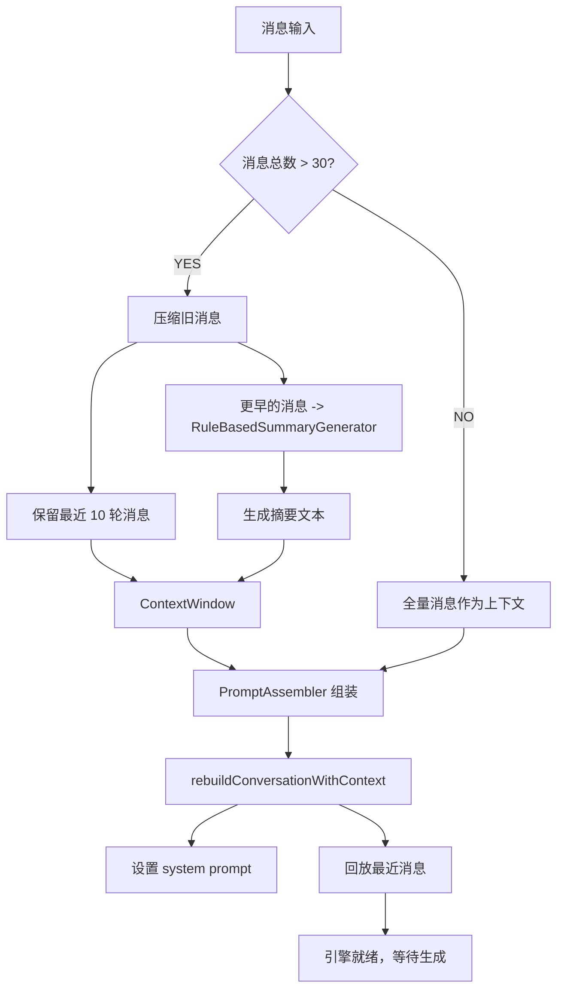

#### Prompt 组装顺序

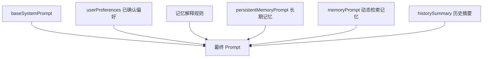

```
组装顺序:
1. baseSystemPrompt     = 默认提示 + 角色卡 + 技能
2. userPreferences      = 已确认的用户偏好
3. 记忆解释规则          = "以下内容均为用户本人的记忆..."
4. persistentMemory     = 长期记忆（永久注入）
5. memoryPrompt         = 动态检索的相关记忆
6. historySummary       = 压缩后的历史摘要
```

#### 任务导向打断处理

对于插入同伴对话中段的短暂任务导向打断，不打断整个陪伴线索：

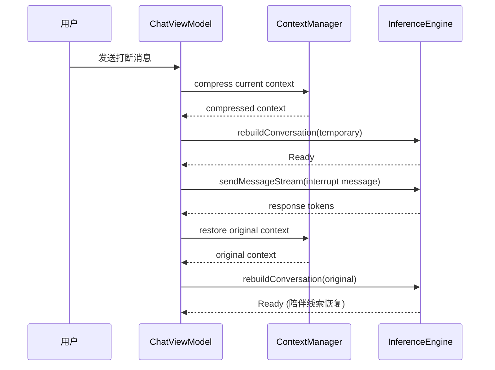

---

### 3. 分层记忆系统

#### 设计目标

许多声称"有内存"的产品，实际上只是把聊天记录存储在别处。记忆不应该是日志，而是**活的知识**。系统将记忆拆分为短期情境、长期记忆和关系状态，基于重要性、重复性以及信息是否可能影响后续关系判断等因素动态决定分类。

#### 双层架构

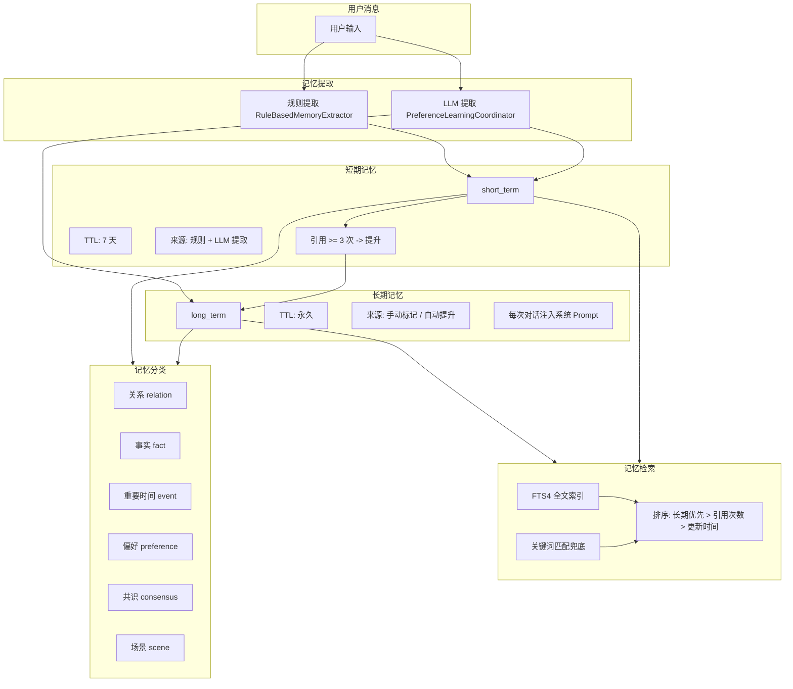

#### 提取流程

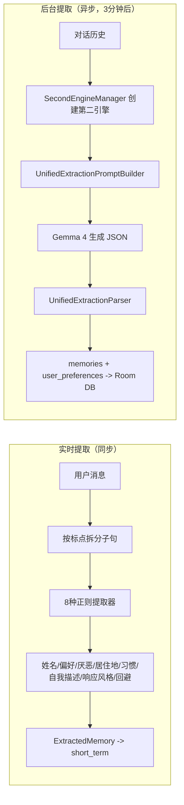

#### 检索流程

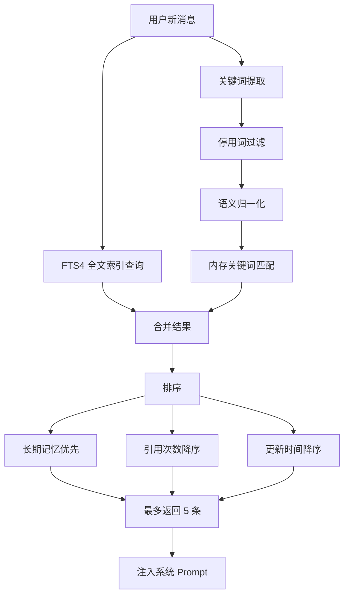

---

### 4. 角色与世界状态注入

#### 设计目标

在伴随产品中，最强烈的失败信号之一不是错误答案，而是感觉"她上次听起来像自己，现在却不一样了"。为此，将角色定义、人格边界、关系状态、当前场景和关键共享协议移入生成前的语境。模型反应的基础超越了用户的最新句子，进入一个持续的角色世界。

#### 角色卡系统

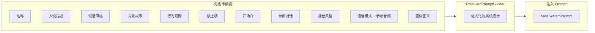

角色卡字段：

| 字段 | 作用 |
|------|------|
| `persona` | 人设描述，定义角色身份 |
| `speakingStyle` | 说话风格，影响语言表达 |
| `background` | 背景故事，提供世界观 |
| `rules` | 行为规则，约束角色行为 |
| `prohibitions` | 禁止项，防止越界 |
| `greeting` | 开场白，建立角色第一印象 |
| `sampleDialogues` | 示例对话，示范角色说话方式 |
| `voiceMode` | DISABLED / SYSTEM_TTS / CLONE |
| `voiceProfileUri` | 参考音频（语音克隆用） |
| `galleryImageUris` | 画廊图片（多模态输入用） |

#### 技能系统

技能即自定义 systemPrompt，如"翻译助手"。内置技能不可删除，可叠加到角色卡之上。

---

### 5. 延迟写回与后台偏好学习

#### 设计目标

如果响应生成、内存提取、候选筛选和持久写入都同步进行，移动端体验会立刻变得沉重。因此**优先回复放在前景，记忆写回和偏好学习在后台延迟进行**。用户首先应感受到系统立即响应，而不是因为无形的后台工作而延迟。

#### 四阶段偏好学习

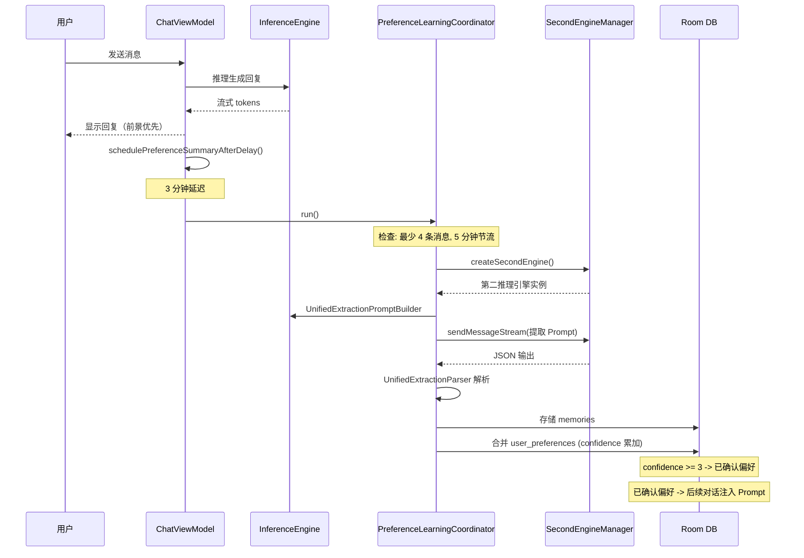

#### 偏好置信度机制

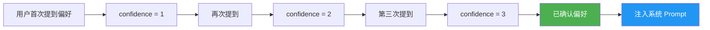

UserPreference 数据模型：
- `category`: name / style / interest / habit / other
- `content`: 偏好内容文本
- `confidence`: 置信度（每次匹配累加，>= 3 为已确认）

---

### 6. 计算预算分配策略

#### 设计目标

在伴随产品中，最有价值的计算资源是关键回复——角色声音依然像她自己，并且还记得用户和她之间发生过的事情。系统将计算预算集中在 Gemma 4 的对话路径上，其他任务由更轻量的模型处理。

#### 任务分配

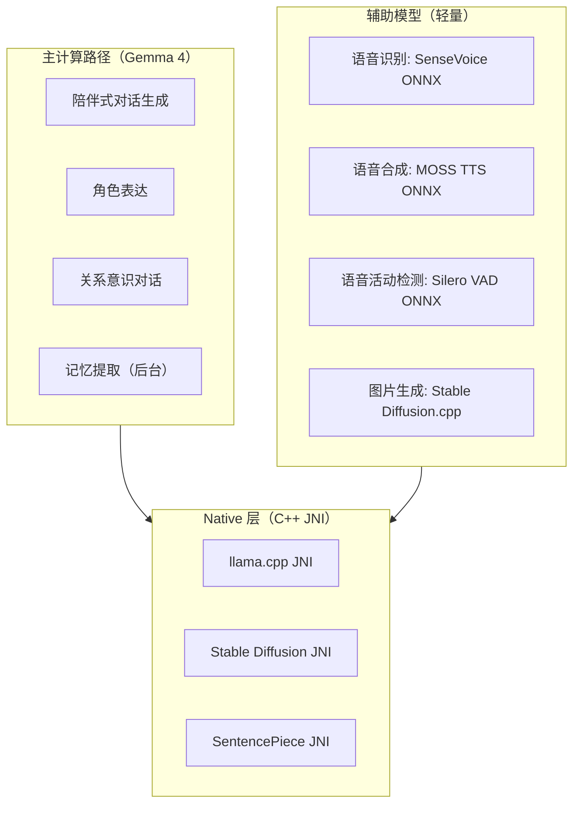

#### 图片生成隔离

图片生成属于增强层，不进入主对话路径。设计为离线一次性动作：按需要触发、完成并退出，不与实时对话争夺资源。

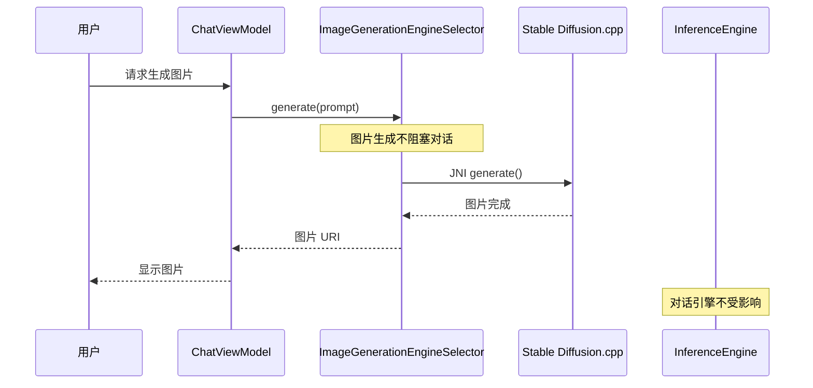

---

### 7. TTS 语音合成与角色语音克隆

#### 设计目标

角色的声音是陪伴体验的关键部分。系统支持角色语音克隆，让每个角色有独特的声音身份。

#### 三层架构

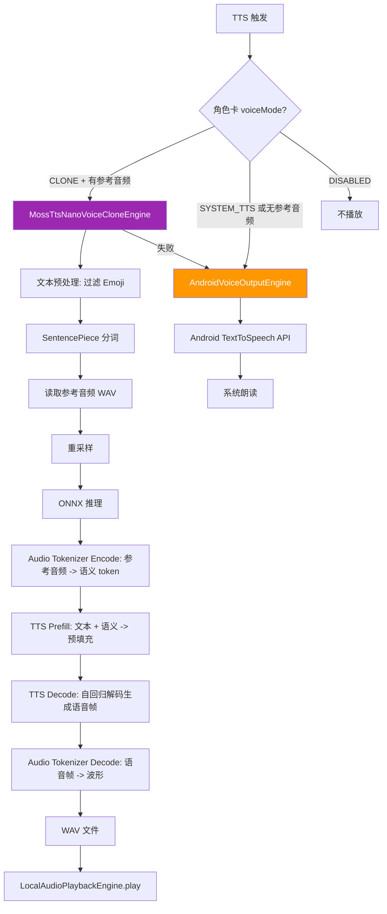

#### Auto-TTS 机制

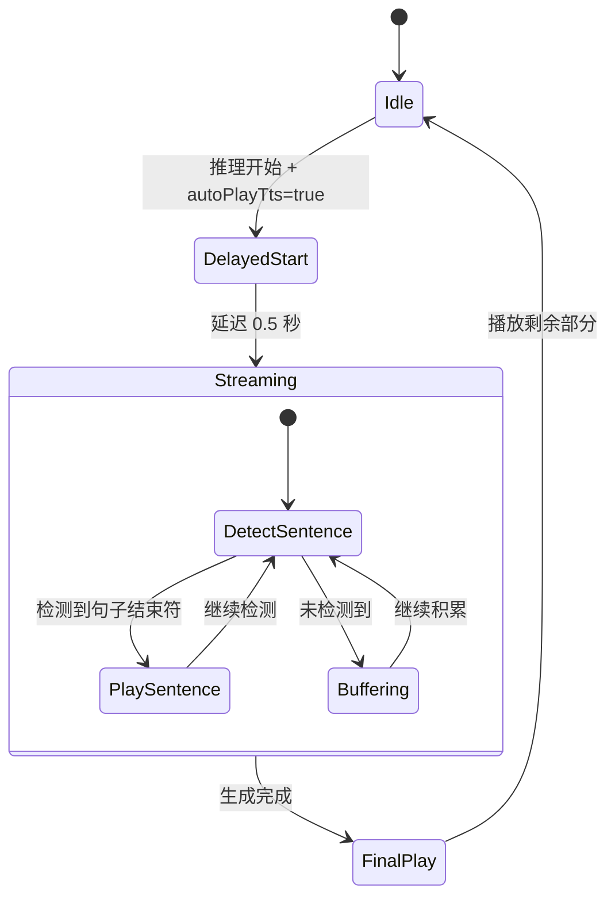

句子结束符：`。！？；.!?\n`，每段最大 100 字符。

---

### 8. ASR 语音识别与 VAD

#### 双后端架构

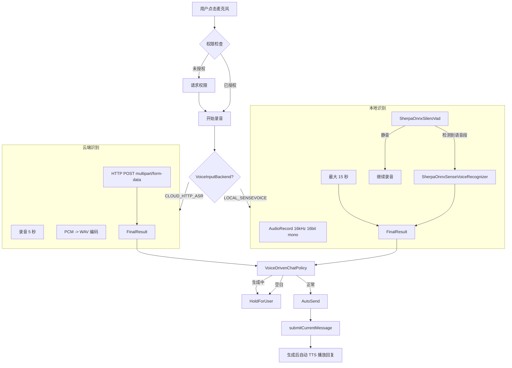

#### VAD 工作流

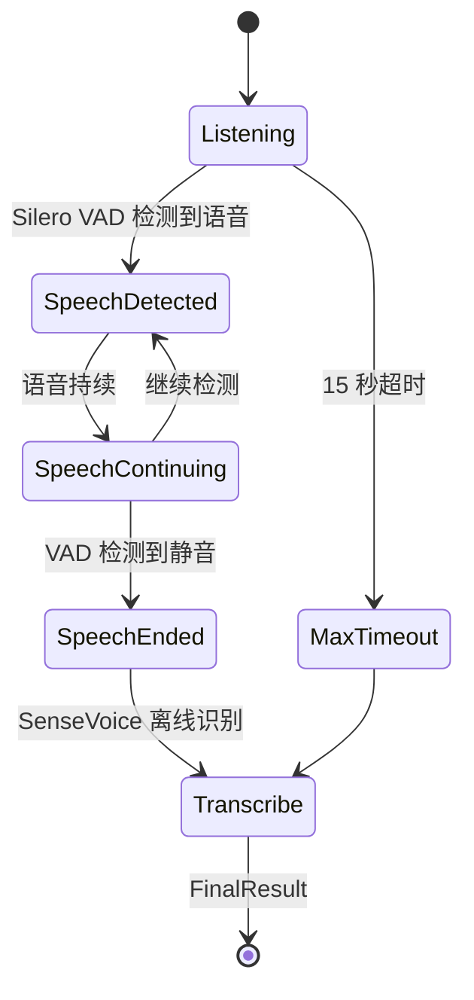

---

### 9. 多模态支持

#### 图片输入流程

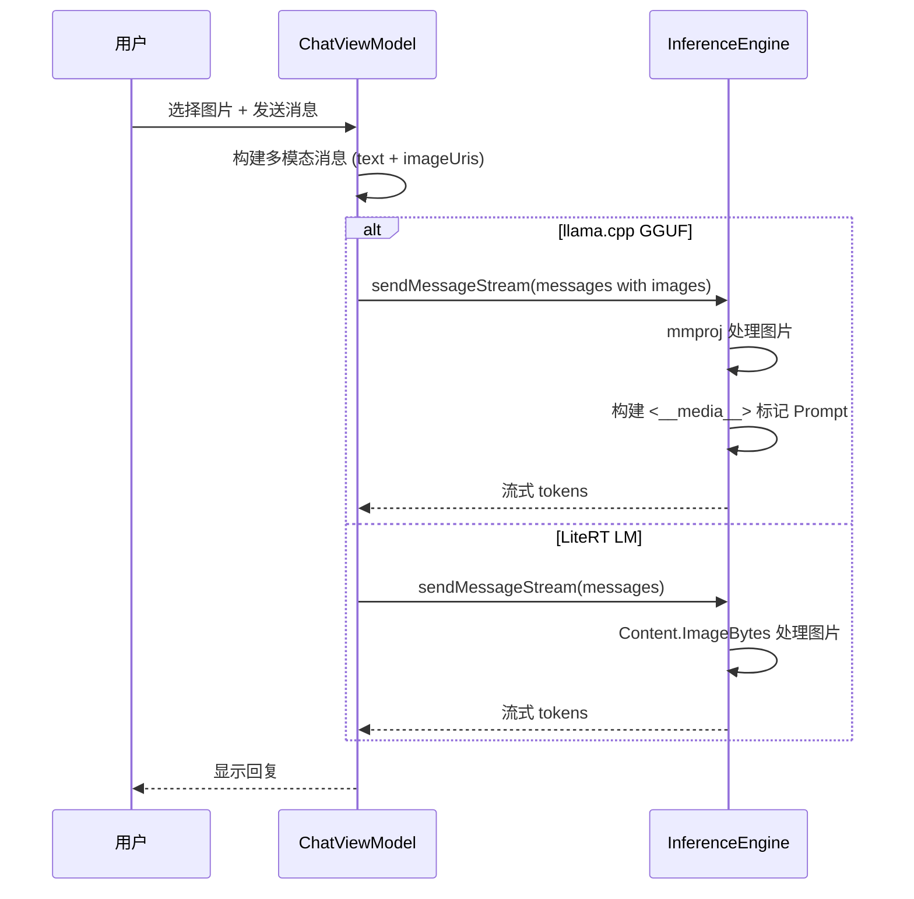

---

### 10. 图片生成

图片生成作为增强层，与主对话路径隔离：

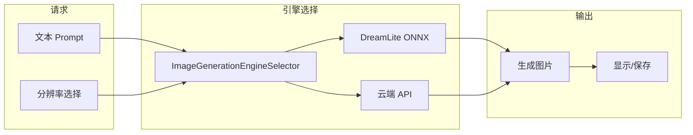

---

## 完整数据流

### 文字消息完整流程

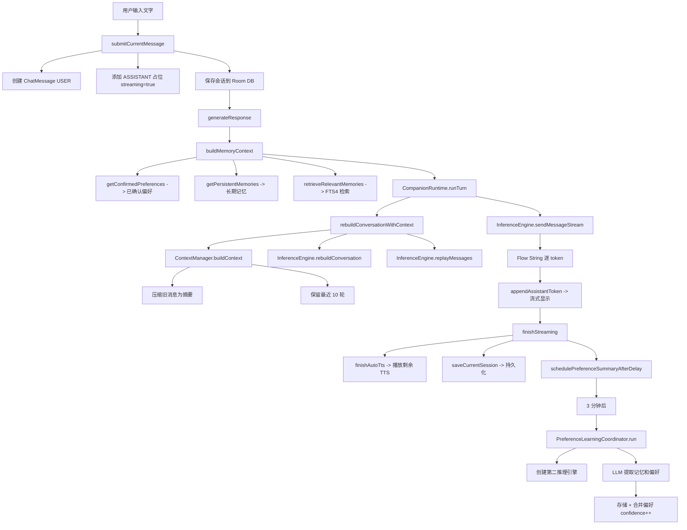

### 语音对话完整流程

```mermaid
flowchart LR
    Mic[点击麦克风] --> ASR[语音识别]
    ASR --> Transcript[文本结果]
    Transcript --> Policy{VoiceDrivenChatPolicy}
    Policy -->|AutoSend| Send[自动发送]
    Send --> LLM[Gemma 4 生成回复]
    LLM --> Response[回复文本]
    Response --> TTS[自动 TTS 播放]
    TTS --> MossClone{角色有克隆语音?}
    MossClone -->|YES| MOSS[MOSS TTS 语音克隆]
    MossClone -->|NO| SysTTS[Android 系统 TTS]
```

---

## 数据库设计

### Entity 关系图

```mermaid
erDiagram
    conversations ||--o{ messages : "1:N"
    conversations {
        string id PK
        string title
        long createdAt
        long updatedAt
    }

    messages {
        string id PK
        string conversationId FK
        string role
        string content
        string imageUris
        long timestamp
        int position
    }

    memories ||--|| memories_fts : "同步"
    memories {
        string id PK
        string content
        string category
        string layer
        string source
        int referenceCount
        string sessionId
        long expiresAt
    }

    user_preferences {
        string id PK
        string category
        string content
        float confidence
    }

    skills {
        string id PK
        string name
        string systemPrompt
        boolean isBuiltIn
        boolean isActive
        int usageCount
    }

    role_cards {
        string id PK
        string name
        string persona
        string speakingStyle
        string avatarImageUri
        string voiceMode
        string voiceProfileUri
        string galleryImageUris
        boolean isActive
    }
```

### FTS4 全文索引

```sql
-- 创建 FTS4 虚拟表
CREATE VIRTUAL TABLE memories_fts USING fts4(content);

-- 插入同步触发器
CREATE TRIGGER memories_ai AFTER INSERT ON memories BEGIN
  INSERT INTO memories_fts(rowid, content) VALUES (new.id, new.content);
END;

-- 删除同步触发器
CREATE TRIGGER memories_ad AFTER DELETE ON memories BEGIN
  INSERT INTO memories_fts(memories_fts, rowid, content)
    VALUES ('delete', old.id, old.content);
END;

-- 更新同步触发器
CREATE TRIGGER memories_au AFTER UPDATE ON memories BEGIN
  INSERT INTO memories_fts(memories_fts, rowid, content)
    VALUES ('delete', old.id, old.content);
  INSERT INTO memories_fts(rowid, content) VALUES (new.id, new.content);
END;
```

### 数据库迁移

| 版本 | 变更 |
|------|------|
| v1 -> v2 | 创建 `role_cards` 表 + 更新翻译助手技能 |
| v2 -> v3 | 为 `role_cards` 添加 `avatarImageUri`、`galleryImageUris`、`voiceProfileUri`、`voiceMode`、`voiceDisplayName` |

---

## 依赖注入

项目不使用 Hilt/Dagger 等框架，采用**手动依赖注入**模式：

```mermaid
graph TD
    App[Anime CompanionApplication] --> Container[AppContainer]

    Container --> DB[CompanionDatabase]
    Container --> MCR[ModelConfigRepository]
    Container --> MR[MemoryRepository]
    Container --> PR[PreferenceRepository]
    Container --> RCR[RoleCardRepository]
    Container --> SR[SkillRepository]
    Container --> IEF[InferenceEngineFactory]
    Container --> VIE[AndroidVoiceInputEngine]
    Container --> VOE[RoleAwareVoiceOutputEngine]
    Container --> CM[DefaultContextManager]
    Container --> PA[PromptAssembler]
    Container --> MPB[MemoryPromptBuilder]
    Container --> RPB[RoleCardPromptBuilder]
    Container --> IGES[ImageGenerationEngineSelector]

    VOE --> SysTTS[AndroidVoiceOutputEngine]
    VOE --> MossTTS[MossTtsNanoVoiceCloneEngine]
    VOE --> Player[LocalAudioPlaybackEngine]

    MR --> MemDao[MemoryDao]
    MR --> MemExt[RuleBasedMemoryExtractor]
    MR --> MemRet[MemoryRetriever]
```

`ChatViewModel` 通过 `application.appContainer` 获取所有依赖，并组装高级组件：
- `CompanionRuntime` -- 核心运行时编排器
- `SecondEngineManager` -- 第二推理引擎（后台学习用）
- `PreferenceLearningCoordinator` -- 偏好学习协调器

---

## Native 层

### CMake 构建目标

```mermaid
graph TD
    CMake[CMakeLists.txt] --> LLama[companion_llama.so]
    CMake --> SD[companion_sd.so]

    LLama --> LlamaJNI[llama_jni.cpp]
    LLama --> Pipeline[pipeline.cpp]
    LLama --> Tokenizer[tokenizer.cpp]
    LLama --> LlamaCpp[third_party/llama.cpp]
    LLama --> SentencePiece[third_party/sentencepiece]

    SD --> DreamJNI[dreamlite_jni.cpp]
    SD --> SDCpp[third_party/stable-diffusion.cpp]

    LlamaCpp --> ONNX[onnxruntime-android]
    SDCpp --> ONNX
```

### JNI 接口

| Native 方法 | 功能 |
|-------------|------|
| `LlamaCppNative.initialize()` | 初始化 llama.cpp 上下文 |
| `LlamaCppNative.generate()` | 流式文本生成 |
| `LlamaCppNative.sendImages()` | 发送多模态图片 |
| `LlamaCppNative.cancelGeneration()` | 取消生成 |
| `LlamaCppNative.release()` | 释放资源 |
| `DreamLiteNative.generate()` | 图片生成 |

### SO 文件清单

```
lib/arm64-v8a/
├── libcompanion_llama.so      # llama.cpp JNI
├── libcompanion_sd.so         # Stable Diffusion JNI
├── liblitertlm_jni.so         # LiteRT LM JNI
├── libLiteRt.so               # LiteRT 运行时
├── libonnxruntime.so          # ONNX Runtime
├── libsherpa-onnx-jni.so      # Sherpa-ONNX (ASR + VAD)
└── libc++_shared.so           # C++ 标准库
```

---

## 高级机制详解

### 11. 模板 Token 净化器 (TemplateTokenSanitizer)

LLM 输出中常包含特殊模板标记（如 `<end_of_turn>`、`<eos>`、`<|eot_id|>`），需要在流式输出中实时过滤。

```mermaid
flowchart TD
    Token[原始 token] --> Buffer[合并 pending 缓冲区]
    Buffer --> Check{匹配 stopMarkers?}
    Check -->|YES| Stop[shouldStop = true, 停止输出]
    Check -->|NO| Remove{匹配 removableMarkers?}
    Remove -->|YES| Strip[移除标记, 继续输出]
    Remove -->|NO| Prefix{可能的标记前缀?}
    Prefix -->|YES| Pending[存入 pending 缓冲区, 等待下一个 token]
    Prefix -->|NO| Emit[正常输出文本]
```

关键机制：
- **双标记列表**：`stopMarkers`（遇到即停止）和 `removableMarkers`（移除但继续）
- **缓冲区**：处理跨 token 边界的标记匹配（一个标记被分割在两个 token 中）
- **最长前缀-后缀匹配**：`longestPossibleMarkerPrefixSuffix()` 防止误发标记片段

---

### 12. RepetitionGuard -- 重复生成检测

防止 LLM 进入"复读机"模式，实时监控生成的 token 流。

```mermaid
stateDiagram-v2
    [*] --> Monitoring
    Monitoring --> Monitoring: 每收到一个 token
    Monitoring --> Detected: 检测到重复模式
    Detected --> ForceStop: 发送停止信号
    ForceStop --> [*]: 推理提前终止
```

---

### 13. 语音驱动对话策略 (VoiceDrivenChatPolicy)

无状态策略对象，决定语音转录后的下一步操作。

```mermaid
flowchart TD
    Transcript[ASR 转录结果] --> Empty{文本为空}
    Empty -->|YES| Hold1[HoldForUser]
    Empty -->|NO| Generating{引擎正在生成}
    Generating -->|YES| Hold2[HoldForUser]
    Generating -->|NO| Ready{引擎就绪}
    Ready -->|NO| Hold3[HoldForUser]
    Ready -->|YES| AutoSend[AutoSend 自动发送消息]
    AutoSend --> Speak[标记 shouldSpeakNextAssistantResponse]
    Speak --> Generate[触发推理 + 生成后自动 TTS]
```

---

### 14. TTS 分句策略

长文本按句子分段合成，避免单次合成过长导致延迟。

```mermaid
flowchart TD
    Text[长文本] --> Split[按句子结束符拆分]
    Split --> Endings["结束符: 。！？；.!?\n"]
    Endings --> MaxLen{每段 > 100 字符?}
    MaxLen -->|YES| ForceSplit[强制按 100 字符截断]
    MaxLen -->|NO| Keep[保持原段]
    ForceSplit --> Queue[合成队列]
    Keep --> Queue
    Queue --> Synth[逐段合成]
    Synth --> Play[顺序播放]
```

---

### 15. 语音输入防抖与生命周期

```mermaid
stateDiagram-v2
    [*] --> Idle
    Idle --> Starting: startListening()
    Starting --> Recording: AudioRecord 启动
    Recording --> Recording: 持续录音 + VAD 检测
    Recording --> Processing: VAD 检测到静音 / 15秒超时
    Processing --> Transcribing: SenseVoice 离线识别
    Transcribing --> EmitResult: emit FinalResult
    EmitResult --> Idle

    Recording --> Idle: stopListening() / release()
    Recording --> Idle: 权限丢失 / 错误
```

关键保护机制：
- 进入录音前验证 `RECORD_AUDIO` 权限
- 检查 `appOpsManager` 的 `OP_RECORD_AUDIO` 是否被拒绝
- 录音中抛出 `SecurityException` 时优雅降级为 `NotListening`
- 最大录音时长 15 秒硬限制

---

### 16. 发现页推荐系统

```mermaid
graph LR
    subgraph Sources["数据源"]
        BuiltIn[内置角色卡列表]
        UserCreated[用户创建的角色卡]
    end

    subgraph DiscoverVM["DiscoverViewModel"]
        Filter[按名称/人设过滤]
        Sort[按 updatedAt 降序]
        Limit[返回前 10 个]
    end

    subgraph UI["发现页 UI"]
        Grid[网格展示]
        Activate[点击激活]
        Navigate[跳转到对话]
    end

    BuiltIn --> DiscoverVM
    UserCreated --> DiscoverVM
    DiscoverVM --> UI
```

---

### 17. 会话持久化与数据迁移

```mermaid
flowchart TD
    Start[App 启动] --> Check{首次启动?}
    Check -->|YES| Migrate[ChatSessionRepository.ensureInitialized]
    Check -->|NO| Normal[正常加载]

    Migrate --> ReadOld[读取 SharedPreferences 旧版数据]
    ReadOld --> HasOld{有旧数据?}
    HasOld -->|YES| Convert[转换为 Room Entity]
    Convert --> Save[写入 Room DB]
    Save --> CleanOld[清理 SharedPreferences]
    HasOld -->|NO| Done[跳过迁移]

    Normal --> Load[从 Room DB 加载会话列表]
    Load --> Display[显示到 UI]
```

会话保存策略：
- 每次流式 token 更新后保存
- 流式完成时保存
- 用户离开页面时保存
- 使用 `replaceSession()` 事务（删除旧消息 + 插入新消息）

---

### 18. 推理引擎状态机

```mermaid
stateDiagram-v2
    [*] --> Idle
    Idle --> Initializing: initialize()
    Initializing --> Ready: 初始化成功
    Initializing --> Error: 初始化失败
    Ready --> Generating: sendMessageStream()
    Generating --> Ready: 生成完成
    Generating --> Error: 生成异常
    Generating --> Generating: 逐 token 更新 partialText
    Error --> Ready: 重试初始化
    Ready --> [*]: release()
    Idle --> [*]: release()
```

状态暴露为 `StateFlow<InferenceState>`，UI 层观察该状态驱动界面变化。

---

### 19. 用户头像与会话标题自动编辑

```mermaid
flowchart LR
    subgraph A["用户头像"]
        Camera[拍照] --> Compress[旋转压缩]
        Gallery[相册选择] --> Compress
        Compress --> Crop[裁剪]
        Crop --> Save[保存头像]
    end

    subgraph B["会话标题"]
        FirstMsg[第一条用户消息] --> Truncate[截取前20字]
        Truncate --> TitleResult[设置为标题]
    end
```

---

### 20. 视觉风格注入

角色卡的 `visualStyle` 字段描述角色外观，注入多模态图片描述 Prompt：

```mermaid
graph LR
    RoleCard[角色卡 visualStyle] --> Inject[注入图片描述 Prompt]
    Inject --> LLM[Gemma 4 生成图片描述]
    LLM --> Gallery[追加到角色卡画廊]
```

当用户触发"生成角色图片"时，系统将 visualStyle 作为 Prompt 前缀，引导图片生成引擎产出符合角色设定的图片。

---

### 21. 推理输出清理管线

LLM 输出经过多层清理才显示给用户：

```mermaid
flowchart LR
    Raw[原始 token] --> Sanitizer[TemplateTokenSanitizer]
    Sanitizer --> RepGuard[RepetitionGuard]
    RepGuard --> Clean[清理后文本]
    Clean --> UI[UI 显示]
    Clean --> TTS[Auto-TTS 输入]

    style Sanitizer fill:#FF5722,color:#fff
    style RepGuard fill:#FF5722,color:#fff
```

清理管线顺序：
1. `TemplateTokenSanitizer` -- 移除模板标记（`<end_of_turn>` 等）
2. `RepetitionGuard` -- 检测重复模式并提前停止
3. 输出干净文本

---

### 22. MOSS TTS 音频后处理管线

```mermaid
flowchart TD
    Wav[合成输出 WAV] --> Decode[解码音频数据]
    Decode --> Format{格式检测}
    Format -->|PCM Int16| Convert1[转换为 Float32]
    Format -->|PCM Int32| Convert2[转换为 Float32]
    Format -->|IEEE Float32| Direct[直接使用]

    Convert1 --> Channel{声道数?}
    Convert2 --> Channel
    Direct --> Channel

    Channel -->|Mono| Upmix[自动上混为立体声]
    Channel -->|Stereo| Resample{采样率匹配?}

    Upmix --> Resample
    Resample -->|不匹配| Interp[线性插值重采样]
    Resample -->|匹配| Write[写入最终 WAV]

    Interp --> Write
    Write --> Play[LocalAudioPlaybackEngine.play]
```

---

### 23. 偏好提取 Prompt 构建

`UnifiedExtractionPromptBuilder` 将最近 N 条消息格式化为提取 Prompt：

```mermaid
flowchart LR
    Messages[最近对话消息] --> Format[格式化为 "角色: 内容" 列表]
    Format --> Template[套入提取 Prompt 模板]
    Template --> Instructions["指令: 提取 memories + user_preferences"]
    Instructions --> Output["要求输出 JSON: { memories: [...], user_preferences: [...] }"]
    Output --> Engine[发送给第二推理引擎]
```

---

### 24. 记忆生命周期管理

```mermaid
flowchart TD
    Boot[App 启动] --> Cleanup[MemoryLifecycleManager.cleanupOnStartup]
    Cleanup --> Expire[清理 expiresAt < 当前时间 的短期记忆]
    Expire --> Promote[检查引用 >= 3 次的短期记忆]
    Promote --> Upgrade[自动提升为 long_term]
    Upgrade --> Done[完成]

    style Expire fill:#FF9800,color:#fff
    style Upgrade fill:#4CAF50,color:#fff
```

---

### 25. 导航结构

```mermaid
flowchart TD
    Nav[NavHost] --> Home
    Nav --> Chat
    Nav --> NewChat
    Nav --> Memories
    Nav --> Settings
    Nav --> RoleCardList
    Nav --> RoleCardDetail

    Home[home 首页和发现页] --> Chat
    Home --> NewChat
    Home --> RoleCardList
    Chat[chat 对话页] --> Memories
    Chat --> Settings
    NewChat[新建对话] --> Chat
    Memories[记忆管理] --> Chat
    Settings[设置] --> Chat
    RoleCardList[角色卡列表] --> RoleCardDetail
    RoleCardDetail[角色卡详情] --> Chat
```

---

### 26. 应用启动流程

```mermaid
sequenceDiagram
    participant App as Anime CompanionApplication
    participant AC as AppContainer
    participant DB as CompanionDatabase
    participant MEM as MemoryLifecycleManager
    participant CS as ChatSessionRepository
    participant UI as MainActivity

    App->>AC: appContainer (lazy init)
    App->>DB: database (lazy init)
    App->>MEM: cleanupOnStartup()
    MEM->>MEM: 清理过期短期记忆
    MEM->>MEM: 提升高频引用记忆

    App->>CS: ensureInitialized()
    CS->>CS: 检查 SharedPreferences 旧数据
    CS->>CS: 迁移到 Room DB (如有)

    App->>UI: setContent { ComposeNavHost }
    UI->>UI: 加载会话列表
```

---

### 27. 技能管理

```mermaid
graph LR
    subgraph Builtin["内置技能"]
        Translate[翻译助手]
        Translate -->|不可删除| DB[(Room)]
    end

    subgraph Custom["自定义技能"]
        UserSkill[用户创建] --> DB
    end

    subgraph Activation["激活"]
        DB --> Active[isActive = true]
        Active --> Inject[注入 baseSystemPrompt]
    end
```

技能与角色卡叠加：当角色卡激活时，技能的 systemPrompt 追加到角色卡之后。

---

### 28. 用户画像

```mermaid
graph LR
    subgraph Profile["UserProfile"]
        Avatar[头像 URI]
        Name[用户名]
    end

    subgraph Storage["存储"]
        Avatar --> File[getExternalFilesDir avatars/]
        Name --> Prefs[SharedPreferences]
    end

    subgraph Usage["使用"]
        Profile --> Chat[显示在聊天界面]
        Profile --> Home[显示在首页]
    end
```

---

## 架构设计亮点总结

| 设计 | 机制 | 效果 |
|------|------|------|
| 端侧推理 | 双运行时 (llama.cpp / LiteRT LM) | 高端/主流设备均可流畅运行 |
| 动态上下文 | 压缩旧历史 + 保留最近回合 + 任务打断隔离 | 长对话不断裂，打断不影响陪伴线索 |
| 分层记忆 | 短期(7天) + 长期(永久) + FTS4 检索 | 记忆随时间积累，越用越懂你 |
| 角色世界注入 | 角色卡 + 关系状态 + 场景 -> 生成前 Prompt | 角色身份一致，不会"每回合重启" |
| 延迟写回 | 前景优先响应，后台 3 分钟后偏好学习 | 用户感受不到后台开销 |
| 计算预算集中 | Gemma 4 专注对话，轻量模型处理辅助任务 | 对话质量最大化 |
| 语音克隆 | MOSS TTS ONNX + 参考音频 | 每个角色有独特声音 |
| 记忆提取 | 规则实时 + LLM 后台异步双通道 | 兼顾速度和深度 |
| 模板 Token 净化 | TemplateTokenSanitizer + 缓冲区 + 跨 token 匹配 | 输出干净无模板标记 |
| 重复生成防护 | RepetitionGuard 实时监控 | 防止"复读机"现象 |
| 语音策略 | VoiceDrivenChatPolicy 无状态决策 | 语音输入自动发送/等待 |
| TTS 分句 | 按句子结束符拆分 + 100 字符上限 | 流式分句播放，降低延迟 |
| 数据迁移 | SharedPreferences -> Room 自动迁移 | 版本升级无感 |
| 音频后处理 | 格式检测 + 声道上混 + 重采样 | 兼容各种参考音频格式 |
| 手动 DI | AppContainer + by lazy | 轻量、无框架依赖 |
