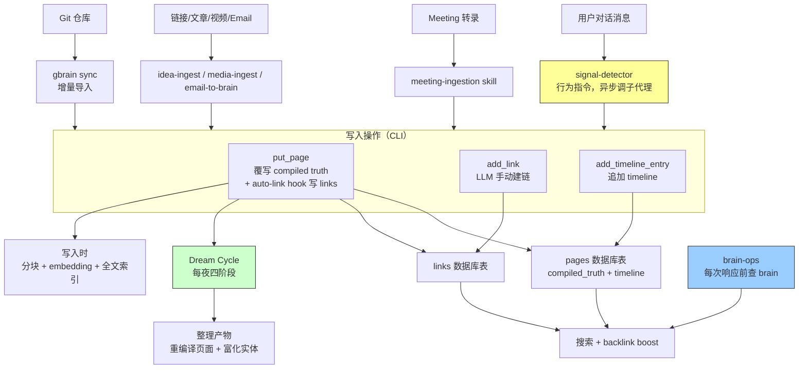
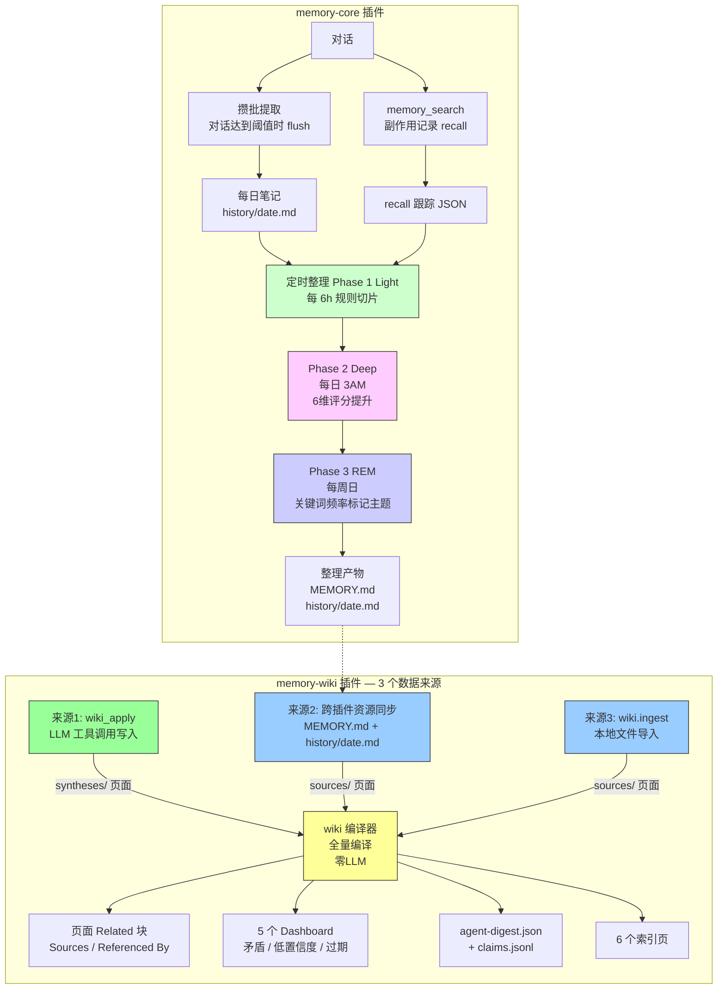
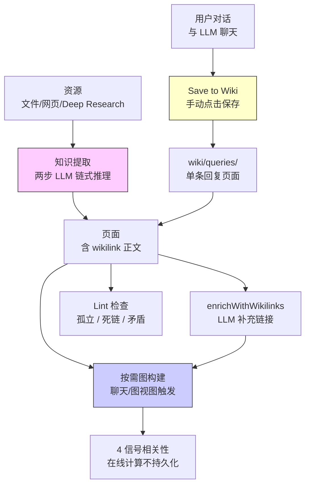
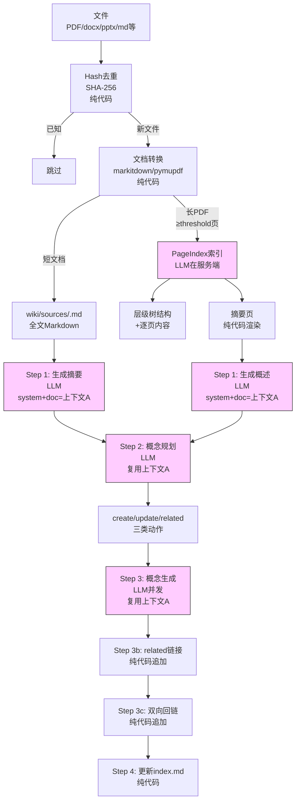
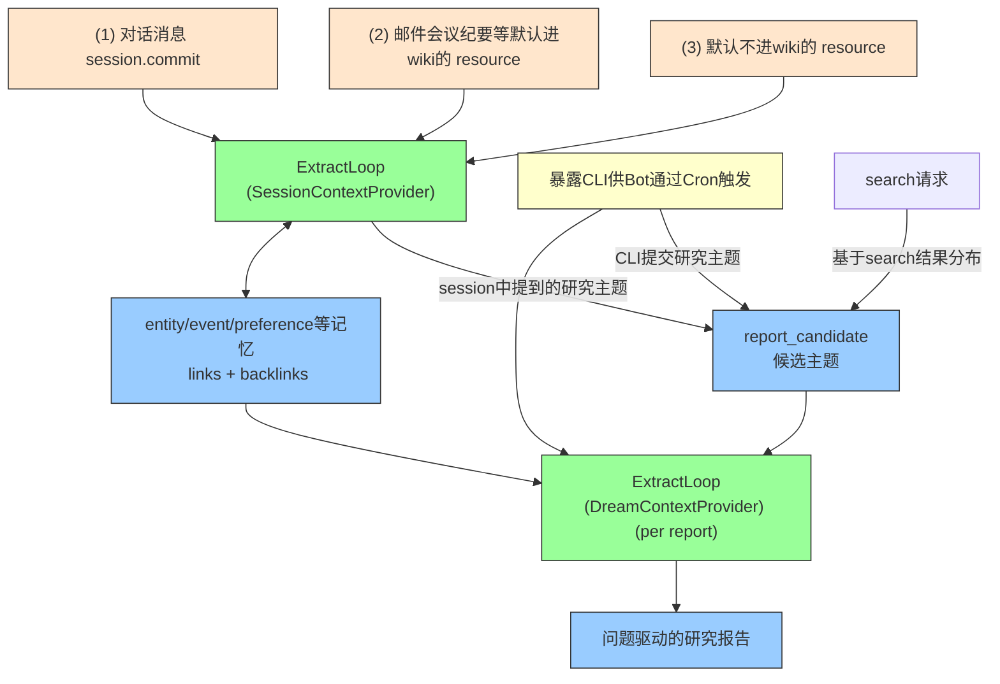

# Memory Link 设计文档

> 日期: 2026-04-23
> 状态: Draft
> 分支: feat/memory_isolation

## 1. 概述

Memory Link 是在现有记忆体系（profile/preferences/entities/events 等）之上建立的统一关系层，将分散的记忆文件通过有向链接互联。

**核心目标：**
- 实体关系与链接：记忆之间建立有向、带类型、带权重的链接，支持双向回链
- 主题整合：外部 Bot T+1 触发整理，从已有记忆中发现问题，生成问题驱动的研究报告

**设计原则：**
- 记忆类型扩展链接能力 — 扩展现有 MemoryTypeSchema，所有记忆文件自带链接能力
- 存储载体：VikingFS 文件，与现有记忆体系一致
- 链接存储在 `.relations.json` 目录级 sidecar 文件中，content 保持纯净，检索时按需渲染
- 不拘泥于现有 MemoryField 体系，以实现好功能为主

## 2. 竞品实现分析

### 2.1 GBrain

**定位：** 个人知识大脑，AI agent 在每次响应前读取、对话后写入的持久化知识库。

**Skill 执行模型：** GBrain = CLI 工具（TypeScript，确定性操作如 search/put/sync/embed）+ Skillpack（29 个 fat markdown 指令文件）。Skill 是指令不是代码——告诉宿主 agent 什么时候调什么 CLI、什么条件下调 LLM，但不含运行时，没有 hook。

`gbrain skillpack install --all` 将 skill 文件复制到运行时 workspace。




#### 输入写入

**输入源：**

| 输入 | 机制 | 负责 Skill |
|------|------|------------|
| 对话消息 | CLAUDE.md / RESOLVER.md 写入"signal-detector on every inbound message"，用户每条消息触发子代理异步执行：①检测原创想法→`brain/originals/`（原文逐字记录）②`gbrain search`检测实体引用→已有页面追加 timeline / 无页面则创建③回链铁律：实体页面补写回链④`gbrain sync` | `signal-detector` |
| Meeting 转录 | 拉取完整转录（非 AI 摘要），创建会议页，传播到所有参会者/公司的 timeline，双向建链 | `meeting-ingestion` |
| 链接/文章/Tweet | 用户分享链接 → 创建页面 + 作者人物页 + 交叉链接 | `idea-ingest` |
| 视频/音频/PDF | 转录 → 实体提取 → 回链传播 | `media-ingest` |
| Email | 确定性脚本拉取邮件 → LLM 判断实体/行动项 → 更新 brain 页面 | `email-to-brain` recipe |
| Git 仓库 | `gbrain sync` 增量导入变更文件，逐文件走 put_page | CLI |

**对话读取机制**（brain-ops，行为指令）：每次响应前先查 brain（`gbrain search` / `gbrain get`），形成 read-enrich-write 循环。同样是 LLM 行为指令，非程序级 hook。


**数据模型：** `pages` 表存储页面，每个页面由 `---` 分隔为两部分：

```markdown
---
title: Pedro Franceschi
type: person
tags: [ceo, brex]
---

Pedro is CEO of Brex. Previously co-founded Cognito.
---

- 2026-04-10 | Presented Q1 numbers [Source: board meeting, 2026-04-10]
- 2026-04-05 | Met for coffee, discussed Series D [Source: conversation, 2026-04-05]
```

- **Compiled Truth**（`---` 上方）：agent 对该实体的当前认知摘要，每次更新**整体覆写**。类似维基条目的当前版本
- **Timeline**（`---` 下方）：带日期 + source attribution 的证据链，**只追加不覆写**。类似 git log，记录"谁在什么时候说了什么"

#### compile机制

**核心事实（基于 GBrain v0.12 源代码分析）：**
- compiled_truth 和 timeline 是两个独立存储，**没有自动从 timeline 编译到 compiled_truth 的代码逻辑**
- compiled_truth 更新**完全依赖 LLM agent** 主动调用 `put_page` 覆写
- timeline 只追加不覆写，通过 `add_timeline_entry` 写入

**更新路径：**

| 路径 | 触发 | 计算方式 | 说明 |
|------|------|----------|------|
| 1. 实时更新 | 用户对话中 agent 主动调用 | LLM | agent 读取现有 compiled_truth + timeline，重新生成新 compiled_truth，调用 `put_page` 覆写 |
| 2. stale 页面更新 | Dream Cycle 未实现 | LLM（未实现） | 设计文档提到的 "T+1 compile" 概念，代码中未实现 |

**stale-link reconciliation：**
- auto-link post-hook 在 `put_page` 时自动移除不再存在的链接（基于内容重新提取）
- 但 slug 改名问题仍存在：指向旧 slug 的 Markdown 链接不会自动更新，读取端用 pg_trgm 模糊匹配缓解

#### 链接系统

**写入方式**（两条路径，都会写 `links` 表）：

**路径 A：put_page 内 auto-link hook**（`runAutoLink`，零 LLM，每次 `put_page` 自动执行，`gbrain sync` 也会触发）：

1. **Entity-ref 提取**：从 compiled_truth 中提取 Markdown 链接（`[张三](../people/zhangsan.md)`）和裸 slug 引用（`people/zhangsan`），自动剥离 code fence 避免代码块误提取
2. **类型推断级联**：对 compiled_truth 做正则匹配 + 页面元数据启发式，推断 link_type（零 LLM）。从强到弱级联，同一对页面（from_slug, to_slug）只保留一条边、优先级最高的类型：

   | 内容模式 | link_type | 示例 |
   |----------|-----------|------|
   | `"founded"/"co-founded"` | `founded` | `"Alice founded Acme AI"` → `founded` |
   | `"invested in"` | `invested_in` | `"Bob invested in Acme AI"` → `invested_in` |
   | `"advises"/"advisor"` | `advises` | `"Carol advises Acme AI"` → `advises` |
   | `"CEO of"/"CTO of"` 等 | `works_at` | `"Alice, CEO of Acme AI"` → `works_at` |
   | 会议页（type=meeting）+ 人物引用 | `attended` | 会议页提到 `[Alice](people/alice)` → `attended` |
   | partner-bio 语言 | `invested_in` | VC 机构人物页提到某公司 → `invested_in` |

3. **Within-page 去重**：同一页面内指向同一目标的多个引用只保留一条链接


**路径 B：LLM agent 手动调用 `add_link`**：meeting-ingestion 等 skill 指令调 `add_link` CLI。两页面间只有一条边，重复调用覆盖


#### 核心路径

| # | 路径 | 触发 | 处理摘要 |
|---|------|------|----------|
| 1 | **put_page** | CLI / MCP / Agent | 解析 frontmatter → SHA256 去重 → 分块(300词) → embedding → 旧值快照 → 覆写 pages → 对账 tags → **runAutoLink**（auto-link hook，写 links 表 + stale-link reconciliation） |
| 2 | **gbrain sync** | CLI / cron / `--watch` | `git pull` → `git diff` → 按 A/M/D/R 分类 → 逐文件走 put_page |
| 3 | **add_link** | LLM agent 按 skill 指令调用 | `INSERT ON CONFLICT DO UPDATE`（两页面间一条边） |
| 4 | **add_timeline_entry** | LLM agent 按 skill 指令调用 | 参数：slug + date（YYYY-MM-DD，严格校验）+ summary + detail（可选）+ source（可选）→ 追加单条 timeline_entries 记录，不动 compiled_truth；DB trigger 自动刷新 search_vector（timeline 内容参与全文搜索）和 updated_at |
| 5 | **extract links** | 首次启用 / 版本升级 | 遍历所有页面 → 提取实体引用 → 类型推断级联 → 写入 links。支持 `--since` 增量、`--dry-run` |
| 6 | **check-backlinks** | CLI / maintain skill | 正则扫描正文 Markdown 链接 → `check` 报告缺失 / `fix` 补写 timeline |

#### 定时整理

Dream Cycle，通过 cron + skills 实现的 6 阶段维护管道（从 GBrain v0.12 源代码分析得出）：

| 阶段 | 输入 | 计算方式 | 输出 |
|------|------|----------|------|
| Phase 1: Lint | 所有页面 | CLI（无 LLM） | lint 报告，检查缺失字段等结构问题 |
| Phase 2: Backlinks | 所有页面 | CLI（无 LLM） | 检查回链完整性，调用 `check-backlinks fix` |
| Phase 3: Sync | Git 仓库 | CLI（无 LLM） | `gbrain sync` 拉取并导入变更 |
| Phase 4: Extract | 新增/变更页面 | CLI + auto-link post-hook（零 LLM） | 调用 `gbrain extract links` 批量提取链接 |
| Phase 5: Embed | 嵌入过期的页面 | CLI（无 LLM） | `gbrain embed --stale` 重新计算向量 |
| Phase 6: Orphans | 孤立实体 | CLI（无 LLM） | 识别无入边的实体页面 |

**核心事实：**
- Dream Cycle 是**维护管道**，全部 6 个阶段均为 CLI 确定性操作，零 LLM 调用
- auto-link post-hook 已在 `put_page` 时自动执行，Extract 阶段用于批量回填历史页面
- Orphans 阶段只统计孤立页面数量（>20 则状态 warn），不自动处理


#### 搜索管线（读路径）

```
1. Query → 意图分类器（entity/temporal/event/general）
2. 多查询扩展（llm 生成 2 个query + 原始query 共3路）
3. 向量搜索（HNSW cosine）+ 关键词搜索（tsvector）→ RRF 融合
4. compiled truth boost: compiled_truth 权重是timeline的两倍
5. backlink boost: r.score *= (1.0 + 0.05 * Math.log(1 + count)) 被更多页面链接的实体分数更高（P@5 +5.4pts，Recall@5 +11.5pts）
6. cosine 重评分: const blended = 0.7 * normRrf + 0.3 * cosine
7. 去重逻辑：
（1）同一页面只保留top3 chunks
（2）Jaccard相似度大于 0.85 trunk去重。
（3）同一页面类型不超过结果60% （比如 person）
（4）同一页面只保留top2 chunks
```

**Backlink boost**：被更多页面链接的实体排名更高。BrainBench v1（240 页）：P@5 +5.4pts，Recall@5 +11.5pts。

#### 图遍历
```
  基于链接提供了图遍历的CLI供模型调用（基于postgresql实现）
  例 1：谁在 Acme 工作？（入边 + 类型过滤）
  gbrain graph-query companies/acme --type works_at --direction in

  例 2：谁投资了 Acme？（入边 + 不同类型）
  gbrain graph-query companies/acme --type invested_in --direction in

  例 3：两跳关系——Alice 通过会议间接见过谁？
  gbrain graph-query people/alice --type attended --depth 2
```

#### 关键取舍

- 建链依赖 LLM 行为指令（skill markdown），没有代码级 hook 保证执行——agent 可能跳过建链
- backlink boost 是简单排序加分，不做图传播，无法发现种子文件多跳之外的关联
- auto-link post-hook 基于正则提取，无法验证目标页面是否存在（可能产生悬空链接）
- 正文 Markdown 链接不会随 slug 改名自动更新，stale-link reconciliation 修复内容修改引起的失效，但 slug rename 场景未完全解决

#### 评测

提供了BrainBench 用于评测
https://github.com/garrytan/gbrain-evals

### 2.2 OpenClaw

**定位：** 开源自托管 AI 个人助理平台，插件架构，memory 是一个特殊 plugin slot。

**输入源：** 对话（memory-core 和 memory-wiki 分别消费对话）。

**memory-wiki** 为独立于**memory-core**的记忆加工与存储模块

**memory-core 在线写入（攒批提取）：** 对话达到阈值时 LLM flush 写入，生成每日笔记 history/date.md。SQLite 索引做搜索。

**memory-wiki 在线写入（工具调用写入）：** LLM 在对话中调用 `wiki_apply` 工具，写入带 Claims 的 wiki 页面（YAML frontmatter）。memory-wiki 是独立子系统，通过跨插件资源同步从 memory-core 导入整理产物（MEMORY.md、history/date.md）作为资源输入。

#### Claims — 结构化知识可信度管理

OpenClaw 最核心的设计是 Claims 体系，将页面中的事实声明结构化，支持可信度评估和矛盾检测。

**Claim 结构：** 每个页面可包含多个 claim，每个 claim 有：
- `text`：声明内容（如 "Alpha uses PostgreSQL"）
- `status`：supported / contested / contradicted / refuted / superseded
- `confidence`：0~1 可信度
- `evidence`：证据数组，每条证据指向源页面 + 行号范围 + 权重

**三层链接机制：**
1. **Claim ID 跨页引用**：相同 claim `id` 出现在不同页面时，自动聚类检测矛盾
2. **sourceIds 页面溯源**：页面级指向源页面，编译时生成 Sources / Referenced By / Related Pages 三类关联
3. **Evidence 证据溯源**：每条证据指向具体源页面的行号，比页面级溯源更精细

**矛盾检测与健康评估：** 按 claim ID 聚类检测矛盾，按更新时间计算 freshness（fresh < 30天 / aging 30-89天 / stale ≥ 90天）。Dashboard 展示 Open Questions、Contradictions、Low Confidence 等报告。




**memory core部分**

**Phase 1 Light Sleep 规则切片示例**：

输入 `history/2026-04-05.md`：
```markdown
## 运维
- 重启了网关，auth 偏移导致的。
- Token 现在对齐了。

## 小王
- 她喜欢直接定时间，不喜欢"改天再说"。
- 最好给一个具体时间段。
```

切片产出（写入 short-term-recall.json）：

| chunk | 行号 | snippet | 分数 |
|-------|------|---------|------|
| 1 | 2-3 | `运维: 重启了网关，auth 偏移导致的。; Token 现在对齐了。` | 0.62（硬编码） |
| 2 | 6-7 | `小王: 她喜欢直接定时间，不喜欢"改天再说"。; 最好给一个具体时间段。` | 0.62（硬编码） |

切片规则：按 `## heading` 分组 → 列表项用 `; ` 拼接 → 每组最多 4 行/280 字符 → 不调 LLM → 分数硬编码（daily=0.62, session=0.58）

**Phase 2 Deep Sleep 评分提升示例**：

假设"小王"这条 snippet 在接下来几天被搜索召回了 4 次，跨 3 天、2 个不同 query：

| 维度 | 权重 | 值 | 加权 |
|------|------|------|------|
| frequency | 0.24 | log1p(4)/log1p(10) = 0.66 | 0.158 |
| relevance | 0.30 | avgScore = 0.78 | 0.234 |
| diversity | 0.15 | max(2,3)/5 = 0.60 | 0.090 |
| recency | 0.15 | exp(-ln2/14 × 2) = 0.91 | 0.137 |
| consolidation | 0.10 | max(spread=0.55, grounded=0) = 0.55 | 0.055 |
| conceptual | 0.06 | 2tags/6 = 0.33 | 0.020 |
| **总分** | | | **0.694** |

门控条件：signalCount(4) ≥ 3 ✓ | diversity(3) ≥ 3 ✓ | score(0.694) < 0.8 ✗ → **未通过，不提升**

若后续又被召回 2 次（共 6 次），分数升至 0.86，则通过门控，追加到 MEMORY.md：
```markdown
## Promoted From Short-Term Memory (2026-04-08)
<!-- openclaw-memory-promotion:memory:memory/2026-04-05.md:6:7:a1b2c3d4e5f6 -->
- 小王: 她喜欢直接定时间，不喜欢"改天再说"。; 最好给一个具体时间段。
  [score=0.86 recalls=6 avg=0.80 source=memory/2026-04-05.md:6-7]
```

**Phase 3 REM Sleep 关键词频率标记主题示例**：

关键词来源：对每个 snippet 做规则分词（词表匹配 + 复合 token 正则 + Intl.Segmenter 分词），过滤停用词和太短的词，最多 8 个关键词。不调 LLM。

假设 short-term-recall.json 中有 20 条 snippet，关键词频率统计：

| 关键词 | 出现次数 | 总条目数 | strength | 标记主题? |
|--------|----------|----------|----------|----------|
| 网关 | 3 | 20 | min(1, 3/20×2) = 0.30 | ✗ (< 0.75) |
| 定时间 | 12 | 20 | min(1, 12/20×2) = 1.0 | ✓ |

超过阈值(0.75)的关键词输出为标记主题：
```markdown
### 标记主题
- Theme: `定时间` kept surfacing across 12 memories.
  - confidence: 1.0
  - evidence: memory/2026-04-05.md:6-7, memory/2026-04-06.md:2-3, ...

### Possible Lasting Truths
- 小王: 她喜欢直接定时间。[confidence=0.72 evidence=memory/2026-04-05.md:6-7]
```

标记主题不直接提升记忆，只是发现高频关键词；candidate truths 列出的条目会被 REM 写入 phase-signals.json（remHits += 1），后续 Deep Sleep 评分时通过 phaseBoost（0.09 × remStrength × remRecency）间接加分，仍需通过 6 维评分门控才能提升到 MEMORY.md。注意这不是关键词共现分析，只是单个关键词的频率统计。

memory core最终输出的为MEMORY.md及history/2026-04-26.md 

**memory-wiki 部分 — 3 个数据来源，写入后均触发全量编译**

**来源1: wiki_apply（LLM 工具调用写入）**
- **触发**：LLM 在对话中调用 `wiki_apply` 工具
- **输入**：JSON，包含 op + title + body + sourceIds + claims + contradictions + questions
- **处理**：写入 wiki 页面（YAML frontmatter + markdown body）→ 触发全量编译
- **输出**：wiki 页面 .md 文件 + 编译产物

  wiki_apply 只支持两种操作：`create_synthesis`（写入 `syntheses/xxx.md`）和 `update_metadata`（更新已有页面 frontmatter）。不支持创建 entity/concept 页面。sourceIds 和 claims 均由 LLM 填写，编译器只做被动 Map 查找。

  **输入示例**（LLM 发送的工具调用）：
  ```json
  {
    "op": "create_synthesis",
    "title": "小王运维手册",
    "body": "小王负责生产环境 Kubernetes 集群的日常运维，包括滚动升级和故障排查。",
    "sourceIds": ["source.小王周报", "source.oncall-log"],
    "claims": [
      {
        "id": "claim.小王.k8s",
        "text": "小王是生产环境 K8s 集群的一线运维负责人",
        "status": "supported",
        "confidence": 0.92,
        "evidence": [{"sourceId": "source.小王周报", "lines": "3-7", "weight": 0.9}]
      }
    ],
    "contradictions": ["与旧版值班表冲突"],
    "questions": ["小王是否还负责测试环境?"],
    "confidence": 0.8
  }
  ```

  **输出示例**（写入 `syntheses/小王运维手册.md`）：
  ```markdown
  ---
  pageType: synthesis
  id: synthesis.小王运维手册
  title: 小王运维手册
  sourceIds:
    - source.小王周报
    - source.oncall-log
  claims:
    - id: claim.小王.k8s
      text: 小王是生产环境 K8s 集群的一线运维负责人
      status: supported
      confidence: 0.92
      evidence:
        - sourceId: source.小王周报
          lines: 3-7
          weight: 0.9
  contradictions:
    - 与旧版值班表冲突
  questions:
    - 小王是否还负责测试环境?
  confidence: 0.8
  updatedAt: "2026-04-26T10:00:00.000Z"
  ---

  # 小王运维手册

  ## Summary
  <!-- openclaw:wiki:generated:start -->
  小王负责生产环境 Kubernetes 集群的日常运维，包括滚动升级和故障排查。
  <!-- openclaw:wiki:generated:end -->

  ## Notes
  <!-- openclaw:human:start -->
  <!-- openclaw:human:end -->
  ```

  页面结构：YAML frontmatter 存结构化数据（claims/contradictions/questions/confidence/sourceIds），正文分 Summary（编译器管理）和 Notes（人类可编辑）两个 managed block。

**来源2: 跨插件资源同步（memory-core → memory-wiki）**
- **触发**：几乎每次 wiki 操作前先跑
- **输入**：memory-core 的整理产物（MEMORY.md、history/date.md）
- **处理**：按 mtime + size 做增量跳过 → 写入 sources/ 页面 → 判断是否需要编译
- **输出**：sources/*.md 页面 + 可能触发全量编译

  同步是纯文件搬运，不对内容做任何提取或加工。原始内容整体放入 `## Content` 代码块，frontmatter 记录元信息。

  **同步示例**：

  输入：memory-core 的 `MEMORY.md`（mtime 或 size 变化）

  产出：写入 `sources/bridge-workspace-a1b2c3d4-memory-ef567890.md`：
  ```yaml
  ---
  pageType: source
  id: source.bridge.workspace-a1b2c3d4.memory-ef567890
  title: "Memory Bridge (main): memory / MEMORY"
  sourceType: memory-bridge
  sourcePath: /absolute/path/to/workspace/MEMORY.md
  bridgeRelativePath: MEMORY.md
  bridgeWorkspaceDir: /absolute/path/to/workspace
  bridgeAgentIds:
    - main
  updatedAt: "2026-04-26T12:00:00.000Z"
  ---

  # Memory Bridge (main): memory / MEMORY

  ## Bridge Source
  - Workspace: `/absolute/path/to/workspace`
  - Relative path: `MEMORY.md`
  - Updated: 2026-04-26T12:00:00.000Z

  ## Content
  ```markdown
  <MEMORY.md 的原始内容>
  ```

  ## Notes
  <!-- openclaw:human:start -->
  <!-- openclaw:human:end -->
  ```

  增量跳过逻辑：读取 `.openclaw-wiki/source-sync.json`，比对 mtime + size + renderFingerprint，三项都没变则跳过写入。

**来源3: wiki.ingest（本地文件导入）**
- **触发**：CLI / gateway 调用
- **输入**：本地文件路径 + 可选 title
- **处理**：读取文件 → 断言 UTF-8 文本 → slug 化标题 → 写入 sources/ 页面 → 触发全量编译
- **输出**：sources/*.md 页面

  纯文件搬运，不对内容做任何提取或 LLM 调用。产出格式与 bridge 类似，但 frontmatter 用 `sourceType: local-file`，正文用 `## Source` 块记录文件元信息 + `## Content` 块放原始内容。

**全量编译 compileMemoryWikiVault（全程零 LLM）**
- **触发**：每次写入后自动触发 / CLI 命令 / gateway 调用
- **输入**：所有 wiki 页面
- **处理**：全量读所有页面 → 计算每个页面的 Related 块 → 矛盾检测 + freshness 评估 → 生成 5 个 Dashboard → 生成 agent-digest.json + claims.jsonl → 生成索引页
- **输出**：页面 `## Related` 块 + 5 个 Dashboard 页面 + agent-digest.json + claims.jsonl + index.md + 分组 index.md

  **编译示例**（3 个页面）：

  输入页面：
  | 页面 | kind | sourceIds | claims |
  |------|------|-----------|--------|
  | `sources/小王周报.md` | source | — | — |
  | `syntheses/小王运维手册.md` | synthesis | source.小王周报 | claim.小王.k8s: "小王是 K8s 一线运维" (supported, 0.92) |
  | `syntheses/运维排班.md` | synthesis | source.小王周报 | claim.小王.k8s: "小王已不负责 K8s，转交小李" (contested, 0.6) |

  编译产出 1 — Related 块（注入各页面）：

  `syntheses/小王运维手册.md` 获得：
  ```markdown
  ## Related
  <!-- openclaw:wiki:related:start -->
  ### Sources
  - [小王周报](sources/小王周报.md)

  ### Related Pages
  - [运维排班](syntheses/运维排班.md)
  <!-- openclaw:wiki:related:end -->
  ```

  `sources/小王周报.md` 获得：
  ```markdown
  ## Related
  <!-- openclaw:wiki:related:start -->
  ### Referenced By
  - [小王运维手册](syntheses/小王运维手册.md)
  - [运维排班](syntheses/运维排班.md)
  <!-- openclaw:wiki:related:end -->
  ```

  Related 块计算逻辑：Sources = 当前页 sourceIds 指向的页面（Map 查找）；Referenced By = sourceIds 包含当前页 id 的页面 + `[[wikilink]]` 指向当前页的页面；Related Pages = 共享 sourceIds 但不在前两者中的页面。全量遍历，非增量。

  编译产出 2 — 矛盾检测（按 claim ID 聚类）：

  同一 claim ID `claim.小王.k8s` 出现在 2 个页面，且文本不同 + 状态不同 → 形成矛盾聚类：
  ```
  key: "claim.小王.k8s"
  entries: [运维排班(contested, stale), 小王运维手册(supported, fresh)]
  ```

  矛盾检测全部依赖 LLM 填写的 claim id 和 contradictions 字段：claim 级矛盾按 claim.id 分组（同一 id 在 ≥2 页且 text/status 不同），页面级矛盾按 contradictions 文本归一化分组。编译器只做被动聚类，不调 LLM。

  编译产出 3 — freshness 评估（按 updatedAt 天数）：

  | 页面 | updatedAt | 天数 | level |
  |------|-----------|------|-------|
  | 小王运维手册 | 2026-04-26 | 0 | fresh |
  | 运维排班 | 2026-01-05 | 111 | stale (≥90) |

  编译产出 4 — Dashboard 页面：

  `reports/contradictions.md`：
  ```markdown
  # Contradictions
  - Competing claim clusters: 1
  ### Claim Clusters
  - `claim.小王.k8s`: 运维排班 -> contested, stale | 小王运维手册 -> supported, fresh
  ```

  `reports/stale-pages.md`：
  ```markdown
  # Stale Pages
  - [运维排班](syntheses/运维排班.md): stale (2026-01-05)
  ```

  编译产出 5 — agent-digest.json（元数据摘要）：

  `.openclaw-wiki/cache/agent-digest.json`：
  ```json
  {
    "generatedAt": "2026-04-26T10:30:00.000Z",
    "stats": {
      "totalPages": 3,
      "sources": 1,
      "syntheses": 2,
      "entities": 0,
      "concepts": 0,
      "totalClaims": 2,
      "contradictionClusters": 1,
      "openQuestions": 1
    },
    "pages": [
      {
        "path": "syntheses/小王运维手册.md",
        "title": "小王运维手册",
        "kind": "synthesis",
        "id": "synthesis.小王运维手册",
        "updatedAt": "2026-04-26T08:00:00.000Z",
        "freshness": "fresh",
        "claimCount": 1,
        "questionCount": 1,
        "contradictionCount": 1,
        "sourceIds": ["source.小王周报.2026w17"],
        "topClaims": [
          {
            "id": "claim.小王.k8s",
            "text": "小王是 K8s 一线运维负责人",
            "status": "supported",
            "confidence": 0.92
          }
        ]
      },
      {
        "path": "syntheses/运维排班.md",
        "title": "运维排班",
        "kind": "synthesis",
        "id": "synthesis.运维排班",
        "updatedAt": "2026-01-05T14:00:00.000Z",
        "freshness": "stale",
        "claimCount": 1,
        "questionCount": 0,
        "contradictionCount": 1,
        "sourceIds": ["source.小王周报.2026w17"],
        "topClaims": [
          {
            "id": "claim.小王.k8s",
            "text": "小王主要负责测试环境维护",
            "status": "contested",
            "confidence": 0.65
          }
        ]
      },
      {
        "path": "sources/小王周报.md",
        "title": "小王周报",
        "kind": "source",
        "id": "source.小王周报.2026w17",
        "updatedAt": "2026-04-22T18:00:00.000Z",
        "freshness": "aging",
        "claimCount": 0,
        "questionCount": 0,
        "contradictionCount": 0,
        "sourceIds": [],
        "topClaims": []
      }
    ],
    "claimHealth": {
      "contradictionClusters": [
        {
          "key": "claim.小王.k8s",
          "type": "claim-id",
          "entries": [
            {
              "path": "syntheses/运维排班.md",
              "status": "contested",
              "freshness": "stale"
            },
            {
              "path": "syntheses/小王运维手册.md",
              "status": "supported",
              "freshness": "fresh"
            }
          ]
        }
      ]
    }
  }
  ```

**读路径（全程零 LLM）**

**wiki_search（wiki 内搜索）**
- **触发**：LLM 调用 `wiki_search` 工具 / CLI / gateway
- **输入**：query 字符串 + corpus（wiki/memory/all）
- **处理**：先读 agent-digest.json 做元数据预筛选 → 对候选页面全文本搜索评分
- **输出**：排序结果列表

  评分规则（纯数值，不调 LLM）：

  | 匹配位置 | 加分 |
  |----------|------|
  | title 精确匹配 | +50 |
  | title 包含 | +20 |
  | claim text 包含 | +25 |
  | sourceId 包含 | +12 |
  | 正文出现（每次） | +1（上限 10） |
  | claim confidence | +0~10 |
  | freshness | fresh +8 / aging +4 / stale -2 |

  搜索结果示例：
  ```json
  {
    "corpus": "wiki",
    "path": "syntheses/小王运维手册.md",
    "title": "小王运维手册",
    "kind": "synthesis",
    "score": 53,
    "snippet": "小王是 K8s 一线运维负责人",
    "id": "synthesis.小王运维手册",
    "updatedAt": "2026-04-26T08:00:00.000Z"
  }
  ```

**wiki_lint（结构检查）**
- **触发**：CLI / gateway / tool 调用
- **输入**：所有 wiki 页面
- **处理**：编译先跑一遍 → 然后逐页检查 16 种问题
- **输出**：`reports/lint.md`

  16 种检查全部是纯字段过滤，不调 LLM：

  | 类别 | 代码 | 严重度 | 检测什么 |
  |------|------|--------|----------|
  | 结构 | missing-id / duplicate-id / missing-page-type / page-type-mismatch / missing-title | error | frontmatter 完整性和一致性 |
  | 溯源 | missing-source-ids / missing-import-provenance / claim-missing-evidence | warning | 页面和 claim 的来源可追溯性 |
  | 链接 | broken-wikilink | warning | [[wikilink]] 目标不存在 |
  | 矛盾 | contradiction-present / claim-conflict | warning | 页面级矛盾声明 + claim ID 聚类冲突 |
  | 问题 | open-question | warning | 页面有未解决问题 |
  | 质量 | low-confidence / claim-low-confidence / stale-page / stale-claim | warning | 低置信度 + 过时（stale ≥ 90天） |

  产出示例（`reports/lint.md`）：
  ```markdown
  # Lint Report
  - Errors: 0
  - Warnings: 3

  ### Contradictions
  - `syntheses/小王运维手册.md`: Claim cluster `claim.小王.k8s` has competing variants across 2 pages.

  ### Quality Follow-Up
  - `syntheses/运维排班.md`: Claim `claim.小王.k8s` is missing structured evidence.
  - `syntheses/运维排班.md`: Page freshness is stale (2026-01-05).
  ```

**Prompt Section（agent digest 注入 LLM 上下文）**
- **触发**：每次 LLM 调用前构建 prompt 时（需 `includeCompiledDigestPrompt=true`，默认关闭）
- **输入**：`.openclaw-wiki/cache/agent-digest.json`
- **处理**：按 claim/question/contradiction 数量对页面排序 → 取 top 4 页面 → 每页取 top 2 claims → 拼接摘要
- **输出**：注入 LLM system prompt 的 wiki 概要

  LLM 看到的内容：
  ```markdown
  ## Compiled Wiki
  Use the wiki when the answer depends on accumulated project knowledge.
  Workflow: wiki_search first, then wiki_get for the exact page.

  ## Compiled Wiki Snapshot
  Compiled wiki currently tracks 2 claims across 1 high-signal pages.
  Contradiction clusters: 1.
  - 小王运维手册: synthesis, 1 claims, 1 open questions, 1 contradiction notes
    - 小王是 K8s 一线运维负责人 (status supported, confidence 0.92, freshness fresh)
    - 小王是否还负责测试环境? (open question)
  ```

  本质：把编译产物的摘要注入 LLM 上下文，让 LLM 知道 wiki 里有什么，决定是否调 wiki_search/wiki_get 获取详情。

**关键取舍：**
- Claims 三层链接提供了结构化的知识可信度管理，但增加了写作负担
- 矛盾检测依赖 claim `id` 的一致性（无 id 的 claim 无法跨页关联），而 claim id 由 LLM 填写，一致性无保证
- 编译器全程零 LLM，所有关系计算依赖 LLM 在 wiki_apply 时填写的 sourceIds、claims、contradictions 字段

### 2.3 nashsu_llm_wiki

**定位：** 桌面应用（Tauri + React），实现 Karpathy LLM Wiki 模式——LLM 增量构建并维护持久化 wiki，而非每次查询重新推导。

**架构：** 原始素材（不可变）→ wiki（LLM 生成的页面）→ schema（配置 wiki 结构）

**输入源：** 两种方式并存：
1. **文件导入（主要）**：文件/网页剪藏/Deep Research → 自动触发知识提取 → 生成完整 wiki 页面
2. **Save to Wiki（对话）**：用户与 LLM 对话 → 手动点击 "Save to Wiki" → 仅保存单条助手回复为 `wiki/queries/` 页面



**1. 知识提取（两步 LLM）**
- **第一步分析**：读取源内容 + wiki/index.md + wiki/purpose.md，输出结构化分析（关键实体/关键概念/核心论点/矛盾/建议）
- **第二步生成**：把第一步分析作为上下文（不解析，直接传文本），输出的是**纯文本**，格式是多个块依次拼接：
  1. 每个要写入的页面对应一个 `---FILE: wiki/path/to/page.md---` 开头、`---END FILE---` 结尾的块，中间是完整的 Markdown 内容（含 frontmatter）
  2. 所有页面块之后，可选输出 `---REVIEW: type | Title---` 开头、`---END REVIEW---` 结尾的块，标注需要人工确认的项
- 生成的页面通常包括：sources/（源摘要）+ entities/（实体页）+ concepts/（概念页）+ index.md（索引）+ log.md（日志）+ overview.md（概览）
- SHA256 缓存去重，不变的素材不重复处理

  **具体例子**：

  假设导入一份 `acme-k8s-migration.pdf`（Acme 公司的 Kubernetes 迁移报告）：

  - **第一步分析输出**：
    ```
    ## 关键实体
    - Alice Smith (人物，核心，技术负责人)
    - Acme Corp (组织，核心，迁移实施方)
    - Kubernetes (产品，边缘，已有页面可能存在)

    ## 关键概念
    - 微服务架构：将应用拆分为独立服务的方法，本报告核心
    - CI/CD 流水线：自动化构建测试部署流程

    ## 核心论点
    - Acme Corp 从单体应用迁移到微服务，使用 Kubernetes
    - 部署时间减少 70%
    - 证据：报告中提供的迁移前后部署指标对比

    ## 矛盾
    - 无外部矛盾
    - 内部张力：部署变快但运维复杂度上升

    ## 建议
    - 创建 Alice Smith 和 Acme Corp 的实体页
    - 创建微服务架构概念页（如果不存在）
    - 更新 overview 加入这个迁移案例
    ```

  - **第二步生成输出**：
    ```
    ---FILE: wiki/sources/acme-k8s-migration.md---
    ---
    type: source
    title: "Source: Acme K8s Migration Report"
    created: 2026-04-28
    updated: 2026-04-28
    tags: [migration, kubernetes]
    sources: ["acme-k8s-migration.pdf"]
    ---
    # Source: Acme K8s Migration Report

    ## 摘要
    Acme Corp 成功从单体应用迁移到基于 Kubernetes 的微服务架构，由 Alice Smith 主导。

    ## 关键发现
    - 部署时间减少 70%
    - 运维复杂度有所上升
    ---END FILE---

    ---FILE: wiki/entities/alice-smith.md---
    ---
    type: entity
    title: "Alice Smith"
    created: 2026-04-28
    updated: 2026-04-28
    tags: [engineer, migration-lead]
    related: [[acme-corp]]
    sources: ["acme-k8s-migration.pdf"]
    ---
    # Alice Smith

    ## 角色
    Acme Corp 技术负责人，主导微服务迁移。

    ## 背景
    推动 Acme Corp 从单体迁移到 Kubernetes 的核心人物。
    [[acme-corp]]
    ---END FILE---

    ---FILE: wiki/entities/acme-corp.md---
    ---
    type: entity
    title: "Acme Corp"
    created: 2026-04-28
    updated: 2026-04-28
    tags: [company, technology]
    related: [[alice-smith]]
    sources: ["acme-k8s-migration.pdf"]
    ---
    # Acme Corp

    ## 简介
    一家最近完成微服务迁移的科技公司。

    ## 关键行动
    - 2026: 从单体迁移到 Kubernetes 微服务
    [[alice-smith]]
    ---END FILE---

    ---FILE: wiki/concepts/microservices-architecture.md---
    ---
    type: concept
    title: "微服务架构"
    created: 2026-04-28
    updated: 2026-04-28
    tags: [architecture, cloud]
    related: [[kubernetes]]
    sources: ["acme-k8s-migration.pdf"]
    ---
    # 微服务架构

    ## 定义
    将应用开发为一组小型独立服务，通过 API 通信。

    ## 权衡
    - 部署更快
    - 运维复杂度上升
    ---END FILE---

    ---FILE: wiki/index.md---
    ---
    type: overview
    title: "Wiki Index"
    created: 2026-04-01
    updated: 2026-04-28
    ---
    # Wiki Index

    ## 实体
    - [[alice-smith]]
    - [[acme-corp]]

    ## 概念
    - [[microservices-architecture]]
    ---END FILE---

    ---REVIEW: duplicate | Kubernetes 可能已存在---
    分析提到 Kubernetes，但不确定是否已有页面，建议检查后再决定是否创建。
    OPTIONS: Create Page | Skip
    SEARCH: kubernetes 容器编排 | 微服务 kubernetes 部署
    ---END REVIEW---
    ```

**2. enrichWithWikilinks（链接补充）**
- LLM 判断哪些术语应链接到已有页面 → 在正文插入 `[[wikilink]]`

**3. 按需图构建**
- 读所有 .md 文件 → 正则提取 `[[wikilink]]` → 构建图结构 → 缓存在内存（模块级变量）
- 使用时：如果 `cachedGraph.dataVersion === 当前 dataVersion` 则直接用缓存，否则重新构建
- 需要相关性分数时：调用 `calculateRelevance` 函数**在线实时计算**（不缓存）

4 信号相关性：

| 信号 | 权重 | 来源 |
|------|------|------|
| 直接链接 | 3.0 | `[[wikilink]]` 语法 |
| 源文件重叠 | 4.0 | frontmatter `sources: []` 共享 |
| Adamic-Adar | 1.5 | 共同邻居，按 1/log(度) 加权 |
| 类型亲和 | 1.0 | 同类型页面加分 |


**4. 检索**
- 分词搜索 + 向量搜索（LanceDB，可选）→ RRF 融合 → 排序结果（最多 20 条）：

| 步骤 | 说明 |
|------|------|
| 分词搜索 | 本地文件扫描，分数计算：文件名精确匹配（+200）> 标题包含短语（+50）> 正文包含短语（每次+20，最多10次）> 标题token匹配（每个+5）> 正文token匹配（每个+1） |
| 向量搜索 | 可选（LanceDB），返回 top10 语义相似结果 |
| RRF 融合 | `fused(p) = 1/(60 + token_rank) + 1/(60 + vector_rank) |
| 去重排序 | 按 RRF 分数降序，同分按路径字母顺序，取前 20 条 |


**5. Lint 检查**
- 结构检查（孤立/死链）+ 语义检查（LLM 检测矛盾/过期）

**无定时整理**：所有知识产出依赖知识提取时一次性完成，没有后续的矛盾发现、过时更新或跨页面整合

**关键取舍：**
- 链接存正文（`[[wikilink]]`），slug 变更时链接失效
- 没有链接类型、没有权重，关系计算靠源文件重叠和图拓扑
- 4 信号相关性模型比纯 PPR 更丰富，但权重硬编码

### 2.4 OpenKB

**定位：** 开源 CLI 工具，将原始文档编译成结构化、相互链接的 wiki 风格知识库。受 Andrej Karpathy "LLM Wiki" 想法启发——LLM 自动生成摘要、概念页和交叉引用，让知识随时间积累，而非每次查询重新推导（传统 RAG 的做法）。

**输入源：** 文件导入（PDF、docx、pptx、md 等），或文件系统监控（watchdog 自动处理 `raw/` 目录新增文件）。

**架构：** 文档 → 转换 → 编译（多步 LLM 管线）→ wiki 页面（summaries + concepts + index）



#### 文档转换（纯代码，零 LLM）

| 文件类型 | 转换方式 | 输出 |
|----------|----------|------|
| `.md` | 直接读取 + 复制相对路径图片并改写链接 | `wiki/sources/{name}.md` |
| `.pdf`（短，< threshold 页） | pymupdf dict-mode 逐页遍历 text/image block → Markdown + 内联图片 | `wiki/sources/{name}.md` + `wiki/sources/images/{name}/*.png` |
| `.pdf`（长，≥ threshold 页） | 仅标记 `is_long_doc=True`，不转换，交给 PageIndex | 返回标记 |
| 其他（docx/pptx/xlsx/html/txt/csv） | markitdown 库转换 → 解码 base64 图片保存磁盘并改写链接 | `wiki/sources/{name}.md` + `wiki/sources/images/{name}/*.png` |

额外操作：原始文件复制到 `raw/` 目录存档，SHA-256 哈希注册到 `hashes.json`。

#### PageIndex 索引（仅长 PDF，LLM 在服务端）

| 子步骤 | 输入 | 计算 | LLM | 输出文件 |
|--------|------|------|-----|----------|
| 索引 | PDF 文件 | `PageIndexClient.collection().add(pdf)` — 上传 PDF 到 PageIndex 服务，服务端用 LLM 解析文档结构 | 是（PageIndex 内部） | `doc_id`, `doc_description`, `structure`（层级树） |
| 获取页面内容 | doc_id, page_count | Cloud 模式：OCR 后的 Markdown；失败回退本地 pymupdf | Cloud 模式用 OCR | `wiki/sources/{name}.json`（per-page 内容数组） |
| 渲染摘要 | tree 结构 | `render_summary_md()` — 递归遍历树节点，渲染为 Markdown 层级标题 + summary | 否 | `wiki/summaries/{name}.md` |

PageIndex 使用无向量（vectorless）的推理式检索——通过层级树索引实现长文档的结构化访问，不依赖 embedding。

#### Wiki 编译（多步 LLM 管线，prompt 缓存）

编译管线的核心设计是**上下文 A 复用**：Step 1 构造 system_msg（AGENTS.md schema + 语言指令）+ doc_msg（文档内容/PageIndex 摘要），作为 prompt 缓存的前缀；Step 2-3 复用同一前缀，让 LLM 服务端命中缓存，减少重复计算。

**Step 1: 生成摘要/概述**

| 项 | 短文档 | 长文档 |
|----|--------|--------|
| Prompt | `_SUMMARY_USER` — 文档全文 + "写摘要页" | `_LONG_DOC_SUMMARY_USER` — PageIndex 摘要 + "写概述" |
| LLM 调用 | 1 次同步 | 1 次同步 |
| 输出格式 | JSON `{"brief": "...", "content": "..."}` | 纯 Markdown |
| 写入文件 | `wiki/summaries/{name}.md`（frontmatter: doc_type=short） | 摘要已在 PageIndex 步骤写好，此步输出作为后续输入 |

**Step 2: 概念规划**

| 项 | 说明 |
|----|------|
| 输入 | 上下文 A + 上一步 summary + 已有概念页的 briefs |
| LLM 调用 | 1 次同步 |
| 输出 | JSON plan: `{"create": [...], "update": [...], "related": [...]}` |

三种动作：
- **create**: 新概念，需生成全新页面
- **update**: 已有概念有新信息，需全文重写（不是追加）
- **related**: 轻量关联，只加交叉链接不改内容

已有概念页以紧凑格式呈现给 LLM：`- {slug}: {brief}`（brief 从 frontmatter 读取，缺省时截取正文前 150 字符）。

**Step 3: 概念页生成/更新**

| 项 | 说明 |
|----|------|
| LLM 调用 | N 次并发异步（N = create 数 + update 数，默认 concurrency=5） |
| create Prompt | `_CONCEPT_PAGE_USER` — title + doc_name，生成新概念页 |
| update Prompt | `_CONCEPT_UPDATE_USER` — title + doc_name + **已有概念页全文**，LLM 被要求"全文重写融入新信息，不要追加" |
| 输出格式 | JSON `{"brief": "...", "content": "..."}` |

写入逻辑：
- **create**: 新文件，frontmatter 含 `sources` 和 `brief`
- **update**: 读取已有 frontmatter → 追加 source_file 到 sources 列表 → 替换 body 为 LLM 重写内容 → 更新 brief

**Step 3b/3c: 关联链接 + 双向回链（纯代码，零 LLM）**

| 操作 | 做什么 |
|------|--------|
| `_add_related_link()` | 在 related 概念页末尾追加 `See also: [[summaries/{doc}]]` + frontmatter 追加 source |
| `_backlink_summary()` | 在摘要页追加 `## Related Concepts` 章节，列出所有 `[[concepts/{slug}]]` |
| `_backlink_concepts()` | 在每个概念页追加 `## Related Documents` 章节，列出 `[[summaries/{doc}]]` |

目的：确保双向链接闭环——摘要链接概念，概念也链接摘要。

**Step 4: 更新索引（纯代码，零 LLM）**

在 `wiki/index.md` 的 `## Documents` 下插入文档条目，`## Concepts` 下插入或更新概念条目。条目格式：`- [[link]] (type) — brief text`。

#### 全流程 LLM 调用汇总

| 步骤 | LLM 调用次数 | 缓存利用 | 备注 |
|------|-------------|----------|------|
| Hash 去重 | 0 | — | 纯代码 |
| 文档转换 | 0 | — | 纯代码 |
| PageIndex 索引（仅长PDF） | 1+（PageIndex 内部） | — | 对 OpenKB 透明 |
| Step 1: 生成摘要/概述 | **1** | system+doc 构成缓存上下文 A | 短文档用全文，长文档用 PageIndex 摘要 |
| Step 2: 概念规划 | **1** | 复用上下文 A（缓存命中） | |
| Step 3: 概念页生成 | **N**（create+update 数） | 复用上下文 A（缓存命中） | 并发执行，默认 concurrency=5 |
| Step 3b/3c: 关联+回链 | 0 | — | 纯代码 |
| Step 4: 更新索引 | 0 | — | 纯代码 |

典型短文档：2 + N 次 LLM 调用（1 摘要 + 1 规划 + N 概念页）。典型长 PDF：2 + N 次加 PageIndex 内部调用。

#### 链接系统

**链接载体：** 正文内 `[[wikilink]]` 语法（如 `[[concepts/attention]]`、`[[summaries/attention-is-all-you-need]]`）。

**链接类型：** 无类型系统，所有链接都是无类型的 wikilink，无法区分"属于""导致""矛盾"等关系语义。

**链接权重：** 无权重，所有链接等价。

**双向链接机制：** 通过代码级回链保证——编译管线的 Step 3b/3c 在写入后立即补全反向链接。但只在编译时执行，如果后续手动编辑页面删除了链接，反向链接不会自动清理。

**链接精度：** 页面级（`[[concepts/slug]]`），不支持行号级定位。

#### 搜索/问答

- **query 命令**：OpenAI Agents SDK 驱动的 LLM agent，3 个工具（`read_file`、`get_page_content`、`get_image`）导航已编译 wiki 回答问题
- **chat 命令**：交互式多轮对话 REPL，支持会话持久化、slash commands
- **无向量化搜索**：query/chat agent 依赖 LLM 自主决策读哪些页面，不做 embedding 检索

#### Lint 检查

| 层级 | 检查内容 | 计算方式 |
|------|----------|----------|
| 结构性 lint | 断链、孤儿页、raw 文件缺 wiki 条目、index.md 不同步 | 纯代码（正则匹配 wikilink） |
| 语义 lint | 矛盾、遗漏、过时、冗余、概念覆盖 | LLM agent（OpenAI Agents SDK） |

#### 定时整理

**无定时整理。** 所有知识产出在文件导入时一次性完成（多步 LLM 编译管线），没有后续的矛盾发现、过时更新或跨页面整合机制。随着页面增多，概念页可能过时但不自动刷新。

#### 关键取舍

- 链接存正文（`[[wikilink]]`），slug 变更时链接失效，无 stale-link reconciliation
- 无链接类型和权重，所有关系等价，无法区分"属于""导致""矛盾"等语义
- 双向回链仅在编译时保证，手动编辑后可能不一致
- 无定时整理/矛盾发现，知识库长期维护依赖人工 lint
- 多步 LLM 管线的 prompt 缓存设计有效降低重复计算，但每次编译都是全量生成（无增量更新）
- PageIndex 的无向量检索是对传统 RAG 的有趣替代，但仅限于长 PDF 场景

### 2.5 竞品启发与设计决策

**1. PageIdMap 消除死链（vs GBrain auto-link + check-backlinks / OpenKB 编译时回链）**
GBrain 在 `put_page` 时通过 auto-link post-hook 自动提取实体引用并创建链接，还通过 `check-backlinks` 命令检查并修复回链，用 pg_trgm 模糊 slug matching 缓解读取端问题。但 auto-link 基于正则提取，无法验证目标页面是否存在（可能产生悬空链接）。OpenKB 在编译时通过代码级 `_backlink_summary` / `_backlink_concepts` 保证双向链接，但仅在编译时刻执行，手动编辑或 slug 变更后链接可能断裂，且无 stale-link reconciliation。OV 的 PageIdMap 从结构上杜绝死链——page_id 只分配给上下文中确认存在的文件，链接不可能指向不存在的页面。

**2. 延迟渲染替代写入时链接（vs GBrain 正文 Markdown 链接 / OpenKB [[wikilink]] 正文链接）**
GBrain 的 auto-link post-hook 有 stale-link reconciliation 功能，在内容修改时自动移除失效链接。但正文中的 Markdown 链接（如 `[张三](../people/zhangsan.md)`）不会随 slug 改名自动更新，仍是断裂风险点。OpenKB 同样把链接写在正文中（`[[wikilink]]`），编译时生成，无 reconciliation 机制，slug 变更直接导致断链。OV 的 content 保持纯净，链接存在 `links` 元数据中，检索时按需渲染 match_text。target_uri 变化只改元数据，content 不动。

**3. LinkType 枚举 + weight 权重（vs GBrain 自由文本 + 类型推断 / OpenClaw 无权重 / OpenKB 无类型无权重）**
GBrain 的 `links` 表的 `link_type` 列是自由文本，但 auto-link post-hook 能通过类型推断级联自动推断标准类型（founded → invested_in → advises → works_at）。不过 LLM 调 `add_link` 时仍可填入任意值（同义歧义如 `knows` vs `familiar_with`）。OpenClaw 没有权重。OpenKB 的 `[[wikilink]]` 完全没有类型和权重，所有链接等价，无法区分"属于""导致""矛盾"等语义。OV 用枚举约束关系类型，用 weight 表达关联强度，支持更精细的检索排序。

**4. 不引入 Claims 层（from OpenClaw 启发）**
OpenClaw 的 Claims 三层链接 + 矛盾检测 + freshness 评估是一套完整的知识可信度管理，但 OV 不引入独立 claims 层。原因：原始 md 已包含事实记录，links 体系已覆盖 claim 的核心能力——矛盾（`CONTRADICTS`）、演变（`EVOLVED_FROM`）、可信度（`weight`）、证据溯源（`t_uri + t_field + t_line_ranges`）。独立 claim 层只是 links 的冗余子集。

**5. 链接元数据 vs 正文内链接（from nashsu_llm_wiki / OpenKB 启发）**
nashsu_llm_wiki 和 OpenKB 都把链接写在正文中（`[[wikilink]]`），slug 变更时链接失效，且无法携带类型和权重。GBrain 的结构化链接存储在独立数据库表中（不在正文中），auto-link post-hook 通过 stale-link reconciliation 自动修复内容变更引起的失效链接，但正文中的 Markdown 交叉引用仍有 slug 变更问题。OV 的链接存在元数据中，正文保持纯净，与第 2 点延迟渲染策略一致。

**6. 外部 Bot T+1 触发主题整合 vs Dream Cycle 维护管道（from GBrain + nashsu_llm_wiki + OpenKB 启发）**
nashsu_llm_wiki 和 OpenKB 都没有定时整理，全靠导入/编译时一次性产出。GBrain 的 Dream Cycle 是纯维护管道（lint → backlinks → sync → extract → embed → orphans），不涉及 LLM，没有记忆整合或实体升级功能。随着页面增多，一次性提取或纯维护都难以发现跨页面的矛盾、过时和遗漏。OpenKB 的语义 lint 能发现矛盾和过时，但需人工触发，无自动整理。OV 的整理由外部 Bot T+1 触发，从已有记忆中发现问题，调用 ExtractLoop 生成报告，保持知识库活力。

**7. 现有 merge_op 映射（vs GBrain 页面内容覆写 / OpenClaw Dreaming）**
OV 已有的 merge_op 体系与竞品的记忆整理模式天然对应：
- `upsert`（PATCH）≈ GBrain compiled_truth（LLM 主动覆写式重编译）
- `add_only`（SUM）≈ GBrain timeline / OpenClaw history/date.md（追加式）
- 外部 Bot T+1 触发主题整合 ≈ OpenClaw Phase 2/3（短期→长期提升 + 关键词频率标记主题）
无需新建整理范式，复用现有机制即可。

**8. PPR 搜索增强（vs GBrain backlink boost / nashsu_llm_wiki 4 信号图扩展 / OpenKB LLM agent 导航）**
GBrain 已实现 backlink boost——搜索排序时被更多页面链接的实体排名更高（BrainBench v1: P@5 +5.4pts, Recall@5 +11.5pts），但这是简单排序加分，不做图传播，无法发现种子文件多跳之外的关联。OV 用 PPR 算法实现 query 相关的图增强检索，从搜索种子出发沿 links 做带权随机游走，天然支持多种子桥接发现，详见 3.5 节。nashsu_llm_wiki 用 4 信号加权做图扩展，但权重硬编码且无类型区分；OV 的 PPR 按 `(link_type, links/backlinks)` 配置表驱动，灵活可调。OpenKB 不做图增强，query/chat 完全依赖 LLM agent 自主决策导航 wiki 页面，召回能力受 agent 推理能力限制。

**9. ExtractLoop 统一提取 vs 多步编译管线（from OpenKB 启发）**
OpenKB 的编译管线是精心设计的多步 LLM 调用链：摘要 → 概念规划 → 并发概念生成 → 代码级回链 → 索引更新，每步有明确的输入/输出契约，且通过 prompt 缓存复用上下文降低成本。但每次新文档导入都独立走完整管线，概念页的"update"路径依赖 LLM 全文重写（非增量），随着页面增多成本线性增长。OV 的 ExtractLoop 在单次 LLM 调用中统一输出记忆操作 + links，由 merge_op 体系处理增量合并（`upsert` PATCH / `add_only` SUM），更轻量且天然支持增量更新。

## 3. OpenViking 链接设计

### 3.1 设计总览

**定位：** AI agent 的持久化记忆系统，在对话中实时写入记忆，外部 Bot T+1 触发整理发现主题生成研究报告。

**输入源：** 对话消息 + 资源（默认进 wiki / 默认不进 wiki）。

**数据写入（3 种输入场景）：**

| 场景 | 触发 | 说明 |
|------|------|------|
| (1) 对话消息 | session.commit | 对话进记忆，互链 |
| (2) 邮件会议纪要等默认进 wiki 的 resource | add-resource | 资源进记忆，互链 |
| (3) 默认不进 wiki 的 resource | add-resource | 资源不进记忆，但记忆可链接到资源 |

三种场景统一走 ExtractLoop，LLM 按 schema 输出记忆操作 + links

**链接机制：** 链接存在文件元数据 JSON（VikingFS）中，content 保持纯净。6 种 LinkType 枚举约束，weight 表达关联强度，t_line_ranges 行号级精度。一条链接写入 from 端 links + to 端 backlinks，两侧记录完全相同。PageIdMap 从结构上杜绝死链。

**T+1整理：** 主题整合。从已有记忆中发现问题（新记忆无关联 report / CONTRADICTS 链接 / report_candidate），逐主题调用 ExtractLoop（DreamContextProvider）生成 report。暴露 CLI 供 Bot 通过 Cron 触发。report_candidate 来源：session 中提到的研究主题 / CLI 提交研究主题 / 基于搜索结果分布。

**整理产物：** 问题驱动的研究报告（report memory_type）。



**关键路径**：对话消息/资源 → ExtractLoop（LLM 统一输出记忆 + links）→ merge_op 合并写入 → 向量化/摘要异步入队 → report_candidate → Bot Cron 触发 T+1 整理 → PPR 在线图增强

**1. 在线写入（3 种输入场景统一走 ExtractLoop）**

| 场景 | 触发 | 说明 |
|------|------|------|
| (1) 对话消息 | session.commit | 记忆间互链 |
| (2) 邮件会议纪要等默认进 wiki 的 resource | add-resource | 资源进记忆，互链 |
| (3) 默认不进 wiki 的 resource | add-resource | 资源不进记忆，但记忆可链接到资源 |

- **处理**：
  1. SessionExtractContextProvider.prefetch() — 搜索/读取已有记忆文件和资源
  2. ExtractLoop.run() — LLM 按 schema 输出记忆操作 + links（统一输出）
  3. resolve_operations() — page_id 转 URI，链接分发到 from 端 links + to 端 backlinks
  4. MemoryUpdater.apply_operations() — merge_op 合并 + 写入记忆文件 + 行号修正 + 向量化入队
- **输出**：记忆 .md 文件（含 links/backlinks 元数据）+ EmbeddingMsg 入队 + memory_diff.json

**2. MergeOp 字段合并**
- **触发**：apply_operations 中对每个 field 调用
- **输入**：current_value + patch_value
- **处理**：patch（SEARCH/REPLACE 搜索替换）/ sum（数值加法）/ immutable（不可变）
- **输出**：合并后的字段新值

**3. 向量化计算**
- **触发**：记忆写入后入队
- **输入**：记忆文件内容（去除 MEMORY_FIELDS 注释）
- **处理**：后台 worker 从队列取出 → embedder 计算向量 → upsert 到向量存储
- **输出**：向量索引记录

**4. Semantic Processor（摘要生成）**
- **触发**：记忆写入后入队 SemanticMsg
- **输入**：目录中的 .md 文件
- **处理**：LLM 生成每文件摘要 → 汇总生成 .abstract.md 和 .overview.md → 摘要文件入队向量化
- **输出**：.abstract.md + .overview.md + 摘要 EmbeddingMsg

**5. T+1 触发整理**
- **触发**：暴露 CLI 供 Bot 通过 Cron 触发
- **输入**：当天新增/修改的记忆文件 + 已有 report 列表 + report_candidate
- **处理**：
  1. 主题发现：新记忆无关联 report → 新主题；CONTRADICTS 链接 → 冲突主题；report_candidate → 候选主题
  2. 逐主题生成：DreamContextProvider 读取相关文件 → ExtractLoop 调 LLM 按 report schema 输出 → MemoryUpdater 写入
- **输出**：report 文件（问题驱动的研究报告）+ report_candidate 标记已处理

**6. PPR 图增强检索**
- **触发**：搜索请求 / prefetch 阶段
- **输入**：搜索种子 + links/backlinks 元数据
- **处理**：从种子沿 links 做带权随机游走 → 按 (link_type, links/backlinks) 配置表决定权重/继续/深度 → 分数合并
- **输出**：补充召回的文件列表 + 排序分数（临时，不持久化）

### 3.2 Link 数据模型

#### 3.2.1 两层模型设计

链接系统分为两层：**LLM 输出层**（使用 page_id 引用）和**存储层**（使用 URI）。

##### LLM 输出层：WikiLink

LLM 在 structured output 中统一输出链接，不散在每个记忆字段内：

```python
class LinkType(str, Enum):
    RELATED_TO = "related_to"
    BELONGS_TO = "belongs_to"
    CAUSED_BY = "caused_by"
    DERIVED_FROM = "derived_from"
    CONTRADICTS = "contradicts"
    EVOLVED_FROM = "evolved_from"

class WikiLink(BaseModel):
    f: int                        # page_id A
    t: int                        # page_id B
    t_field: str                  # B 的字段名（to 端精确定位）
    t_line_ranges: Optional[str]  # B 的行号范围："3-5"（to 端精确定位）
    link_type: LinkType           # 关系类型（枚举）
    weight: float = 1.0           # 关联权重 0~1
    match_text: Optional[str]     # A 中需链接化的文本片段（检索时用于渲染）
    description: str = ""         # 链接描述：为什么建立此关联
```

**链接不对称**：from 侧是锚点（`match_text`），to 侧是展开信息（`t_field` + `t_line_ranges`）。存储时，一条链接写入两端文件的独立列表：from 文件的 `links`（正链，需渲染）+ to 文件的 `backlinks`（反链，不渲染，只用于遍历）。两侧记录内容完全相同，不翻转 link_type。

LLM 输出示例：

```json
{
  "preferences": [
    {"page_id": 100, "topic": "Python code style", "content": "User dislikes type hints..."},
    {"page_id": 101, "topic": "Communication style", "content": "User prefers direct..."}
  ],
  "events": [
    {"page_id": 102, "event_name": "Code review", "content": "Caroline reviewed Python code..."}
  ],
  "links": [
    {"f": 100, "t": 3, "t_field": "content", "t_line_ranges": "3-5",
     "link_type": "belongs_to", "weight": 0.9, "match_text": "User",
     "description": "该偏好属于 Caroline"},
    {"f": 102, "t": 100, "t_field": "content", "t_line_ranges": "1-2",
     "link_type": "related_to", "weight": 0.7, "match_text": "Python code",
     "description": "事件中讨论的代码风格与该偏好相关"}
  ]
}
```

**page_id 分配规则**：
- 已有页面（prefetch/search/read 获取的）：1~99，由 PageIdMap 自动分配
- 新建页面（本次 LLM 输出的记忆）：从 100 开始自增，每个记忆项自带 `page_id` 字段
- page_id 是 ExtractLoop 生命周期内的临时标识，**不持久化**

##### 存储层：StoredWikiLink

写入文件后，page_id 全部转换为 URI：

```python
class StoredWikiLink(BaseModel):
    f_uri: str                    # 源文件 URI
    t_uri: str                    # 目标文件 URI
    t_field: str                  # 目标字段名
    t_line_ranges: Optional[str]  # 目标行号范围
    link_type: LinkType           # 关系类型（枚举）
    weight: float                 # 权重
    match_text: Optional[str]     # 源中需链接化的文本
    description: str              # 链接描述
```

#### 3.2.2 PageIdMap 组件

URI ↔ page_id 双向映射，ExtractLoop 生命周期内有效：

```python
class PageIdMap:
    """URI ↔ page_id 双向映射，ExtractLoop 生命周期内有效"""

    def get_or_assign(self, uri: str) -> int:
        """URI → page_id。首次分配，后续返回同一 id"""

    def get_uri(self, page_id: int) -> Optional[str]:
        """page_id → URI。从 id 还原 uri"""

    def next_new_page_id(self) -> int:
        """分配新建页面的 page_id（从 100 开始自增）"""
```

**page_id 范围隔离**：
- 1~99：已有页面（prefetch 阶段分配）
- 100+：新建页面（LLM 输出时自增）

#### 3.2.3 存储方式

content 保持纯净，不插入 Markdown 链接。链接存储在 `.relations.json` 目录级 sidecar 文件中，复用并扩展现有 VikingFS relation 基础设施。

#### 为什么选择 .relations.json 而非 MEMORY_FIELDS

| 维度 | .relations.json | MEMORY_FIELDS |
|------|----------------|---------------|
| 向下兼容 | 兼容老格式（读取时自动适配），无需数据迁移 | 不兼容，需迁移老 `.relations.json` |
| PPR 遍历 | 按目录读一个文件拿到全量 links，I/O 小 | 逐文件读 MEMORY_FIELDS 解析 links，I/O 大 |
| 写入独立性 | 写 link 不修改记忆文件，不触发内容重写和重新向量化 | 写 link 需改两端文件的 MEMORY_FIELDS |
| 现有基础设施 | 复用 link/unlink/加密/ovpack 导入导出/HTTP API | 需新建或大幅改造 serialize/deserialize |
| 改动范围 | 中（viking_fs 扩展字段 + 上层适配） | 大（content.py + memory_updater + viking_fs + 迁移） |

#### 存储结构

链接存储在 `from_uri` 所在目录的 `.relations.json` 中。现有 `RelationEntry` 扩展为 `StoredLink`，新增 `from_uri`/`to_uri`/`direction`/`link_type`/`weight`/`t_field`/`t_line_ranges`/`match_text`/`description` 字段：

```json
[
  {
    "id": "link_1",
    "from_uri": "viking://user/caroline/memories/preferences/Python_code_style.md",
    "to_uri": "viking://user/caroline/memories/profile.md",
    "direction": "links",
    "link_type": "belongs_to",
    "weight": 0.9,
    "t_field": "content",
    "t_line_ranges": "3-5",
    "match_text": "User",
    "description": "该偏好属于 Caroline",
    "created_at": "2026-04-27T10:00:00.000Z"
  },
  {
    "id": "link_2",
    "from_uri": "viking://user/caroline/memories/events/2026/04/27/code_review.md",
    "to_uri": "viking://user/caroline/memories/preferences/Python_code_style.md",
    "direction": "backlinks",
    "link_type": "related_to",
    "weight": 0.7,
    "t_field": "content",
    "t_line_ranges": "1-2",
    "match_text": "Python code style",
    "description": "事件中讨论的代码风格与该偏好相关",
    "created_at": "2026-04-27T10:00:00.000Z"
  }
]
```

- `direction`: `"links"` = 当前文件引用别人（正链，渲染时替换 `match_text`）；`"backlinks"` = 别人引用当前文件（反链，不渲染，只用于 PPR 遍历和整理主题发现）
- 同一条链接写入两端文件各自所在目录的 `.relations.json`：from 端写 `direction="links"`，to 端写 `direction="backlinks"`
- 两侧 `StoredLink` 记录内容完全相同（`link_type` 不翻转）

#### 向下兼容

同一个 `.relations.json` 文件内新老格式共存，读取时按字段判断：

- entry 有 `uris` 字段 → 老格式 `RelationEntry`，每个 uri 展开为一条 `StoredLink`，新字段走默认值（`direction="links"`, `link_type="related_to"`, `weight=1.0`），`reason` → `description`
- entry 有 `to_uri` 字段 → 新格式 `StoredLink`，完整解析

写入只产新格式，老 entry 随文件自然更新逐步迁移。

#### 与 StoredWikiLink 的关系

3.1 节的 `StoredWikiLink` 是 LLM 输出后 page_id→URI 转换后的逻辑模型，字段与 `StoredLink` 一致。写入 `.relations.json` 时额外携带 `id`/`from_uri`/`direction`/`created_at`。

#### 查询接口

- `get_file_links(uri, direction)` — 获取某文件的所有 links/backlinks，在文件所在目录的 `.relations.json` 中按 `from_uri` + `direction` 过滤
- `relations(uri)` — 返回目录级关联列表（向后兼容，返回值扩展 `link_type`/`weight` 等字段）

#### 3.2.4 检索时按需渲染

content 原文不修改，链接渲染延迟到检索阶段，根据 `match_text` 在 content 中做运行时替换：

```
存储: "User dislikes type hints, prefers concise comments."
渲染: "[User](viking://.../profile.md) dislikes type hints, prefers concise comments."
```

**不同场景的渲染策略**：

| 场景                 | 是否替换 match_text | 原因                       |
| ------------------ | ------------ | ------------------------ |
| LLM prefetch 读入上下文 | 不替换 | LLM 更新时处理链接增加复杂度，PPR 已做实体关联召回 |
| 向量化嵌入              | 不替换 | 纯文本语义更干净                 |
| search 返回摘要        | 替换（仅 links） | 用户可见的链接提升可读性和导航 |
| 外部 Bot T+1 整理读取全量     | 不替换 | 原文做去重/合并更准确              |
| 展示页查看              | 替换（仅 links） | 用户可见的链接提升可读性             |

**渲染规则**：
- match_text 替换**所有出现**
- match_text 在正文中找不到时降级：links 保留该链接，正文不替换
- 多个 match_text 有包含关系时，按长度降序匹配（先匹配长的）

**好处**：
- 写入幂等——content 是 LLM 原始输出不被修改
- 链接可更新——target_uri 变化只改 links 元数据，content 不用动（GBrain 的 stale-link reconciliation 修复内容修改引起的链接失效，但 slug rename 场景未完全解决）
- match_text 可修正——外部 Bot T+1 整理发现 match_text 不准确，直接改 links
- 链接更新无需重算 embedding——links 存在 `.relations.json` 中，不参与向量化，更新链接不触发重新 embedding

#### 3.2.5 Links Merge 策略

`links` 和 `backlinks` 的合并逻辑在 `utils/links_merge.py` 中独立实现，供 `link()` 调用。两个方向使用相同的合并规则。

**合并规则：**
- 按 `from_uri` + `to_uri` + `t_field` + `t_line_ranges` 组合去重（同一对文件同一字段不同行号范围视为不同链接）
- 权重冲突时取 max
- `link_type` 和 `description` 以最新写入为准
- 结果按 weight 降序排列

#### 3.2.6 t_line_ranges 行号修正机制

文件 PATCH 更新后，`t_line_ranges` 可能偏移。修正流程嵌入 `apply_operations()` 的写入后阶段，实时完成：

**修正步骤：**

```
文件写入完成后，对该文件的所有 links（links + backlinks）执行修正：
  1. 读取旧文件内容（_apply_upsert 前缓存的 old_memory_file_content）
  2. 对每条链接的 t_line_ranges，提取原始段落文本
     - 解析 "3-5" → 读取旧文件第3~5行
  3. 在新文件内容中定位该段落的新行号
     - 先用字符串精确查找（str.find()）
     - 找不到 → 调 LLM 语义匹配重新定位
     - 还是找不到 → 删除该链接（从两端 .relations.json 同时清除）
  4. 双向一致性：修正/删除操作同时作用于两端 .relations.json（从 links 删除 = 从对端 backlinks 删除）
```

**查找规则：**
- 对 `t_line_ranges` 中的每个连续段落（如 "3-5,8-10" 有两个段落），独立查找
- 段落文本 trim 后在新文件中 `str.find()`，匹配第一次出现
- 多个段落都找到则合并为新 ranges（如 "4-6,9-11"），任一找不到则走 LLM 语义匹配
- LLM 语义匹配仍找不到 → 从两端 `.relations.json` 删除该链接

#### 3.2.7 链接类型与使用

##### 3.2.7.1 类型定义

```python
class LinkType(str, Enum):
    RELATED_TO = "related_to"          # 一般关联
    BELONGS_TO = "belongs_to"          # 归属关系
    CAUSED_BY = "caused_by"            # 因果关系
    DERIVED_FROM = "derived_from"      # 派生关系（从已有记忆推导出的合成产物）
    CONTRADICTS = "contradicts"        # 矛盾关系
    EVOLVED_FROM = "evolved_from"      # 演变关系（知识/观点随时间迭代）
```

- LLM 只输出这 6 种类型，系统不生成额外反向类型
- `link_type` 始终从 from 视角定义（如 `A CAUSED_BY B` = A 被 B 导致）
- 遍历 `backlinks` 时，当前文件是 to 端，通过 `(link_type, links/backlinks)` 组合解读反链语义（如当前文件是 to 端的 `CAUSED_BY` = 当前文件是原因）

##### 3.2.7.2 行为分层

按系统行为影响划分，不是按语义：

**信号型**（触发整理主题发现的独立代码分支）：

| link_type | links 语义 | backlinks 语义 | 整理行为 |
|---|---|---|---|
| CONTRADICTS | 我与 to 矛盾 | from 与我矛盾 | 冲突信号 → 生成冲突报告 |
| DERIVED_FROM | 我从 to 派生 | from 从我派生 | 源更新 → 检查源记忆是否更新，触发重研 |
| EVOLVED_FROM | 我从 to 演进 | from 从我演进 | 版本过时 → 旧版本被替代，触发更新 |

**结构型**（影响 PPR 遍历策略，算法统一，不需要独立代码分支）：

| link_type | links 语义 | backlinks 语义 |
|---|---|---|
| BELONGS_TO | 我属于 to（追上下文） | from 属于我（追细节） |
| CAUSED_BY | 我由 to 导致（追根因） | 我导致了 from（找影响范围） |

**兜底型**（无特殊行为）：RELATED_TO，1 跳即止。

##### 3.2.7.3 各模块使用

**PPR**：统一配置表驱动，按 `(link_type, links/backlinks)` 组合查询权重、是否继续、最大深度。不需要为每种类型写不同的遍历逻辑。

**Prefetch**：消费 PPR 结果排序 + CONTRADICTS 强制包含（确保矛盾信息不遗漏）。

**在线检索**：1 跳扩展，仅对 CONTRADICTS / EVOLVED_FROM 强制跟随（毫秒级 budget，不做多跳）。

**整理主题发现**：3 种信号型各有独立逻辑：
- CONTRADICTS → 沿边找冲突，生成冲突报告候选主题
- DERIVED_FROM + backlinks → 已有报告的源记忆是否更新，决定重新研究
- EVOLVED_FROM + backlinks → 旧版本是否被新记忆替代，决定更新报告

##### 3.2.7.4 PPR 配置表 （# TODO 这一章挪到ppr实现那边讲吧）

| (link_type, links/backlinks) | 传播权重 | 是否继续 | 最大深度 | 说明 |
|---|---|---|---|---|
| (CONTRADICTS, links) | 0.8 | 否 | 1 | 直接矛盾，必须跟随 |
| (CONTRADICTS, backlinks) | 0.8 | 否 | 1 | 对称 |
| (BELONGS_TO, links) | 0.7 | 是 | 3 | 追上下文，传递 |
| (BELONGS_TO, backlinks) | 0.7 | 是 | 3 | 追细节，传递 |
| (CAUSED_BY, links) | 0.5 | 是 | 2 | 追根因，链式衰减 |
| (CAUSED_BY, backlinks) | 0.3 | 否 | 1 | 找影响范围，不扩散 |
| (DERIVED_FROM, links) | 0.2 | 否 | 1 | 溯源，低权重 |
| (DERIVED_FROM, backlinks) | 0.6 | 否 | 1 | 合成产物，中权重 |
| (EVOLVED_FROM, links) | 0.3 | 否 | 1 | 新→旧，一般不需要 |
| (EVOLVED_FROM, backlinks) | 0.9 | 是 | 5 | 旧→新，找最新版本 |
| (RELATED_TO, links) | 0.4 | 否 | 1 | 1跳即止 |
| (RELATED_TO, backlinks) | 0.4 | 否 | 1 | 1跳即止 |

### 3.3 Schema 扩展

#### 3.3.1 MemoryTypeSchema 扩展

```python
class MemoryTypeSchema(BaseModel):
    # ... 现有字段不变 ...

    # 新增链接字段
    link_enabled: bool = Field(True, description="Whether linking is active for this type")
```

- `link_enabled: true` 时，该记忆类型参与链接
- 链接天然双向，resolve_operations 时自动分发到两端文件，无需额外配置

#### 3.3.2 YAML 扩展

现有 YAML 文件无需改动（默认启用）。如需禁用链接能力：

```yaml
memory_type: some_type
link_enabled: false
```

#### 3.3.3 链接字段注入方式

links 不作为 MemoryField 注入到每个记忆类型的 schema 中，而是作为 `StructuredMemoryOperations` 的独立顶层字段 `links: List[WikiLink]`。同时在每个记忆类型的 flat data model 中注入 `page_id: int` 字段（从 100 开始自增）。

### 3.4 链接生成流程

#### 3.4.1 Session.commit 实时整理

```
Prefetch 阶段:
  ls/search/read 已有文件 → PageIdMap 分配 page_id (1~99)
  已有页面的 links 读入 LLM 上下文，避免重复建链
                ↓
ExtractLoop:
  LLM 上下文中用 [page:N] 引用已有文件
  LLM 输出记忆操作（每项带 page_id 从 100 起）+ 统一 links
                ↓
resolve_operations():
  f page_id → PageIdMap.get_uri() 或 ResolvedOperations[idx].uri → f_uri
  t page_id → 同上 → t_uri
  t_field + t_line_ranges → 从目标文件计算实际行号范围和字符数
  将链接分发到 .relations.json（写入 from 端和 to 端各自目录）：
    - from 文件所在目录 → link(direction="links")
    - to 文件所在目录 → link(direction="backlinks")
                ↓
MemoryUpdater.apply_operations():
  ├─ _apply_upsert(): 写入记忆文件（content 纯净，links/backlinks 在 .relations.json 中）
  │   - from 文件所在目录的 .relations.json 包含以该文件为 from 的链接
  │   - to 文件所在目录的 .relations.json 包含以该文件为 to 的反向链接
  ├─ t_line_ranges 行号修正（3.6 节，精确匹配 + LLM 语义匹配）
  └─ 链接双向一致性保证
```

**链接场景**：

| 场景 | from | to | 示例 |
|------|------|----|------|
| 新记忆 → 已有页面 | page_id (100+) | page_id (1~99) | 新偏好 → 已有 profile |
| 新记忆 → 新记忆 | page_id (100+) | page_id (100+) | 新 event → 新 preference |
| 已有页面 → 新记忆 | page_id (1~99) | page_id (100+) | 已有 profile → 新偏好 |

所有链接天然双向，一条 WikiLink 同时写入 from 端的 `links` 和 to 端的 `backlinks`，两侧记录内容完全相同。

**死链不可能存在**：page_id 只在 ExtractLoop 上下文中产生，对应文件一定存在（已有文件已读入，新建文件即将写入）。

**一趟写入策略：**
- `resolve_operations()` 阶段将链接分发：from 端链接写入 from 文件所在目录的 `.relations.json`（`direction="links"`），to 端反向链接写入 to 文件所在目录的 `.relations.json`（`direction="backlinks"`）
- `viking_fs.link()` 内部通过 `utils/links_merge.py` 与已有链接合并
- 无需写入后额外 read → merge → write，一趟完成

#### 3.4.2 外部 Bot T+1 触发整理

整理是通用框架：从已有记忆中发现问题（主题），基于已注册的 memory_type schema 生成报告。用户通过 YAML 配置 dream_task，不写死产出什么。

**框架流程：**

```
外部 Bot T+1 触发（如次日由外部 Bot 调用）
    ↓
Step 1: 主题发现
  输入：当天新增/修改的记忆文件 + 已有的 report 列表
  输出：新主题列表（question）+ 需更新的已有 report URI 列表
    ↓
Step 2: 逐主题生成
  对每个主题:
    整理 ContextProvider 读取该主题相关文件 → ExtractLoop 调 LLM 按 schema 输出 → MemoryUpdater 写入
```

**主题发现的输入：**

| 数据 | 说明 | 获取方式 |
|------|------|---------|
| 当天新增/修改的记忆文件 | 增量，不是全量 | 按时间筛选 VikingFS 文件 |
| 当天新文件的 links | 新文件关联了谁 | deserialize_metadata() 提取 |
| 已有 report 列表 | 避免重复 + 决定哪些需更新 | 按 memory_type=report 搜索 |
| report_candidate 列表 | 用户主动提出的主题 | 按 memory_type=report_candidate 搜索 |

**主题发现的逻辑：**
- 新记忆没有关联到已有 report → 可能是新主题
- 新记忆关联到已有 report 的 source_uris → 该 report 需要更新（新信息补充）
- 新记忆之间存在 CONTRADICTS 链接 → 冲突主题
- 用户提交的 report_candidate → 直接作为主题候选（用户主动提出的主题优先）

**report_candidate：** 用户在对话中主动提出"帮我研究 X"时，实时阶段提取为 report_candidate 写入。外部 Bot T+1 整理消费后生成对应 report 时，该 candidate 标记为已处理。

```yaml
memory_type: report_candidate
fields:
  - name: question
    field_type: string
    merge_op: patch
  - name: user_requirement
    field_type: string
    merge_op: patch
  - name: created_at
    field_type: string
    merge_op: patch
  - name: status
    field_type: string
    merge_op: patch
```

**复用实时阶段组件：**

| 外部 Bot T+1 整理 | 实时阶段 |
|-------|---------|
| 整理 ContextProvider（按主题选文件） | SessionContextProvider（按对话 prefetch） |
| ExtractLoop（调 LLM 按 schema 输出） | ExtractLoop（同样） |
| MemoryUpdater.apply_operations（写入） | MemoryUpdater.apply_operations（同样） |

核心区别只在 ContextProvider 的输入选择策略不同。

**整理 ContextProvider 流程（Step 2 逐主题生成时）：**

```
1. 按主题读取相关文件
   - memory_type 锚点：找指定类型（entity/preferences/events 等）的所有文件，沿 links 入边收集 1-hop 邻居
   - conflict：检测有 CONTRADICTS 链接的文件对

2. 读取每组文件的内容
   - VikingFS.read_file() 读每个 URI 的内容 + get_file_links() 读 links
   - 从 links 过滤组内链接

3. 读已有同类 report
   - 按 memory_type=report 搜索已有报告
   - 相关 report 读入 LLM 上下文，避免重复产出

4. 组装 LLM 输入
   - 文件正文（plain_content）
   - 组内 links（关系结构，特别是 CONTRADICTS / EVOLVED_FROM）
   - 已有相关 report
   - output memory_type 的 schema 定义

5. LLM 产出 0~N 个 report（无值得研究的问题则跳过）
```

**配置示例：**

```yaml
dream_tasks:
  - input:
      source: entity
      scope: 1-hop-neighbors
    output:
      memory_type: report
  - input:
      source: conflict
    output:
      memory_type: report
```

**report schema 定义：**

```yaml
memory_type: report
fields:
  - name: question
    field_type: string
    merge_op: patch
  - name: answer
    field_type: string
    merge_op: patch
  - name: source_uris
    field_type: list
    merge_op: sum
  - name: conflicts
    field_type: list
    merge_op: sum
  - name: created_at
    field_type: string
    merge_op: patch
content_template: |
  # {{question}}

  > 产出时间: {{created_at}}

  {{answer}}

  ## 依据

  
  - [{{uri|filename}}]({{uri|relative_path}})
  

  
  ## 矛盾

  
  - {{c}}
  
  
```

**实时阶段已保证：** 死链不存在（PageIdMap）、双向链接强制分发，外部 Bot T+1 整理无需做全局健康检查。

### 3.5 链接消费

#### 3.5.1 PPR 搜索增强

基于 Personalized PageRank (PPR) 算法，利用 links 数据增强检索。PPR 从种子文件出发沿 links 做带权随机游走，分数随传播衰减，实现 query 相关的图增强检索。

**算法核心：**

```
Phase 1: 种子获取
  向量搜索 + 关键词搜索 → 融合排序 → top-K 文件作为 seed set
  每个 seed 有 base_score（搜索排序分数）

Phase 2: PPR 传播
  以 seed set 为 preference nodes，沿 links 和 backlinks 做带权随机游走
  - 每步传播分数 × damping_factor (默认 0.85)
  - 传播策略按 (link_type, links/backlinks) 查 3.2.7.4 配置表决定权重、是否继续、最大深度
  - link_weight 低于阈值（如 0.3）的边跳过，控制扩展量

Phase 3: 分数合并
  对每个文件：
  - 在 seed 中:  final_score = α × base_score + (1-α) × ppr_score
  - 不在 seed 中: final_score = ppr_score
  - ppr_score 低于阈值（如 0.05）的补充文件丢弃

Phase 4: 返回
  合并 seed + 补充文件，按 final_score 降序返回
```

**参数：**

| 参数 | 默认值 | 说明 |
|------|--------|------|
| α | 0.7 | 搜索分数权重，PPR 定位为补充而非主导 |
| damping_factor | 0.85 | PPR 衰减因子，每跳分数 × 0.85 |
| depth | 1 | 传播深度，1 跳已足够（2 跳仅搜索质量差时启用） |
| min_link_weight | 0.3 | 传播时跳过低权重边 |
| min_ppr_score | 0.05 | 补充文件的最低分数阈值 |

**计算成本：** 纯数值计算，不需要 LLM 或 embed。假设 top-K=10，每文件平均 5 条 links，一跳扩展最多 50 个文件。瓶颈仅在文件 I/O（读 `.relations.json` 中的 links），计算本身毫秒级。

##### 3.5.1.1 在线检索增强

搜索 API 的后处理层，补充召回 + 重排序。

**场景：** 用户主动搜索记忆（如搜"Caroline 的代码风格"），返回结果可能遗漏关联文件。

**流程：** 向量+关键词搜索返回 seed → PPR 传播 → 补充召回向量未命中但图上强关联的文件 → 重排序返回。

**举例：**

```
seed = {code_review.md(0.8), Python_style.md(0.7)}

PPR 传播 (damping=0.85, 按 3.2.7.4 配置表):
  code_review.md →[belongs_to, links, w=0.7]→ caroline.md
  Python_style.md →[evolved_from, links, w=0.3]→ old_style.md

结果:
  caroline.md:     0.7×0.85 = 0.60  (补充召回，向量未命中)
  old_style.md:    0.3×0.85 = 0.26  (低于 min_ppr_score，丢弃)

返回 [code_review.md, Python_style.md, caroline.md]
  caroline.md 是向量未命中但 PPR 补充召回的高关联文件
```

**特点：** 单次短 query，seed 通常 1~3 个，PPR 传播量小，补充召回为主。

##### 3.5.1.2 记忆提取 Prefetch 扩展

ExtractLoop 的 prefetch 阶段，将 PPR 高分文件主动读入 LLM 上下文。

**场景：** session.commit 时 prefetch 已有记忆。query 是完整对话，向量搜索可能返回多个不相关的种子文件。

**多种子桥接：** prefetch 的 query 是完整对话，向量搜索可能返回多个不同主题的种子。PPR 在多种子同时传播时，桥接文件会获得多个种子的分数叠加，自然浮出——这是单种子场景无法发现的价值。

```
对话涉及 "Caroline" 和 "Go 语言兴趣"

向量搜索 seed:
  seed1: entities/caroline.md       (命中"Caroline")
  seed2: preferences/go_interest.md (命中"Go语言")

PPR 传播（多种子叠加，按 3.2.7.4 配置表）:
  caroline.md →[belongs_to, links, w=0.7]→ Python_style.md: 0.7 × 0.85 = 0.60
  go_interest.md →[evolved_from, links, w=0.3]→ Python_style.md: 0.3 × 0.85 = 0.26
  Python_style.md 的 ppr_score = 0.60 + 0.26 = 0.86  ← 桥接文件，多种子叠加

  Python_style.md 连接了两个种子，向量搜索未命中（query 没提 Python），
  但 PPR 多种子传播使其自动浮出
```

**特点：** 完整对话 query，seed 数量多（可能 5~10 个），多种子叠加是核心价值。PPR 高分的桥接文件读入 LLM 上下文，避免重复建链和遗漏关联。

##### 3.5.1.3 外部 Bot T+1 整理阶段文件群选取

外部 Bot T+1 整理阶段，PPR 用于整理 ContextProvider 的输入选择——从记忆图中定位枢纽文件，优先处理高链接密度的区域。

**场景：** 整理 ContextProvider 按 memory_type 策略选取文件群时，全量遍历成本高。PPR 可以快速定位"枢纽区域"——哪些文件的入边邻居最多、权重最高。

**流程：** 以某 memory_type 的所有文件为均匀种子 → PPR 传播 → 分数高的文件是图中的枢纽（多条链接汇聚）→ 对高分区文件及其入边邻居生成 report。

**特点：** 均匀种子（所有目标类型文件等权），PPR 分数反映图的拓扑结构——链接越多、权重越高的文件分数越高，天然对应"值得研究的知识集群"。source 可以是任意已注册的 memory_type（entity、preferences、events 等），不限于 entity。

### 3.6 与现有系统的集成点

#### 3.6.1 修改清单

| 模块 | 改动 |
|------|------|
| `dataclass.py` | `MemoryTypeSchema` 新增 `link_enabled`；新增 `WikiLink`, `StoredWikiLink`, `LinkType` 模型 |
| `viking_fs.py` | `RelationEntry` → `StoredLink`（扩展字段）；`link()` 新签名；`unlink()` 扩展；新增 `get_file_links()`；`_read_relation_table()` 兼容老格式 |
| `schema_model_generator.py` | `create_flat_data_model()` 中 link_enabled 时自动注入 `page_id` 字段 |
| `memory_updater.py` | `apply_operations()` 中链接分发（from→links, to→backlinks 写入 `.relations.json`）+ 行号修正 |
| `memory_type_registry.py` | `_parse_memory_type()` 解析 `link_enabled` 字段；支持 `dream_tasks` 配置 |
| `tools.py` | 搜索 API 新增 PPR 后处理层（6.1.1）；prefetch 扩展 PPR（6.1.2） |
| `session/compressor_v2.py` | `_create_relations()` 使用新 `link()` 签名 |
| `session/session.py` | `_run_memory_extraction()` 使用新 `link()` 签名 |
| `server/routers/relations.py` | `LinkRequest` 扩展 `direction`/`link_type`/`weight` 等字段 |
| `openviking_cli/client/base.py` | `link()` 方法签名扩展 |
| YAML templates | 新增 `report` + `report_candidate` memory_type 定义 + `dream_tasks` 配置；现有模板默认 link_enabled=true |
| 新增模块 | `memory/dream_context_provider.py` — 整理上下文提供者；`utils/links_merge.py` — links/backlinks 合并逻辑；`retrieve/ppr.py` — PPR 算法 |

#### 3.6.2 不改动的部分

- `extract_loop.py` — LLM 自然输出 links 字段，不需要改 ReAct 循环逻辑
- `session_extract_context_provider.py` — prefetch 基础逻辑不变，PPR 扩展作为后处理层叠加
- `memory_isolation_handler.py` — 隔离逻辑不变，links 的 URI 遵循隔离规则
- 现有 YAML 文件 — 不需修改，默认启用

### 3.7 开放问题

1. ~~**语义补充的向量计算成本**~~：已去掉 session.commit 时的语义补充和零 LLM 扫描，关联发现统一交给外部 Bot T+1 触发整理
2. ~~**link_type 词汇表**~~：已确定为枚举，定义 6 种类型（related_to, belongs_to, caused_by, derived_from, contradicts, evolved_from）
3. ~~**links 字段是否放入 LLM prompt**~~：已确认需要，prefetch 时将已有页面的 links 读入上下文，避免重复建链
4. ~~**backlink 同步的并发安全**~~：已确认无并发问题——所有读取的文件都加锁，backlink 只对已读取的文件回链
5. ~~**target_ranges 行号偏移**~~：实时阶段一步到位——精确匹配 + LLM 语义匹配 + 找不到则删除，无需 pending_repair
6. ~~**Dream 具体产出**~~：Dream 为通用框架，产出 report memory_type 实例（问题驱动的报告），用户通过 YAML 配置 dream_task

## 4. 竞品对比总结

| 维度 | GBrain | OpenClaw | nashsu_llm_wiki | OpenViking（目标） |
|------|--------|----------|-----------------|-------------------|
| 输入源 | 对话 + Git 资源 | 对话 | 资源 | 对话 + 资源（待建） |
| 页面写入 | LLM 直接写入 | 攒批提取（memory-core）+ 工具调用写入（memory-wiki） | 攒批提取（两步 LLM） | hook 攒批提取（session.commit）+ 资源目录提取（add-resource） |
| 链接存储 | 数据库表（整数 ID 引用） | 页面 sourceIds + 编译计算 | 正文 [[wikilink]] | 文件元数据 JSON（VikingFS） |
| 链接权重 | 无 | 无 | 无（4 信号加权替代） | 有（weight 字段） |
| 链接精度 | 文件级 | 文件级 | 文件级 | 行号级（target_ranges） |
| 链接类型 | 有（auto-link 推断标准类型 + LLM 填写自由文本） | 无（隐式 sourceIds） | 无（无类型，[[wikilink]] 平等） | 有（枚举约束） |
| 自动链接 | 已实现（put_page auto-link post-hook + 类型推断级联） | 编译器全量计算（零 LLM） | 正文 [[wikilink]] 解析 | LLM 统一输出 |
| 双向回链 | auto-link 自动建链 + check-backlinks 审计 | 编译时计算 | 无反向链接 | 自动生成反向链接 |
| 定时整理 | Dream Cycle 6阶段维护管道（cron + skills） | Dreaming 三阶段 | 无 | 外部 Bot T+1 触发主题整合 |
| 整理产物 | 维护产物（lint/backlinks/sync/extract/embed/orphans） | MEMORY.md + 重编译关联 | 无 | 问题驱动的研究报告（外部 Bot T+1 触发） |
| 搜索 | 向量+关键词+RRF+多查询扩展+backlink boost | 混合搜索 + 多样性重排 | 分词+向量 → RRF 融合 → 图扩展 | 向量+关键词 + PPR 图增强 |
| 链接参与检索 | Backlink boost（简单排序加分，非图传播） | 编译产物参与搜索 | 4 信号图扩展参与排序 | PPR 图增强，链接直接参与检索排序 |
| 知识可信度 | 无 | Claims + 矛盾检测 + 新鲜度评估 | Lint 检查（结构+语义） | links 已覆盖矛盾/演变/权重/溯源，不引入独立 claims 层 |

**OpenViking 的差异化：**
- 唯一支持链接权重（weight），支持更精细的关联强度
- 唯一支持行号级链接精度（target_ranges），检索时可只读目标行范围，减少 token 消耗
- 唯一支持 hook 攒批提取 + 资源目录提取双模式在线写入
- 唯一支持链接类型枚举约束（GBrain link_type 为自由文本，LLM 手动填写可能产生同义歧义如 knows vs familiar_with）
- 唯一支持 PPR 图增强检索（GBrain backlink boost 是简单排序加分，不做图传播；nashsu_llm_wiki 4 信号图扩展权重硬编码）
- 唯一支持外部 Bot T+1 触发主题整合（GBrain Dream Cycle 是纯维护管道不做知识整合；nashsu_llm_wiki 无定时整理）

**核心差异：**

| | GBrain | OpenClaw | nashsu_llm_wiki | OpenViking |
|---|---|---|---|---|
| 在线写入 | put_page + auto-link post-hook（零 LLM） + LLM 调 add_link | 攒批提取 + 工具调用写入，编译器全量计算关系 | 攒批提取（两步 LLM），链接写正文 | hook 攒批提取（session.commit）+ 资源目录提取（add-resource），LLM 统一输出记忆 + links |
| 离线整理 | Dream Cycle（cron + skills）6阶段维护管道 | Dreaming 三阶段提升 + 关键词频率标记主题 | 无 | 外部 Bot T+1 触发主题整合，从已有记忆生成 report |
| 自动建链 | put_page auto-link post-hook（零 LLM） + extract links 批量回填 | 编译器全量计算 | 正文 [[wikilink]] 解析 | 不自动建链，靠 LLM 输出 + 外部 Bot T+1 整理补充 |
| 链接参与检索 | Backlink boost（简单排序加分，非图传播） | 编译产物参与搜索 | 4 信号图扩展参与排序 | PPR 图增强，链接直接参与检索排序 |
