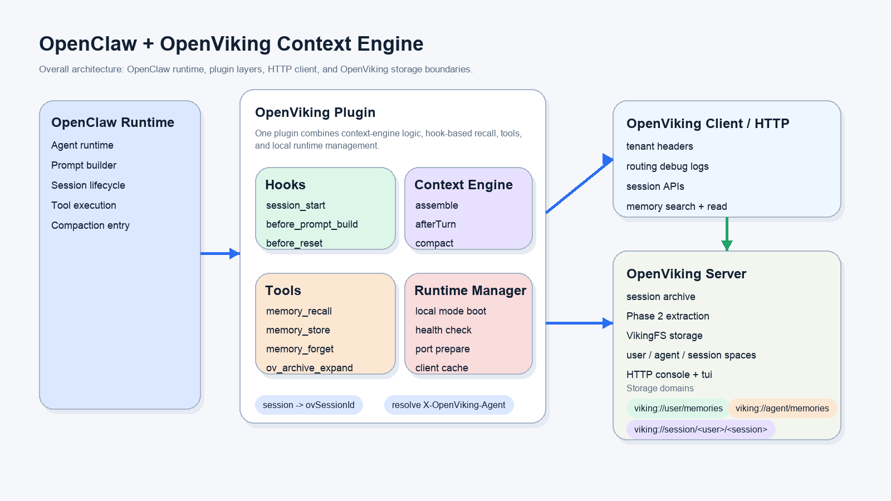
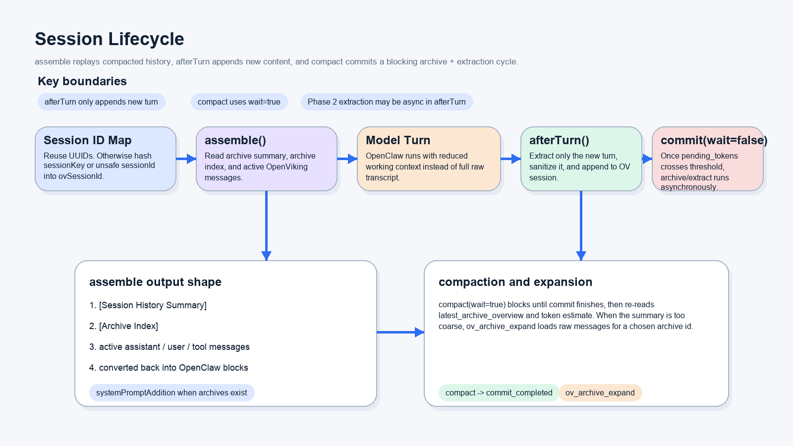
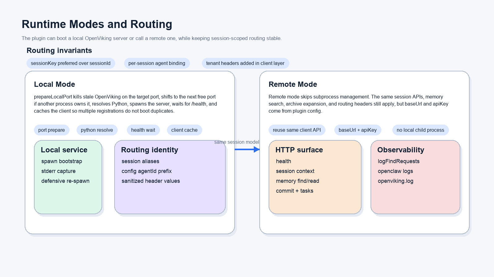

# OpenViking for OpenClaw

将 [OpenViking](https://github.com/volcengine/OpenViking) 作为 OpenClaw 的远程上下文引擎：会话归档、基于阈值或 `/compact` 的记忆抽取、自动召回、resource/skill 检索、召回链路追踪，以及大工具结果的引用式分页读取。

当前实现重点：

- **仅远程模式**：插件是已有 OpenViking 服务的 HTTP 客户端，不会启动本地 OpenViking server 进程。
- **生命周期集成**：`assemble` 重建压缩会话历史并注入相关记忆；`afterTurn` 增量写入本轮消息并按阈值异步 commit；`compact` 执行阻塞 commit 和结果回读。
- **导入与检索**：Agent 可导入 resources 和 Agent Skills，检索它们，并在召回中选择 `resource`、`user`、`agent` 等目标。
- **可调试性**：可选的 recall trace 可通过 `ov_recall_trace` 或 `/ov-recall-trace` 查询；超大工具输出会外置存储，并可按 ref 列表、搜索和读取。

## 快速开始

```bash
openclaw plugins install clawhub:@openviking/openclaw-plugin
openclaw openviking setup --base-url http://my-server:1933 --api-key sk-xxx --json
openclaw gateway restart
openclaw openviking status --json
```

四步完成。`setup` 命令会自动激活 context-engine slot 并验证连接。

常用 setup 变体：

```bash
# 可选 agent 命名空间前缀
openclaw openviking setup --base-url http://my-server:1933 --api-key sk-xxx --peer-prefix openclaw-prod --json

# root/trusted key 部署，需要显式租户身份 header
openclaw openviking setup --base-url http://my-server:1933 --api-key root-xxx --account-id acc_123 --user-id user_456 --json

# 默认只召回 account 级共享知识资源
openclaw openviking setup --base-url http://my-server:1933 --api-key sk-xxx --recall-target-types resource --json
```

### 火山 OpenViking Service 一键接入

如果使用火山控制台托管的 OpenViking Service，可直接注入控制台提供的 server url 和 API Key：

```bash
OPENVIKING_BASE_URL="https://api.vikingdb.cn-beijing.volces.com/openviking" \
OPENVIKING_API_KEY="<your-openviking-service-api-key>" \
OPENVIKING_PEER_PREFIX="openclaw-prod" \
bash scripts/install.sh --json
```

脚本默认从 TOS `prod/latest` 安装插件，并完成 `openviking.env` 写入、`openclaw openviking setup`、Gateway 重启和状态验证。安装脚本依赖 bash，请不要用 `sh` 执行；下载包场景可使用 `bash output/install.sh --source tarball --tarball output/openviking.tgz`。

### 或者直接让 Agent 安装

> 帮我安装 OpenViking 远程记忆插件 @openviking/openclaw-plugin。我的服务器地址是 `http://my-server:1933`，API key 是 `sk-xxx`。

Agent 会自动完成安装 → 配置 → 重启 → 验证。详见 [INSTALL-AGENT.md](./INSTALL-AGENT.md)。

## 工作原理

| 阶段 | 行为 |
|------|------|
| **每轮对话后** (`afterTurn`) | 新消息追加到 OpenViking session；commit/抽取由阈值触发 |
| **明确要求记住** (`memory_store`) | 重要长期事实可立即写入并提交 |
| **`/compact` 时** (`compact`) | 待提交 session 消息被 commit 并抽取为长期记忆 |
| **回复前** (`assemble`) | 自动检索相关记忆并注入上下文 |

## 工具

安装后，插件默认为 Agent 提供以下工具：

| 工具 | 用途 |
|------|------|
| `memory_recall` | 在 `user`、`agent`、`resource` 目标中显式语义召回 |
| `memory_store` | 立即持久化明确的长期事实 |
| `memory_forget` | 按精确 URI 删除记忆，或搜索并删除唯一高置信匹配 |
| `ov_archive_search` | 对当前 session 已归档的原始对话消息做关键词 grep |
| `ov_archive_expand` | 按 archive ID 展开原始消息 |
| `ov_recall_trace` | 查看 auto-recall 和显式 recall/search 记录的召回链路 |
| `add_skill` | 将 `SKILL.md`、skill 目录、原始 skill 内容或 MCP tool dict 导入 `viking://user/skills/...` |
| `ov_search` | 检索已导入的 resources 和 skills |
| `ov_read` | 读取 `ov_search` / trace 返回的 `viking://...` OpenViking 虚拟 URI 完整内容 |
| `ov_multi_read` | 一次读取多个精确 `viking://...` URI，适合同时读取 overview 和同级切片 |
| `ov_list` | 在检索后列出 OpenViking 目录，补查同级切片和 `.overview.md` 文件 |
| `openviking_tool_result_list` | 列出当前 session 中被外置的大工具输出 |
| `openviking_tool_result_search` | 在外置工具输出中按关键词搜索 |
| `openviking_tool_result_read` | 通过 `viking://session/.../tool-results/...` ref 分页读取外置工具输出 |

插件还提供手动 slash command：`/add-resource`、`/add-skill`、`/ov-search`、`/ov-recall-trace`。Agent 可见的 `add_resource` 工具默认禁用（`enableAddResourceTool=false`），避免搜索/检索阶段误触发资源导入；如确实要允许 Agent 导入资源，可显式设置 `enableAddResourceTool=true`，否则使用手动 `/add-resource`。

## 数据流与隐私

- **发送内容**：每轮 user/assistant 消息文本（已剥离注入的记忆块和元数据噪音）。
- **发送去向**：仅发往你配置的 OpenViking 服务（`baseUrl`）。插件本身只与该服务通信；服务端对 embedding、VLM 等模型的调用取决于服务端配置。
- **存储位置**：所有数据存储在你的 OpenViking 服务上，命名空间包括 `viking://user/*`、`viking://session/*`、`viking://resources/*` 等。
- **API Key**：通过 `X-API-Key` header 发送，不会被日志记录或转发。
- **多租户隔离**：支持 `accountId`、`userId`。可选的 `peer_role` / `peer_prefix` 控制是否把 OpenClaw 说话人写入 OpenViking `peer_id`，并在数据面使用 `X-OpenViking-Actor-Peer`。

## 验证

```bash
openclaw openviking status --json     # 一键健康检查
openclaw config get plugins.slots.contextEngine  # 应输出：openviking
```

## 文档

| 文档 | 说明 |
|------|------|
| [INSTALL-ZH.md](./INSTALL-ZH.md) | 完整安装、升级、卸载指南 |
| [INSTALL.md](./INSTALL.md) | English install guide |
| [INSTALL-AGENT.md](./INSTALL-AGENT.md) | Agent 专用操作文档 |
| [docs/openviking-websocket-rpc-api.md](./docs/openviking-websocket-rpc-api.md) | 通过 OpenClaw Gateway WebSocket RPC 调用 OpenViking 工具 |

> **插件 vs Skill**：本页面是 `@openviking/openclaw-plugin`（context-engine 插件）。**不要**使用 `clawhub install openviking`——那安装的是另一个 AgentSkill。

---

<details>
<summary><b>技术细节（面向集成方和工程师）</b></summary>

在 OpenClaw 中，此插件注册为 `openviking` 上下文引擎。

## 设计定位

- OpenClaw 仍然负责 agent runtime、prompt 编排和工具执行。
- OpenViking 负责长期记忆检索、session 归档、archive summary 和记忆抽取。
- `examples/openclaw-plugin` 不是一个单一职责的"记忆查询插件"，而是一组围绕 OpenClaw 生命周期工作的集成层。

按当前代码职责看，插件同时扮演四个角色：

- `context-engine`：实现 `assemble`、`afterTurn`、`compact`
- Hook 层：接管 `session_start`、`session_end`、`before_reset`
- Tool 提供者：注册 memory/archive 工具，以及 OpenViking resource 和 skill 导入工具
- 运行时管理器：连接并监控远程 OpenViking 服务

## 总体架构



上图对应的是当前实现里的整体边界：

- OpenClaw 在左侧，仍然是主运行时；插件并不接管 agent 执行本身。
- 插件中间层把 Hook、Context Engine、Tools、Runtime Manager 四部分合并在一个注册单元里。
- 所有 HTTP 调用最终都走 `OpenVikingClient`，由 client 层统一补 `X-OpenViking-*` 头和路由日志。
- OpenViking 服务端承接 session、memory、archive 和 Phase 2 抽取，底层存储落在 `viking://user/*`（包含 `viking://user/sessions/*`）、`viking://session/*` 和 `viking://resources/*`。

这套拆分的意义，是让 OpenClaw 继续专注推理与编排，让 OpenViking 成为长期上下文的事实源。

## 身份与路由

插件会把 OpenClaw 会话身份保留在 session 和 peer metadata 里；OpenViking 的租户身份仍然是 account/user 级，OpenClaw agent/sender 身份作为 peer 归因和 actor-peer 数据面路由使用。

核心规则如下：

- `sessionId` 是 UUID 时直接复用。
- `sessionKey` 存在时优先用它生成稳定的 `ovSessionId`。
- 非安全路径字符会被规整或退化成稳定的 SHA-256。
- `peer_role=assistant` 是默认值，assistant message 写入 `peer_id=<sessionAgent>`；如果配置了 `peer_prefix`，则写入 `<peer_prefix>_<sessionAgent>`。
- `peer_role=none` 会关闭 peer message 归因和 actor-peer 路由。
- `peer_role=person` 时，user message 使用 OpenClaw sender 身份派生 `peer_id`；assistant message 不写 `peer_id`。
- 数据面的 recall/search/read/import/delete 会在 `peer_role=assistant` 或 `peer_role=person` 时把同一个解析后的 peer 身份作为 `X-OpenViking-Actor-Peer` 发送。
- OpenClaw 没有提供 session agent 时，使用其默认 agent `main` 作为本地 session 和 assistant peer metadata。
- 只有显式配置了 `accountId` / `userId` 时才发送 `X-OpenViking-Account` / `X-OpenViking-User`。

这样做是因为 OpenViking 的租户身份是 account/user 级，OpenClaw agent 身份只作为运行时 metadata 使用。

默认推荐的远程模式配置只有：

- `baseUrl`
- `apiKey`
- 可选 `peer_role`
- `peer_role=assistant` 时可选 `peer_prefix`

其中：

- `apiKey` 推荐使用某个 user 的 user key
- 新安装默认 `peer_role=assistant`
- `accountId` / `userId` 仅在部署需要显式身份 header 时作为高级选项使用，例如 root key 或 trusted server 流程

### User namespace

插件通过 `viking://user/...` 写入和检索 user-scoped memory；OpenViking 会根据请求里的租户身份和 actor peer context 解析这个别名。legacy agent URI namespace 已由 OpenViking 废弃，插件不再使用。

## assemble 召回链路


自动召回现在由 `assemble()` 承接。OpenClaw 会在同一个 context engine 上调用两次 `assemble()`，插件按调用形态区分职责：

1. preflight assemble：调用参数里带 `prompt`，`messages` 还是旧历史；插件从 OpenViking 回读 archive/session context 并重建历史。
2. transformContext assemble：调用参数里不带 `prompt`，最后一条 `messages` 已经是本轮 user；插件只做长期记忆召回，并把记忆块 prepend 到这条 user message 的 content 开头。

召回阶段会：

1. 从最后一条 user message 提取查询文本。
2. 基于当前 `sessionId/sessionKey` 解析本轮的 agent 路由。
3. 先做一次快速可用性检查，避免在 OpenViking 不可用时拖慢模型请求。
4. 检索配置的 `recallTargetTypes`（默认 `user,agent`；可选 `resource`；session 历史请使用 `ov_archive_search` 和 `ov_archive_expand`）。
5. 在插件侧做去重、阈值筛选、重排和 token budget 裁剪。
6. 把最终记忆块以 `<relevant-memories>` 形式 prepend 到当前 user message；不会追加独立 synthetic user message。

这里的重排不是单纯依赖向量分数。当前实现还会额外考虑：

- 是否是 `level == 2` 的叶子记忆
- 是否属于偏好类记忆
- 是否属于事件类记忆
- 与当前 query 的词面重合度

## Session 生命周期



Session 是这套设计的主轴。当前实现里，它覆盖了"历史组装、增量写入、异步提交、阻塞压缩回读"四个动作。

### `assemble()` 负责什么

preflight 阶段的 `assemble()` 并不是简单地把旧聊天记录塞回来，而是按 token budget 从 OpenViking 回读当前 session context，然后重新组装成 OpenClaw 可消费的消息：

- `latest_archive_overview` 被改写成 `[Session History Summary]`
- `pre_archive_abstracts` 被改写成 `[Archive Index]`
- 当前活跃消息保持 message block 形式回放
- assistant 的 tool part 会被还原成 `toolCall`（输入兼容 `toolUse`/`input`，输出统一规范为 `toolCall`/`arguments`）
- tool output 会被拆成独立的 `toolResult`
- 之后再做一轮 `toolCall/toolResult` 配对修复，降低 transcript 结构不稳定的风险

因此，OpenClaw 拿到的是"压缩后的历史摘要 + archive 索引 + 当前活跃消息"，而不是无限增长的原始 transcript。

### `afterTurn()` 负责什么

`afterTurn()` 的职责更窄，专门处理本轮增量写入：

- 只切出本轮新增消息，不重写整段对话
- 只保留 `user` / `assistant` 相关文本内容
- 会把 `toolCall` / `toolResult` 格式化进 capture 文本
- 会先剥掉注入过的 `<relevant-memories>` 和元数据噪音
- 最终把清洗后的增量内容追加到 OpenViking session

之后插件会读取 session 的 `pending_tokens`。当它达到「模型上下文窗口（`tokenBudget`）× `commitTokenThresholdRatio`」时，会触发一次 `commit(wait=false)`：

- archive 和 Phase 2 记忆抽取在服务端异步继续跑
- 当前 turn 不会因为等待抽取而阻塞
- 如果打开 `logFindRequests`，日志里能看到 task id 和后续抽取结果

这条自动路径是 best-effort，并且依赖 commit。短但重要的事实可能会先停留在 live session 里，直到阈值 commit、`/compact` 或显式存储发生后，才进入长期记忆抽取流程。

### 显式长期记忆写入

当用户明确要求 Agent “记住”“保存”“存一下”某个重要长期事实、偏好、项目或决定时，应优先使用 `memory_store`，而不是等待普通 auto-capture 自然触发。`memory_store` 会把文本写入 OpenViking session 并调用 `commit(wait=true)`，因此是集成侧让重要事实尽快进入长期记忆的可靠路径。

它是 auto-capture 的补充，不是替代：

- auto-capture 继续负责普通对话流，并通过批处理平衡成本和延迟
- `memory_store` 面向明确的长期记忆意图，例如“记住我的主项目是 X”或“保存这个偏好”
- 如果 `memory_store` 已提交但抽取出 0 条记忆，应检查 OpenViking 服务端抽取模型/配置；显式路径已经触发抽取，但 extractor 没有产出记忆

### `compact()` 负责什么

`compact()` 走的是另一条更严格的同步边界：

- 它调用 `commit(wait=true)`，阻塞等待 commit 完成
- 如果有 archive 生成，会再回读 `latest_archive_overview`
- 返回新的 token 估算、latest archive id 和 summary
- 如果摘要不够精确，模型可以再调用 `ov_archive_expand` 读取某个 archive 的原始消息

所以 `afterTurn()` 更像"增量写入 + 条件触发异步提交"，而 `compact()` 才是"明确等待压缩与归档完成"的正式边界。

## 工具层与可展开能力

这套插件除了自动行为，默认直接暴露 12 个工具；当 `enableAddResourceTool=true` 时才额外暴露 opt-in 的 `add_resource` 导入工具。Agent 可见工具可以通过 `enabledTools` 和 `disabledTools` 灵活裁剪：

- `memory_recall`：在 memory/resource 目标上显式语义召回
- `memory_store`：把明确的长期事实写入 OpenViking session 并触发阻塞 commit/抽取
- `memory_forget`：按 URI 删除，或先搜索再删除唯一高置信候选
- `ov_archive_search`：按关键词 grep 已归档的原始对话消息
- `ov_archive_expand`：展开某个 archive 的原始消息
- `ov_recall_trace`：查询 auto-recall 和显式 recall/search 调用的召回链路记录
- `add_skill`：导入或注册 OpenViking agent skill
- `ov_search`：检索 OpenViking resources 和 skills，尤其用于导入后的确认和消费
- `ov_read`：读取 `ov_search` 或 recall trace 返回的 `viking://...` OpenViking 虚拟 URI 完整内容
- `ov_multi_read`：读取多个精确 `viking://...` URI，适合同时读取 overview 和同级切片
- `ov_list`：在 `ov_search` 命中后列出父目录，用来补齐同级切片、`.overview.md` 和同源文档上下文
- `openviking_tool_result_list`：列出当前 session 中被外置的大工具输出
- `openviking_tool_result_search`：在外置工具输出中按关键词搜索
- `openviking_tool_result_read`：通过 ref 和 offset/limit 分页读取外置工具输出

工具选择器支持精确工具名，也支持分组：`default`、`all`、`memory`、`resource_query`、`import`、`recall_trace`、`archive`、`tool_result`。例如，禁用记忆并只保留资源查询工具：

```json
{
  "autoCapture": false,
  "autoRecall": false,
  "enabledTools": ["resource_query"]
}
```

如果希望保留默认工具集但移除记忆相关操作，可设置 `"disabledTools": ["memory"]`。`add_resource` 仍然是双重 opt-in：必须同时被 `enabledTools` 选中并设置 `enableAddResourceTool=true` 才会注册。

它们各自的作用不同：

- 自动 recall 解决"模型不知道该先查什么"的默认场景。
- `memory_recall` 给模型一个显式补查入口。
- `memory_store` 适合在用户表达长期记忆意图时，把明确的重要信息立刻落入记忆管线。
- `ov_archive_search` 和 `ov_archive_expand` 负责在 summary 不够细时回到 archive 级原文。
- `ov_recall_trace` 用来解释某次召回/检索为什么命中或没有命中某些内容。
- 手动 `/add-resource` 用于把文档、目录、URL 或 Git 仓库导入为 resource；Agent 可见的 `add_resource` 是 opt-in 工具，不能在搜索、检索、URI 读取或搜索结果优化阶段使用。
- `add_skill` 把 skill 导入 OpenViking。
- `ov_search` 补齐导入后的确认闭环；它返回的 `viking://...` 是 OpenViking 虚拟 URI，不是本地文件路径。
- `ov_read` 通过 OpenViking `/api/v1/content/read` 消费精确的 `viking://...` 命中 URI，避免模型把虚拟 URI 当成本地文件路径读取。
- `ov_multi_read` 能一次读取 overview 和多个同级切片，适合拆分文档需要补上下文的场景。
- `ov_list` 补齐 `ov_search` 的结构浏览能力，避免只拿到某个切片时遗漏同一目录下的连续步骤。
- `openviking_tool_result_*` 避免超大外部工具输出撑爆上下文，同时保留完整内容的可恢复能力。

其中 `ov_archive_expand` 是 `assemble()` 的重要补充，因为 `assemble()` 默认给的是压缩后的索引和摘要，而不是完整历史正文。

### Resource 与 Skill 导入

Resource 和 skill 保持两个入口，因为它们落在不同 OpenViking 命名空间，并使用不同服务端 API：

- resource 走 `/api/v1/resources`，落到 `viking://resources/...`
- skill 走 `/api/v1/skills`，落到 `viking://user/skills/...`

插件也提供显式 slash command，方便手动导入：

```text
/add-resource ./README.md --to viking://resources/openviking-readme --wait
/add-skill ./skills/install-openviking-memory --wait
/ov-search "OpenViking install" --uri viking://resources/openviking-readme
/ov-search "memory install skill" --uri viking://user/skills
/ov-recall-trace --turn latest --include-content
```

Resource 导入支持远程 URL、Git URL、本地文件、本地目录和 zip。OpenViking 内置 parser 覆盖常见文档和媒体类型，例如 Markdown、纯文本、PDF、HTML、Word、PowerPoint、Excel、EPUB、图片、音频和视频。目录导入还支持常见代码、文档和配置扩展名，例如 `.py`、`.js`、`.ts`、`.go`、`.rs`、`.java`、`.cpp`、`.json`、`.yaml`、`.toml`、`.csv`、`.rst`、`.proto`、`.tf`、`.vue`。

出于 HTTP 安全边界，插件不会把本地文件系统路径直接发送给 OpenViking 服务端。本地文件和目录会先通过 `/api/v1/resources/temp_upload` 上传；目录会先在本地使用纯 JavaScript zip 实现打包后再上传。

### Recall Trace 与工具结果引用

Recall trace 默认关闭。可通过插件配置 `traceRecall`、`traceRecallPersist`、`traceRecallDir` 等开启，然后使用 `ov_recall_trace` 或 `/ov-recall-trace` 查询。持久化 trace 默认写入 `~/.openclaw/openviking/recall-traces`，并可通过保留天数和查询上限控制扫描范围。

当 OpenViking 将超大工具输出外置时，可见 preview 会包含 `viking://session/<session_id>/tool-results/<tool_result_id>` 引用。使用 `openviking_tool_result_list` 发现 ref，使用 `openviking_tool_result_search` 定位片段，再使用 `openviking_tool_result_read` 结合 `offset`/`limit` 读取原始内容。

## 运行模式



插件仅以远程模式运行，作为纯 HTTP 客户端：

- `baseUrl` 和可选 `apiKey` 由插件配置提供
- 不会启动或管理本地子进程
- session context、memory search/read、commit、archive expand 这些行为保持不变

OpenViking 服务需要独立部署并运行，插件才能连接到它。

## 与旧设计稿的关系

仓库里还有一份更偏"未来演进方向"的设计稿：`docs/design/openclaw-context-engine-refactor.md`。阅读时需要区分两者的口径：

- 本文描述的是当前实现已经落地的行为。
- 旧设计稿讨论的是"进一步把更多主链路迁入 context-engine 生命周期"的目标态。
- 当前版本里，自动 recall 的主入口已经迁到 `assemble()`：preflight 重建历史，transformContext 注入长期记忆。
- 当前版本里，`afterTurn()` 已经负责增量写入 OpenViking session，但它仍然依赖阈值触发异步 commit。
- 当前版本里，`compact()` 已经走 `commit(wait=true)`，但它的职责仍以"同步提交 + 结果回读"为主，而不是承载一切上层编排。

这段区分很重要，否则很容易把未来设计误读成现状。

## 运维与调试入口

如果你要排查这套插件，优先看这几类入口：

### 查看当前配置

```bash
openclaw openviking status --json
openclaw plugins list
openclaw config get plugins.entries.openviking.config
openclaw config get plugins.slots.contextEngine
```

### 看日志

OpenClaw 插件侧日志：

```bash
openclaw logs --follow
```

OpenViking 服务侧日志：

```bash
cat ~/.openviking/data/log/openviking.log
```

### Web Console

```bash
python -m openviking.console.bootstrap --host 0.0.0.0 --port 8020 --openviking-url http://127.0.0.1:1933
```

### `ov tui`

```bash
ov tui
```

### 常见排查点

| 现象 | 更可能的原因 | 优先检查 |
| --- | --- | --- |
| `plugins.slots.contextEngine` 不是 `openviking` | 插件槽位未设置或被其他插件覆盖 | `openclaw config get plugins.slots.contextEngine` |
| 无法连接 OpenViking 服务 | `baseUrl` 配置错误或服务未启动 | 检查 `baseUrl` 配置并手动测试连接 |
| recall 在不同 session 间不稳定 | 路由身份和预期不一致 | 打开 `logFindRequests`，再看 `openclaw logs --follow` |
| 长对话后没有持续抽取记忆 | `pending_tokens` 未过阈值，或服务端 Phase 2 失败 | 检查插件配置和 `~/.openviking/data/log/openviking.log` |
| summary 太粗，不够回答细节问题 | 你要的是 archive 级明细，不是摘要 | 用 `[Archive Index]` 里的 ID 调用 `ov_archive_expand` |

---

安装、升级、卸载请查看 [INSTALL-ZH.md](./INSTALL-ZH.md)。

</details>
