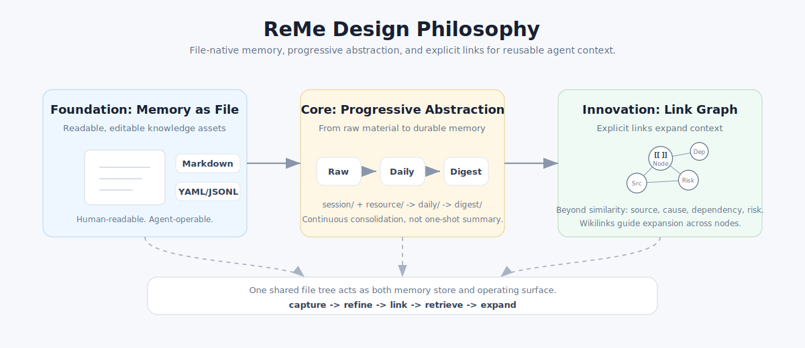
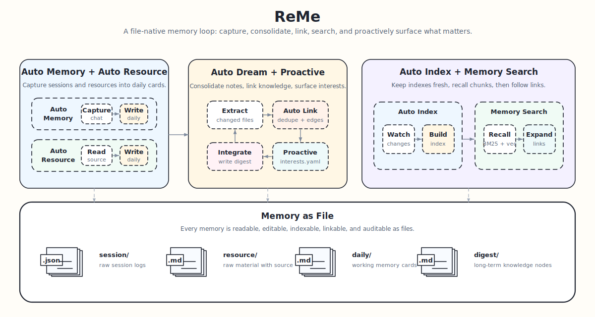

<p align="center">
 
</p>

<p align="center">
  <a href="https://pypi.org/project/reme-ai/"></a>
  <a href="https://pypi.org/project/reme-ai/"></a>
  <a href="https://pepy.tech/project/reme-ai/"></a>
  <a href="https://github.com/agentscope-ai/ReMe"></a>
  <a href="./LICENSE"></a>
  <a href="./README.md"></a>
  <a href="./README_ZH.md"></a>
  <a href="https://github.com/agentscope-ai/ReMe"></a>
  <a href="https://deepwiki.com/agentscope-ai/ReMe"></a>
</p>

<p align="center">
<a href="https://trendshift.io/repositories/20528" target="_blank"></a>
</p>

<p align="center">
  <strong>A memory management toolkit for AI agents — Remember Me, Refine Me.</strong><br>
</p>

> 历史版本：[0.3.x](https://github.com/agentscope-ai/ReMe/tree/reme_v3) ·
> [0.2.x](https://github.com/agentscope-ai/ReMe/tree/v0.2.0.6) ·
> [MemoryScope](https://github.com/agentscope-ai/ReMe/tree/memoryscope_branch)

🧠 ReMe 是一个面向 **AI 智能体** 的记忆管理工具，可将对话和资料沉淀为可读、可编辑、可检索的文件化长期记忆。

## ✨ 核心创新

- **Memory as File**：以带 frontmatter 和 wikilink 的 Markdown 作为记忆节点，让用户和 Agent 都能直接读写。
- **自进化知识库**：通过 Auto Memory、Auto Resource 和 Auto Dream，把对话与资料逐步加工为长期 Markdown 记忆，并自动建立 wikilink 关系。
- **渐进式混合搜索**：融合 wikilink、BM25 和 embedding，支持从关键词匹配到语义召回、关系扩展的混合检索。
- **Agent 友好集成**：通过 SKILL.md + CLI 接入，方便不同 Agent 读写、维护与复用记忆。

<p align="center">
  
</p>

<details>
<summary><b>适用场景</b></summary>

<br>
- **个人助理**：为 [QwenPaw](https://github.com/agentscope-ai/QwenPaw) 等 Agent 提供长期记忆。
- **编程助手**：沉淀代码风格、项目背景和流程经验，跨会话保持一致。
- **知识问答**：把资料和对话渐进加工成可检索、可追溯、可链接的 Markdown 知识库。
- **任务自动化**：复用历史任务中的成功路径、失败教训和操作流程。
</details>

## 🚀 快速开始

### 安装

ReMe 要求 Python 3.11+。

从 pip 安装：

```bash
pip install "reme-ai[core]"
```

从源码安装：

```bash
git clone https://github.com/agentscope-ai/ReMe.git
cd ReMe
pip install -e ".[core]"
```

### 环境变量

配置环境变量：

```bash
cat > .env <<'EOF'
EMBEDDING_API_KEY=sk-xxx
EMBEDDING_BASE_URL=https://dashscope.aliyuncs.com/compatible-mode/v1
LLM_API_KEY=sk-xxx
LLM_BASE_URL=https://dashscope.aliyuncs.com/compatible-mode/v1
EOF
```

### 启动服务

```bash
reme start
```

默认服务地址是 `127.0.0.1:2333`。如果端口被占用，可以指定其他端口：

```bash
reme start service.port=8181
# reme start workspace_dir=/tmp/reme-demo service.port=8181
```

启动后可以检查服务状态；如果使用了自定义端口，请将下面 URL 中的 `2333` 替换为对应端口。

```bash
reme version
curl -s http://127.0.0.1:2333/version -H 'Content-Type: application/json' -d '{}'
```

### 快速接入

ReMe 通过 **SKILL.md + CLI + hook（可选）** 接入支持的 Agent 框架。典型接入方式如下：

- 为 Agent 添加 [memory skill](skills/reme_memory/SKILL.md)，并授予 Agent 调用 CLI 的权限。
- 在 Agent hook 中按需调用 `auto_memory` 和 `proactive`，让对话自动沉淀为 daily 记忆，并在合适时机读取主动提醒。
- `auto_index` 与 `auto_resource` 由文件监控自动触发，负责索引维护和资源加工。
- `auto_dream` 由定时任务触发，将 daily 记忆进一步整理为可长期复用的 digest 记忆。

QwenPaw 2.0 将集成新版 ReMe；后续也会推出 Claude Code plugin，进一步降低手动接入成本。

更多细节见 [快速开始](docs/zh/quick_start.md)。

## 📁 记忆系统

> Memory as File, File as Memory.

ReMe 将**记忆视为文件**，让原始对话和外部资料从 `session/`、`resource/` 渐进加工到 `daily/`，再沉淀为 `digest/`
中可长期复用的知识节点。

### 目录结构

```text
<workspace_dir>/
├── metadata/       # 系统索引、图谱、catalog 等持久状态
├── session/        # 原始对话和 Agent session
│   ├── dialog/
│   │   └── <session_id>.jsonl
│   ├── agentscope/
│   └── claude_code/
├── resource/            # 外部原始材料
│   └── YYYY-MM-DD/
│       └── <resource>.<ext>
├── daily/               # 浅加工记忆：当天事实、对话摘要、资源解读
│   ├── YYYY-MM-DD.md
│   └── YYYY-MM-DD/
│       ├── <session_id>.md
│       ├── <resource_stem>.md
│       └── interests.yaml
└── digest/              # 长期记忆：个人事实、流程经验、知识节点
    ├── personal/
    ├── procedure/
    └── wiki/
```

<p align="center">
  
</p>

### 自动记忆流程

ReMe 的自动记忆流程会把原始对话和资料逐步加工成可检索、可追溯、可长期复用的文件化记忆。常规运行时，后台监听负责维护索引和处理资源，Agent
hook 负责触发对话记忆，长期整理与主动提醒则通过定时任务或按需调用完成。

<details>
<summary><b>查看自动记忆能力表</b></summary>

<br>

| 能力                                          | 运行方式                          | 作用                                                                                                      | 主要参数                                               |
|---------------------------------------------|-------------------------------|---------------------------------------------------------------------------------------------------------|----------------------------------------------------|
| [`auto_index`](docs/zh/memory_search.md)    | 后台维护；对应 `index_update_loop`   | 启动时扫描并持续监听 `daily/`、`digest/`、`resource/` 中的 Markdown/JSONL 变化，更新 chunk、BM25、embedding 与 wikilink 图谱索引。 | 配置项：`watch_dirs`、`watch_suffixes`                  |
| [`auto_memory`](docs/zh/auto_memory.md)     | Agent after-reply hook；也可按需调用 | 保存对话原文，并把有长期价值的信息整理成 `daily/<date>/<session_id>.md` 记忆卡片。                                               | 必填：`messages`；可选：`session_id`、`memory_hint`        |
| [`auto_resource`](docs/zh/auto_resource.md) | 资源监听自动触发；也可按需调用               | 解读 `resource/<date>/` 下的资源变更，生成或更新同名 daily 资源卡片。                                                        | 必填：`changes`；每项可含 `path`、`file_path`、`change`      |
| [`auto_dream`](docs/zh/auto_dream.md)       | 定时任务 `dream_cron`；也可按需调用      | 扫描指定日期的 daily 输入，抽取长期记忆单元并整合进 `digest/`，同时写入 `daily/<date>/interests.yaml`。                             | `date`、`hint`、`topic_count`、`topic_diversity_days` |
| [`proactive`](docs/zh/proactive.md)         | Agent 主动提醒前按需读取               | 读取 `auto_dream` 生成的 `interests.yaml`，将当天值得关注的主题暴露给上层 Agent；是否提醒用户由调用方决定。                                | `date`、`include_content`                           |

</details>

<table>
  <tr>
    <td align="center" width="50%">
      
    </td>
    <td align="center" width="50%">
      
    </td>
  </tr>
  <tr>
    <td align="center" width="50%">
      
    </td>
    <td align="center" width="50%">
      
    </td>
  </tr>
</table>

### Workspace 操作接口

ReMe 通过统一的 CLI / Service Job 接口操作 workspace。Agent 通常只需要使用检索、读取、写入、编辑和自动记忆相关命令；更底层的索引、frontmatter
和文件操作接口主要用于维护、调试或高级集成。

<details>
<summary><b>查看 Workspace 操作接口表</b></summary>

<br>

| 分类    | name                                 | 描述                                                                        | 参数                                                     |
|-------|--------------------------------------|---------------------------------------------------------------------------|--------------------------------------------------------|
| 系统状态  | `version`                            | 返回 ReMe 包版本。                                                              | 无                                                      |
| 系统状态  | `health_check`                       | 返回 ReMe 组件健康检查摘要。                                                         | 无                                                      |
| 系统状态  | `help`                               | 列出已注册 jobs 及其 metadata。                                                   | 无                                                      |
| 检索读取  | [`search`](docs/zh/memory_search.md) | 在 workspace 中执行混合检索，结合向量召回、BM25 和 RRF 融合。                                     | 必填：`query`；可选：`limit`、`min_score`                      |
| 检索读取  | `node_search`                        | 根据候选抽象的名称与描述召回相似 digest 节点，主要用于 `auto_dream` 去重或关联。                       | 必填：`query`；可选：`limit`                                  |
| 检索读取  | `traverse`                           | 从指定路径出发遍历 wikilink 图谱。                                                    | 必填：`path`；可选：`depth`、`direction`                       |
| 检索读取  | `read`                               | 读取 workspace 下的 Markdown 文件。                                                  | 必填：`path`；可选：`start_line`、`end_line`                   |
| 检索读取  | `read_image`                         | 读取 workspace 下的图片文件并返回 base64。                                                | 必填：`path`                                              |
| 索引维护  | `reindex`                            | 清空文件存储索引，并基于现有文件重建索引。                                                     | 配置项：`watch_dirs`、`watch_suffixes`                      |
| Daily | `daily_create`                       | 创建 daily session note：`daily/<date>/<session_id>.md` 或 `daily/<date>.md`。 | `session_id`、`date`                                    |
| Daily | `daily_list`                         | 列出某一天的 notes。                                                             | `date`                                                 |
| Daily | `daily_reindex`                      | 重建 day-index 页面 `daily/<date>.md`。                                        | `date`                                                 |
| 元数据   | `frontmatter_read`                   | 读取文件 frontmatter。                                                         | 必填：`path`                                              |
| 元数据   | `frontmatter_update`                 | 合并 key-values 到文件 frontmatter。                                            | 必填：`path`、`metadata`                                   |
| 元数据   | `frontmatter_delete`                 | 删除文件 frontmatter 中的指定 keys。                                               | 必填：`path`、`keys`                                       |
| 文件操作  | `stat`                               | 获取 workspace 路径状态，包括大小、mtime、是否存在、是否目录或文件。                                    | 必填：`path`                                              |
| 文件操作  | `list`                               | 列出 workspace 路径下的文件。                                                          | `path`、`recursive`、`limit`                             |
| 文件操作  | `write`                              | 创建或覆盖 Markdown 文件，并写入 name/description frontmatter。                       | 必填：`path`、`name`、`description`、`content`；可选：`metadata` |
| 文件操作  | `edit`                               | 对 Markdown 文件执行全文 find-and-replace。                                       | 必填：`path`、`old`、`new`                                  |
| 文件操作  | `move`                               | 移动或重命名 workspace 文件，并默认重写入站 wikilink。                                         | 必填：`src_path`、`dst_path`；可选：`overwrite`、`retarget`     |
| 文件操作  | `delete`                             | 删除 workspace 文件或文件夹，并返回仍存在的入站 wikilink。                                       | 必填：`path`                                              |

</details>

## 🤝 社区与支持

- **问题反馈与需求**：请先查看 [Open Issues](https://github.com/agentscope-ai/ReMe/issues)；如无相关讨论，可新建 Issue
  说明背景、目标行为和影响范围。
- **代码贡献**：改动前建议阅读 [贡献指南](docs/zh/contributing.md) 和 [代码框架](docs/zh/framework.md)，遵循 CLI /
  Service / Application / Job / Step / Component 的分层。
- **文档贡献**：用户可见的安装、配置、调用或行为变化，请同步更新 `docs/zh/` 或 `README.md`。
- **提交规范**：建议使用 Conventional Commits，例如 `feat(search): add link expansion option`、
  `docs(zh): update quick start`。
- **提交前检查**：提交 PR 前请尽量运行 `pre-commit run --all-files` 和 `pytest`；如有依赖 LLM、embedding 或外部服务的测试无法运行，请在
  PR 中说明。
- **获取帮助**：如需反馈 Bug 或功能请求，请使用 [GitHub Issues](https://github.com/agentscope-ai/ReMe/issues)；项目文档见
  [https://reme.agentscope.io/](https://reme.agentscope.io/)。

### 贡献者

感谢所有为 ReMe 做出贡献的朋友们：

<a href="https://github.com/agentscope-ai/ReMe/graphs/contributors">
  
</a>

## 📄 引用

```bibtex
@software{AgentscopeReMe2026,
  title = {AgentscopeReMe: Memory Management Kit for Agents},
  author = {ReMe Team},
  url = {https://reme.agentscope.io},
  year = {2026}
}
```

## ⚖️ 许可证

本项目基于 Apache License 2.0 开源，详情参见 [LICENSE](./LICENSE) 文件。

## 📈 Star 历史

[](https://www.star-history.com/#agentscope-ai/ReMe&Date)
