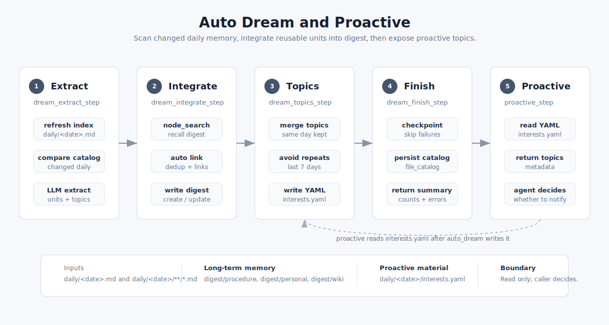

# Auto Dream

`auto_dream` 是 ReMe 的 daily 到 digest 的长期记忆沉淀流程。它扫描指定日期的 daily 输入，只处理相对上次 dream
发生变化的文件，把值得长期保留的内容抽取成 memory units，整合进 `digest/`，再生成当天可供主动提醒使用的 `interests.yaml`。

<p align="center">
  
</p>

它消费的 daily 输入通常来自 [Auto Memory](./auto_memory.md) 和 [Auto Resource](./auto_resource.md)。`digest/`、`derived_from::`
和 wikilink 的文件语义见 [Memory as File](./memory_as_file.md)；Integrate 阶段的链接策略详见 [Auto Link](./auto_link.md)。
`interests.yaml` 的读取接口见 [Proactive](./proactive.md)。

## 配置入口

默认配置在 `reme/config/default.yaml`：

```yaml
auto_dream:
  backend: base
  parameters:
    date:
      type: string
      default: ""
    hint:
      type: string
      default: ""
    topic_count:
      type: integer
      default: 3
    topic_diversity_days:
      type: integer
      default: 7
  steps:
    - backend: dream_extract_step
      file_catalog: dream
      topic_session_id: interests
    - backend: dream_integrate_step
    - backend: dream_topics_step
      topic_count: 3
      topic_diversity_days: 7
    - backend: dream_finish_step
      file_catalog: dream
```

参数含义：

| 参数                     | 作用                                             |
|------------------------|------------------------------------------------|
| `date`                 | 要处理的日期，格式为 `YYYY-MM-DD`。为空时使用应用时区中的今天。         |
| `hint`                 | 调用方给抽取和整合阶段的额外指导。                              |
| `topic_count`          | 最终写入 `interests.yaml` 的 topic 上限，默认 3。         |
| `topic_diversity_days` | 选择 topic 时参考过去多少天的 `interests.yaml` 避免重复，默认 7。 |

## 输入和输出

输入来自指定日期的 daily markdown：

```text
daily/<date>.md
daily/<date>/**/*.md
```

`daily/<date>/interests.yaml` 不作为抽取输入，避免上一轮主动主题反过来污染下一轮抽取。

主要输出有三类：

| 输出                                  | 说明                                  |
|-------------------------------------|-------------------------------------|
| `digest/procedure/*.md`             | 方法、流程、runbook、可执行经验。                |
| `digest/personal/*.md`              | 用户、团队、项目相关的偏好、事实、长期上下文。             |
| `digest/wiki/*.md`                  | 通用知识、概念、观察、决策先例。                    |
| `daily/<date>/interests.yaml`       | 当天值得上层 Agent 主动关注的兴趣主题。             |
| `metadata/file_catalog/dream*` | dream 专用 catalog，用于判断 daily 输入是否变化。 |

## 四个阶段

### 1. Extract

`dream_extract_step` 做三件事：

1. 刷新当天索引页 `daily/<date>.md`。
2. 扫描 `daily/<date>.md` 和 `daily/<date>/**/*.md`，与 `file_catalog: dream` 中记录的 mtime 对比。
3. 只把 changed files 交给 LLM，全局抽取两类结构化结果：`units` 和 `topics`。

`units` 是准备沉淀进 digest 的长期记忆单元，包含 `name`、`bucket`、`summary`、`paths`。`bucket` 只允许 `procedure`、
`personal`、`wiki`；未知值会路由到 `wiki`。

`topics` 是当天主动兴趣候选，包含 `title`、`reason`、`evidence`、`keywords`、`paths`，后续由 Topics 阶段再筛选。

如果没有 changed files，流程会提前成功结束后续抽取工作；如果有变化但没有配置 LLM，Extract 会失败，因为抽取依赖 LLM。

### 2. Integrate

`dream_integrate_step` 对每个 unit 独立调用 Agent，将一个 unit 整合成一个 digest 节点。它会给 Agent 暴露这些工具：

```text
node_search, read, frontmatter_read, write, edit, frontmatter_update
```

这一阶段承担 `auto_link` 的核心职责：先用 `node_search` 在 digest 节点级召回相似或相关节点，再判断是新建还是更新，最后把来源和相关
digest 节点写成 wikilink。具体召回、去重和写边规则见 [Auto Link](./auto_link.md)。

整合动作只有四种：

| 动作            | 含义                      |
|---------------|-------------------------|
| `CREATE`      | 没有相同抽象，创建新的 digest 节点。  |
| `CORROBORATE` | 同一记忆再次出现，追加来源或强化表述。     |
| `REFINE`      | 新材料补充了边界、步骤、前提、适用范围或细节。 |
| `CORRECT`     | 新材料修正了旧节点的错误、遗漏或冲突。     |

Integrate 成功的 unit 会记录到 `integrate_results`；失败的 unit 会进入 `failed_units`，其来源路径会进入 `failed_paths`。
Finish 阶段不会 checkpoint 失败路径，保证下次还能重试。

### 3. Topics

`dream_topics_step` 将 Extract 阶段产生的 topic candidates 变成当天最终的 `daily/<date>/interests.yaml`。

它会读取：

```text
daily/<date>/interests.yaml
daily/<previous-date>/interests.yaml
```

同一天已有 topics 会被保留，最近 `topic_diversity_days` 天出现过的相似主题会被去重。默认最多写 3 个 topic。配置了 LLM 时会让
LLM 选择更具体、可行动、非重复的主题；没有 LLM 时会退化成本地规范化去重。

写入格式示例。读取这个文件的接口见 [Proactive](./proactive.md)：

```yaml
date: 2026-06-20
topic_count: 3
diversity_days: 7
topics:
  - title: 记忆检索链路的质量回归
    reason: 用户近期持续修改 search、node_search 和 dream 集成链路。
    evidence: daily/2026-06-20/session.md
    keywords:
      - memory search
      - auto dream
    paths:
      - daily/2026-06-20/session.md
```

### 4. Finish

`dream_finish_step` 负责收尾：

1. 将成功处理的 changed paths 写入 `file_catalog: dream`。
2. 将 `daily/<date>/interests.yaml` 和 `daily/<date>.md` 也写入 catalog。
3. 如果有 upsert 或 delete，持久化 dream catalog。
4. 返回包含 scanned、changed、integrated、topics、checkpoint 等计数的摘要。

失败路径不会被 checkpoint。这样下一次 `auto_dream` 仍会把它们视作 changed input，直到整合成功。

## 运行方式

CLI：

```bash
reme auto_dream date=2026-06-20
```

带调用提示：

```bash
reme auto_dream date=2026-06-20 hint="优先沉淀工程决策和长期偏好"
```

也可以在配置中把同一组 step 放进 `cron` job，例如每天凌晨运行：

```yaml
jobs:
  daily_auto_dream:
    backend: cron
    cron: "30 3 * * *"
    steps:
      - backend: dream_extract_step
        file_catalog: dream
      - backend: dream_integrate_step
      - backend: dream_topics_step
      - backend: dream_finish_step
        file_catalog: dream
```

## 关键边界

`auto_dream` 只消费 daily 输入，不改写 daily 正文。daily 是事实和现场记录，digest 才是抽象后的长期记忆层。

`digest` 不是原文复制。正文应保留可复用抽象，细节通过 `derived_from:: [[daily/<date>/...]]` 指回来源。链接写法遵循
[Memory as File](./memory_as_file.md) 中的 workspace-relative wikilink 语义。

`auto_dream` 不凭空生成总览。只有 daily 输入中确实出现、并被抽取为 unit 或 topic 的内容，才会进入 digest 或
`interests.yaml`。

完整流程依赖 LLM 完成 Extract 和 Integrate。Topics 可以在没有 LLM 时做本地去重，但这不等于完整 dream 能离线运行。
