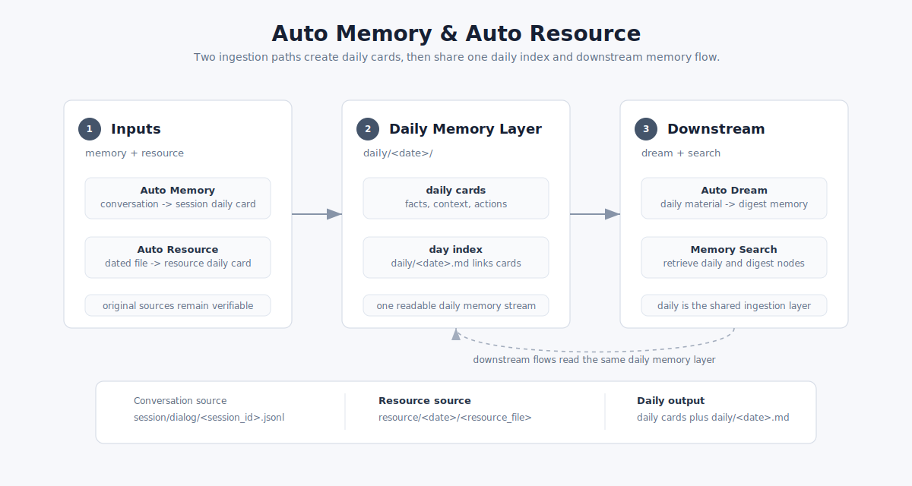

# Auto Resource `Beta`

Auto Resource 是 ReMe 的资源解读入口，目前处于 **Beta**。资源文件先按日期进入 `resource/`，再被解读成同名 daily
资源卡片，最后由当天的 `YYYY-MM-DD.md` 统一索引。

<p align="center">
  
</p>

关于 workspace 分层、`resource/` 和 `daily/` 的通用文件语义，见 [Memory as File](./memory_as_file.md)。对话进入 daily 的流程见
[Auto Memory](./auto_memory.md)。

```text
resource/YYYY-MM-DD/<resource_file>
  ├─ step 1: daily/YYYY-MM-DD/<resource_name>.md  # 资源解读卡片
  ├─ step 2: daily/YYYY-MM-DD.md                  # 当天索引再串起来
  └─ source: resource/YYYY-MM-DD/<resource_file>  # 原始资源保留原位
```

## 它记录什么

它不只是搬运文件内容，而是把资料里以后方便检索和理解的信息提炼出来：

- 核心内容：这份资料主要讲什么。
- 结构脉络：章节、表格、字段、数据组织方式。
- 关键细节：重要数字、名称、日期、结论。
- 背景用途：这份资料为什么存在，和当前工作有什么关系。
- 可行动项：任务、截止时间、后续跟进。

简单说，它负责把“文件存档”变成“资料可用”。

## 原始资料入口

Auto Resource 以 `resource/` 作为原始资料入口。资源需要按日期放置，这个日期会决定它进入哪一天的 daily 记忆层。

示例目录：

```text
workspace/
  resource/
    2026-06-20/
      market-report.md
      meeting-notes.csv
```

当前 Beta 版本更适合处理文本类资源，例如 `md`、`txt`、`json`、`jsonl`、`csv`、`yaml`、`html`。

## 资源卡片

每个资源文件会生成一张同名 daily 资源卡片。文件名 stem 会成为卡片名：

```text
resource/2026-06-20/market-report.md
        ↓
daily/2026-06-20/market-report.md
```

如果资源文件更新，Auto Resource 会重新解读并更新这张卡片；如果资源文件删除，对应的 daily note 也会被清理。

## 当天索引

资源卡片会进入和 Auto Memory 相同的 daily 记忆层。当天的 `YYYY-MM-DD.md` 会作为索引页，把这些资源卡片组织起来：

```text
daily/
  2026-06-20.md
  2026-06-20/
    market-report.md
    meeting-notes.md
```

以后想回看这一天处理过哪些资料，先看 `YYYY-MM-DD.md`；想看某份资料沉淀了什么，再进入对应的资源卡片。

## 同时保留原始资料

解读后的 daily note 负责“好读”，原始资源负责“可信”。

Auto Resource 不会把原始文件挪走：它仍然留在 `resource/YYYY-MM-DD/`。这样，文本资料会进入 daily 记忆流，原始文件也始终保留在它来时的位置。

## 后续流向

Auto Resource 只生成 daily 层的资源解读。要把资源中的长期知识沉淀进 `digest/`，使用 [Auto Dream](./auto_dream.md)；要检索原始资源、
daily 卡片和 digest 节点，使用 [Memory Search](./memory_search.md)。
