# ReMe 代码框架

## 1. 总览

ReMe 的运行时可以理解为：**配置驱动的 Application 把组件和 Job 装配起来，Service 把可服务的 Job 暴露给 CLI、HTTP 或 MCP，Job
再按顺序执行 Step**。

<p align="center">
  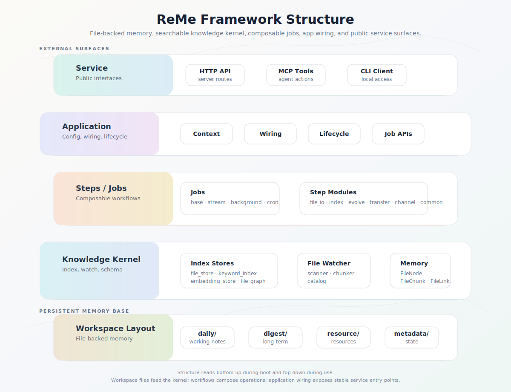
</p>

如果只想先运行和使用 ReMe，见 [快速开始](./quick_start.md)。workspace 文件语义见 [Memory as File](./memory_as_file.md)；检索、
自动记忆和主动读取的用户侧说明分别见 [Memory Search](./memory_search.md)、[Auto Memory](./auto_memory.md)、
[Auto Resource](./auto_resource.md)、[Auto Dream](./auto_dream.md) 和 [Proactive](./proactive.md)。

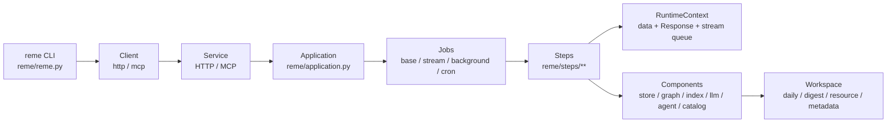

核心分层：

| 层           | 主要目录                       | 职责                                                           |
|-------------|----------------------------|--------------------------------------------------------------|
| CLI         | `reme/reme.py`             | 解析命令；`start` 启动服务；其他 action 通过 client 调用服务                   |
| Service     | `reme/components/service/` | 把 Job 注册成 HTTP endpoint 或 MCP tool                           |
| Application | `reme/application.py`      | 读取配置后的对象装配、依赖拓扑启动、关闭、Job 调用                                  |
| Job         | `reme/components/job/`     | 编排一组 Step；决定同步、流式、后台、定时运行方式                                  |
| Step        | `reme/steps/`              | 业务原子操作，例如读写文件、检索、索引、自进化                                      |
| Component   | `reme/components/`         | 可复用基础设施，例如 file_store、file_graph、keyword_index、agent_wrapper |
| Schema      | `reme/schema/`             | `Request`、`Response`、`FileChunk`、`FileNode`、配置模型等数据结构        |
| Config      | `reme/config/`             | 默认 YAML 配置和命令行覆盖解析                                           |

## 2. 目录结构

```text
reme/
  reme.py                    # CLI 入口
  application.py             # Application 装配与生命周期
  config/
    default.yaml             # 默认 service / jobs / components
    config_parser.py         # config=、dot notation、env 占位符解析
  components/
    component_registry.py    # 全局注册表 R
    base_component.py        # ComponentMixin / BaseComponent / bind 依赖声明
    runtime_context.py       # 单次 Job 执行上下文
    job/                     # BaseJob / StreamJob / BackgroundJob / CronJob
    service/                 # HTTP / MCP 服务
    client/                  # HTTP / MCP 客户端
    file_store/              # 文件索引协调层
    file_graph/              # wikilink 图谱
    keyword_index/           # BM25 等关键词索引
    file_chunker/            # Markdown / 默认文本分块
    file_catalog/            # 变更 checkpoint
    as_llm/, as_embedding/   # 模型封装
    agent_wrapper/           # AgentScope / Claude Code wrapper
  steps/
    base_step.py             # BaseStep、Ref、dispatch_steps
    common/                  # version、help、health_check、demo
    file_io/                 # read/write/edit/delete/move/frontmatter/daily
    index/                   # watch/init/update/search/traverse
    evolve/                  # auto_memory、auto_resource、auto_dream、proactive
    transfer/                # upload/download/ingest
    channel/                 # MCP channel 工具
```

默认 workspace 目录由 `ApplicationConfig` 定义：

```text
<workspace_dir>/
  metadata/     # file_store、file_graph、keyword_index、file_catalog 等持久状态
  session/      # Agent session 与原始对话
  resource/          # 外部资源
  daily/             # 浅加工记忆
  digest/            # 长期 digest 记忆
```

`Application.__init__()` 会先确保这些目录存在，然后初始化 service、components、jobs。

## 3. 启动与调用链

### 3.1 CLI

入口是 `reme/reme.py::main()`：

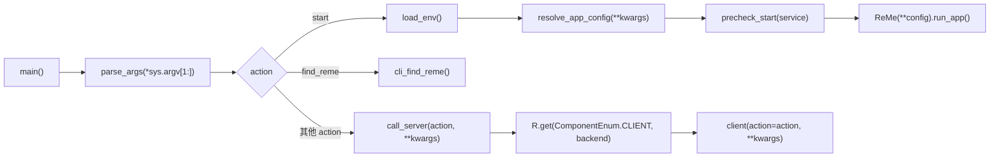

常用命令：

```bash
reme start
reme start service.port=8181
reme version
reme search query="memory" limit=5
reme search query="memory" backend=mcp
```

配置解析支持：

| 能力           | 源码                      | 说明                                          |
|--------------|-------------------------|---------------------------------------------|
| 默认配置         | `resolve_app_config()`  | 未指定 `config` 时加载 `reme/config/default.yaml` |
| 指定配置         | `config=<name-or-path>` | 可传内置配置名或 YAML/JSON 文件路径                     |
| dot notation | `parse_dot_notation()`  | 例如 `service.port=8181`                      |
| 环境变量         | `_expand_env_vars()`    | 支持 `${VAR}` 和 `${VAR:-default}`             |
| 值转换          | `_convert_value()`      | bool、int、float、JSON list/dict/null 会自动转换    |

### 3.2 Service

`BaseService.run_app()` 的顺序：

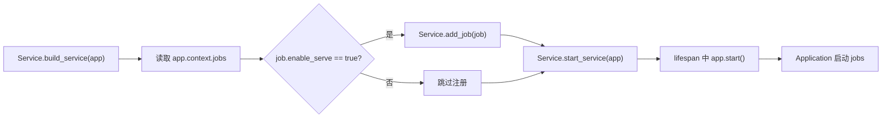

HTTP service 行为：

| Job 类型                               | HTTP 暴露方式                                 |
|--------------------------------------|-------------------------------------------|
| 非 `StreamJob` 且 `enable_serve: true` | `POST /<job.name>`，返回 `Response` JSON     |
| `StreamJob`                          | `POST /<job.name>`，返回 `text/event-stream` |
| `enable_serve: false`                | 不注册 endpoint                              |

MCP service 行为：

| Job 类型                               | MCP 暴露方式                        |
|--------------------------------------|---------------------------------|
| 非 `StreamJob` 且 `enable_serve: true` | 注册为 MCP tool                    |
| `StreamJob`                          | 当前跳过，不注册                        |
| `BackgroundJob`                      | 构造时强制 `enable_serve=False`，不会暴露 |

## 4. Registry 与依赖注入

### 4.1 全局注册表 R

ReMe 使用进程级单例 `R = ComponentRegistry()`。所有组件、Job、Step 都通过 `@R.register("name")` 注册。

```python
from ...components import R


@R.register("version_step")
class VersionStep(BaseStep):
    ...
```

注册表 key 是：

```text
(component_type, register_name) -> class
```

其中 `component_type` 来自类属性，例如：

| 类型        | 类属性                                                       |
|-----------|-----------------------------------------------------------|
| Step      | `BaseStep.component_type = ComponentEnum.STEP`            |
| Job       | `BaseJob.component_type = ComponentEnum.JOB`              |
| Service   | `BaseService.component_type = ComponentEnum.SERVICE`      |
| FileStore | `BaseFileStore.component_type = ComponentEnum.FILE_STORE` |

所以同名 backend 在不同 component type 下可以共存。例如 `http` 同时可以是 service backend 和 client backend。

### 4.2 模块导入触发注册

注册发生在模块 import 时。`reme/components/__init__.py` 会 import 各组件包，`reme/steps/__init__.py` 会 import
`channel/common/evolve/file_io/index/transfer`。这些包的 `__init__.py` 再 import 具体模块，从而执行 `@R.register(...)`。

新增 Step 文件后，必须保证它所在包的 `__init__.py` 会 import 该模块，否则注册表里找不到这个 backend。

### 4.3 Component.bind

组件之间的依赖用 `BaseComponent.bind()` 声明。启动时 `Application._topological_order()` 读取每个组件的 `dependencies`
，按拓扑顺序启动。

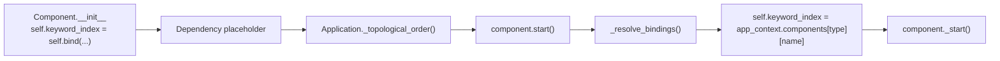

`BaseComponent.bind(name, BaseClass, optional=True)` 的规则：

| 场景                     | 行为                                         |
|------------------------|--------------------------------------------|
| `name` 为空              | 返回 `None`，跳过依赖                             |
| `app_context` 存在       | 从 `app_context.components[ctype][name]` 查找 |
| 依赖缺失且 `optional=True`  | 解析为 `None`                                 |
| 依赖缺失且 `optional=False` | 启动时报错                                      |
| standalone 模式          | 可用 `default_factory` 创建自有组件                |

### 4.4 Step.Ref

Step 不参与组件拓扑启动，它每次 Job 调用时临时创建。Step 访问组件主要靠 `BaseStep.Ref`：

```python
file_store: BaseFileStore = Ref(BaseFileStore, ComponentEnum.FILE_STORE)
agent_wrapper: BaseAgentWrapper = Ref(BaseAgentWrapper, ComponentEnum.AGENT_WRAPPER, optional=True)
```

解析优先级：

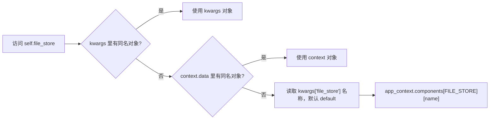

因此在 step 配置里可以写：

```yaml
steps:
  - backend: update_catalog_step
    file_catalog: resource
```

这里 `file_catalog: resource` 表示解析名为 `resource` 的 `file_catalog` 组件。

## 5. Application 生命周期

`Application` 的职责是把配置转换成运行时对象，并按顺序启动和关闭。

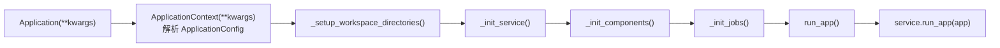

启动顺序在 `Application._start()` 中：


关闭时按 `_started_components` 的反序关闭，保证依赖方先关闭，被依赖方后关闭。

## 6. Job 模型

Job 是外部可调用能力或后台任务的编排单元。配置位置是 `reme/config/default.yaml` 的 `jobs:`。

### 6.1 BaseJob

`BaseJob` 是最常见的请求型 Job：

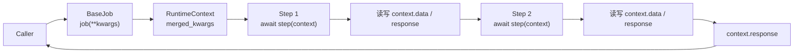

关键源码行为：

| 源码               | 行为                                              |
|------------------|-------------------------------------------------|
| `_start()`       | 把 YAML 中每个 step config 解析成 `(step_cls, params)` |
| `_build_steps()` | 每次调用都创建新的 Step 实例，避免跨请求共享状态                     |
| `__call__()`     | 创建 `RuntimeContext`，按顺序执行 step                  |
| 异常处理             | 捕获异常，`response.success=False`，`answer=str(e)`   |

### 6.2 StreamJob

`StreamJob` 继承 `BaseJob`，但返回流式 chunk：

| 行为      | 说明                                                      |
|---------|---------------------------------------------------------|
| context | 带 `stream_queue`                                        |
| Step 输出 | 调用 `context.add_stream_string(text, ChunkEnum.CONTENT)` |
| 异常      | 写入 `ChunkEnum.ERROR`                                    |
| 结束      | 总是发送 `DONE` chunk                                       |

### 6.3 BackgroundJob

`BackgroundJob` 用于长运行循环，例如文件监听。它在构造时强制 `enable_serve=False`。

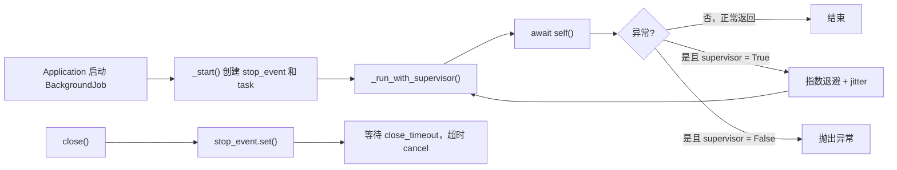

默认 `BackgroundJob.__call__()` 也会按顺序执行配置里的 steps，但异常不会被吞掉，便于 supervisor 重启。

### 6.4 CronJob

`CronJob` 继承 `BackgroundJob`，增加 `cron` 表达式：

```yaml
jobs:
  nightly_dream:
    backend: cron
    cron: "0 3 * * *"
    steps:
      - backend: dream_extract_step
      - backend: dream_integrate_step
      - backend: dream_topics_step
      - backend: dream_finish_step
```

当前实现使用 `croniter` 计算下一次触发时间，时区来自 `app_config.timezone`。

### 6.5 默认 Job 类型分布

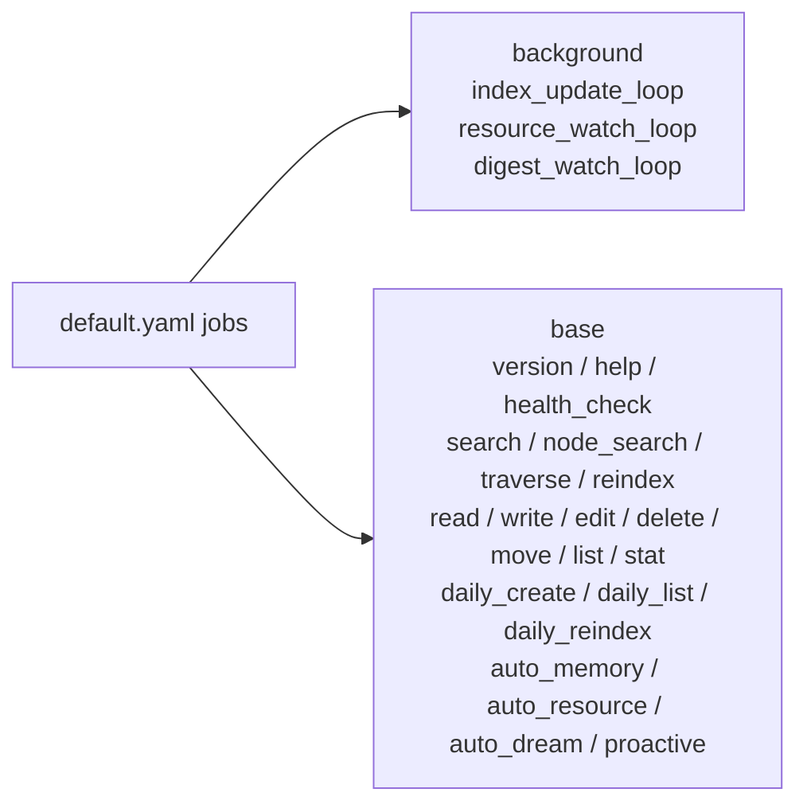

## 7. Step 模型

Step 是具体业务动作。所有 Step 都继承 `BaseStep` 并实现 `execute()`。

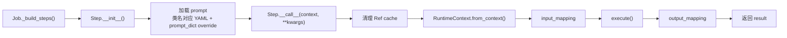

### 7.1 RuntimeContext

`RuntimeContext` 是一次 Job 调用内所有 Step 共享的上下文：

| 字段             | 说明                                          |
|----------------|---------------------------------------------|
| `response`     | 最终返回的 `Response(answer, success, metadata)` |
| `data`         | 自由字典，保存输入参数和中间结果                            |
| `stream_queue` | 流式 Job 的输出队列                                |
| `stop_event`   | 后台 Job 的停止信号                                |

Step 里常见写法：

```python
assert self.context is not None
query = self.context.get("query", "")
self.context["processed_query"] = query.strip().lower()
self.context.response.answer = "..."
self.context.response.metadata["key"] = "value"
return self.context.response
```

### 7.2 input_mapping / output_mapping

`BaseStep.__call__()` 会在执行前后调用 `RuntimeContext.apply_mapping()`：

```yaml
steps:
  - backend: some_step
    input_mapping:
      user_query: query
    output_mapping:
      result: final_result
```

语义是把 `context.data[source]` 复制到 `context.data[target]`。

### 7.3 dispatch_steps

部分 Step 会产生批量事件，然后把事件分发给其他 Step。`BaseStep.dispatch_steps()` 会按配置解析并执行子 Step。

默认配置中的例子：

```yaml
index_update_loop:
  backend: background
  watch_dirs: [ daily_dir, digest_dir ]
  watch_suffixes: [ md ]
  steps:
    - backend: init_changes_step
      monitor_type: file_store
      monitor_name: default
      dispatch_steps: [ update_index_step ]
    - backend: watch_changes_step
      dispatch_steps: [ update_index_step ]
```

流程图：

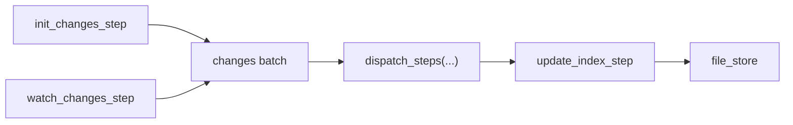

## 8. 默认配置里的组件

`reme/config/default.yaml` 当前默认组件：

| ComponentEnum     | 名称                              | backend                        | 说明                                                   |
|-------------------|---------------------------------|--------------------------------|------------------------------------------------------|
| `service`         | 单例                              | `http`                         | 默认 HTTP 服务                                           |
| `tokenizer`       | `default`                       | `regex`                        | BM25 分词器                                             |
| `as_embedding`    | `default`                       | `${EMBEDDING_BACKEND:-openai}` | embedding 模型封装                                       |
| `embedding_store` | `default`                       | `local`                        | embedding 存储，依赖 `as_embedding: default`              |
| `as_llm`          | `default`                       | `${LLM_BACKEND:-openai}`       | LLM 模型封装                                             |
| `agent_wrapper`   | `default`                       | `agentscope`                   | AgentScope wrapper                                   |
| `agent_wrapper`   | `claude_code`                   | `claude_code`                  | Claude Code wrapper                                  |
| `file_graph`      | `default`                       | `local`                        | wikilink 图谱                                          |
| `file_catalog`    | `default/resource/digest/dream` | `local`                        | 文件变更 checkpoint                                      |
| `file_chunker`    | `markdown`                      | `markdown`                     | Markdown AST 分块                                      |
| `file_chunker`    | `default`                       | `default`                      | 默认文本分块，当前支持 `jsonl`                                  |
| `keyword_index`   | `default`                       | `bm25`                         | BM25 关键词索引                                           |
| `file_store`      | `default`                       | `local`                        | 组合 file_graph、keyword_index；默认 `embedding_store: ""` |

注意：`search` step 的配置含 `vector_weight`，但默认 `file_store.default.embedding_store` 为空，因此实际是否有向量检索取决于运行配置是否启用
embedding store。

## 9. 新增 Step

### 9.1 最小 Step

假设要新增一个把输入文本转大写的 Step。

新建文件，例如 `reme/steps/common/uppercase.py`：

```python
from ..base_step import BaseStep
from ...components import R


@R.register("uppercase_step")
class UppercaseStep(BaseStep):
    async def execute(self):
        assert self.context is not None
        text = self.context.get("text", "")
        result = str(text).upper()

        self.context["uppercase_text"] = result
        self.context.response.answer = result
        self.context.response.metadata["length"] = len(result)
        return self.context.response
```

### 9.2 让 Step 被注册

确认 `reme/steps/common/__init__.py` import 了新模块。新增：

```python
from . import uppercase
```

原因：`@R.register("uppercase_step")` 只有在模块被 import 后才会执行。

### 9.3 访问组件

如果 Step 需要访问已有组件，优先使用 `BaseStep` 已提供的 Ref：

```python
class MySearchStep(BaseStep):
    async def execute(self):
        assert self.context is not None
        results = await self.file_store.keyword_search(
            self.context.get("query", ""),
            limit=5,
        )
        ...
```

可直接用的常见属性：

| 属性                   | 默认解析的组件                      |
|----------------------|------------------------------|
| `self.as_llm`        | `as_llm: default` 的 `.model` |
| `self.agent_wrapper` | `agent_wrapper: default`，可选  |
| `self.file_catalog`  | `file_catalog: default`，可选   |
| `self.file_store`    | `file_store: default`        |

如果希望 Job 配置指定非 default 组件：

```yaml
steps:
  - backend: my_step
    file_catalog: dream
```

### 9.4 Step 设计建议

| 建议                                         | 原因                                         |
|--------------------------------------------|--------------------------------------------|
| 从 `context` 读取输入，向 `context` 写中间结果         | 多 Step Job 依赖同一个上下文传递数据                    |
| 最终结果写到 `context.response`                  | Service 和 client 只关心标准 `Response`          |
| 不在 Step 实例上保存请求级状态                         | 每次 Job 调用会重建 Step，但保持无状态更容易测试              |
| 需要中断的后台循环检查 `context.stop_event`           | `BackgroundJob.close()` 依赖 stop_event 优雅退出 |
| 流式输出只在 StreamJob 中调用 `add_stream_string()` | 普通 Job 没有 stream queue                     |

### 9.5 单测示例

可以直接实例化 Step 并传入 `RuntimeContext`：

```python
import pytest

from reme.components.runtime_context import RuntimeContext
from reme.steps.common.uppercase import UppercaseStep


@pytest.mark.asyncio
async def test_uppercase_step():
    ctx = RuntimeContext(text="hello")
    resp = await UppercaseStep()(ctx)
    assert resp.answer == "HELLO"
    assert ctx["uppercase_text"] == "HELLO"
```

## 10. 新增 Job

Job 通常不需要写 Python 类，只需要在配置里编排已有 Step。只有需要新的运行方式时，才新增 Job backend。

### 10.1 新增普通请求型 Job

在 YAML 配置的 `jobs:` 下新增：

```yaml
jobs:
  uppercase:
    backend: base
    description: "Convert text to uppercase."
    parameters:
      type: object
      properties:
        text:
          type: string
          description: "input text"
      required:
        - text
    steps:
      - backend: uppercase_step
```

启动后调用：

```bash
reme start
reme uppercase text="hello"
```

调用链：


### 10.2 新增多 Step Job

一个 Job 可以串联多个 Step：

```yaml
jobs:
  demo_echo:
    backend: base
    description: "Normalize query, then echo it."
    parameters:
      type: object
      properties:
        query:
          type: string
          default: ""
        min_score:
          type: number
          default: 0.5
    steps:
      - backend: demo_echo_step1
      - backend: demo_echo_step2
```

第一个 Step 写入：

```text
context["processed_query"]
context["adjusted_min_score"]
```

第二个 Step 再读取这些字段并写最终 `response`。

### 10.3 新增 Stream Job

配置使用 `backend: stream`：

```yaml
jobs:
  stream_uppercase:
    backend: stream
    description: "Stream uppercase text."
    parameters:
      type: object
      properties:
        text:
          type: string
      required:
        - text
    steps:
      - backend: uppercase_prepare_step
      - backend: uppercase_stream_step
```

流式 Step 示例：

```python
from ..base_step import BaseStep
from ...components import R
from ...enumeration import ChunkEnum


@R.register("uppercase_stream_step")
class UppercaseStreamStep(BaseStep):
    async def execute(self):
        assert self.context is not None
        for ch in self.context.get("uppercase_text", ""):
            await self.context.add_stream_string(ch, ChunkEnum.CONTENT)
        return self.context.response
```

### 10.4 新增后台 Job

配置使用 `backend: background`：

```yaml
jobs:
  my_watch_loop:
    backend: background
    watch_dirs: [ daily_dir ]
    watch_suffixes: [ md ]
    steps:
      - backend: init_changes_step
        monitor_type: file_store
        monitor_name: default
        dispatch_steps: [ update_index_step ]
      - backend: watch_changes_step
        dispatch_steps: [ update_index_step ]
```

后台 Job 的特点：

| 特点           | 说明                                                 |
|--------------|----------------------------------------------------|
| 不对外暴露        | `BackgroundJob.__init__()` 强制 `enable_serve=False` |
| 有 supervisor | 默认异常后指数退避重启                                        |
| 有 stop_event | close 时通知循环退出                                      |
| 适合监听/消费      | 文件监听、队列消费、周期性长循环                                   |

### 10.5 新增 Cron Job

配置使用 `backend: cron`：

```yaml
jobs:
  daily_auto_dream:
    backend: cron
    cron: "30 3 * * *"
    steps:
      - backend: dream_extract_step
        file_catalog: dream
      - backend: dream_integrate_step
      - backend: dream_topics_step
      - backend: dream_finish_step
        file_catalog: dream
```

`cron` 表达式无效时会在启动时报错。

### 10.6 什么时候需要新增 Job backend

大多数场景只需要新增 Step + YAML Job。只有这些情况才考虑新增 `reme/components/job/*.py`：

| 需求             | 是否需要新 Job 类               |
|----------------|---------------------------|
| 新增一个业务命令       | 否，用 `backend: base`       |
| 串联多个已有步骤       | 否，用 `steps:`              |
| 要 SSE/流式输出     | 否，用 `backend: stream`     |
| 要后台循环          | 否，用 `backend: background` |
| 要 cron 定时      | 否，用 `backend: cron`       |
| 要全新的调度/并发/事务语义 | 是，新增 Job backend          |

新增 Job backend 的最小形态：

```python
from .base_job import BaseJob
from ..component_registry import R


@R.register("my_job_backend")
class MyJob(BaseJob):
    async def __call__(self, **kwargs):
        # 自定义调度逻辑
        return await super().__call__(**kwargs)
```

同样需要确保模块被 `reme/components/job/__init__.py` import。
