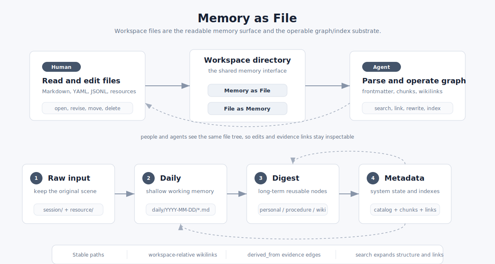

# Memory as File

ReMe 的核心思想是：**Memory as File, File as Memory**。

<p align="center">
  
</p>

**Memory as File**：长期记忆不是藏在黑盒数据库里，而是落在 workspace 目录中的 Markdown 文件、资源文件和索引快照里。用户和 Agent
都可以直接读、写、移动、删除这些文件。

**File as Memory**：每个文件不只是普通文本，也是一个可索引、可链接、可演化的记忆节点。ReMe 会从文件中解析 frontmatter、正文
chunk、wikilink 边，并把它们组织成检索和图谱。

换句话说，文件是人的可读界面，也是 Agent 的操作接口；目录结构负责承载记忆分层，Markdown 语法负责表达内容、元数据和关系。

## 设计目标

ReMe 把记忆设计成文件，不只是为了“方便存储”，而是为了让长期记忆具备几个基本性质：

| 目标       | 含义                                                                   |
|----------|----------------------------------------------------------------------|
| 可读       | 用户可以直接打开 workspace，像读普通笔记一样读 daily、digest 和原始材料。                         |
| 可编辑      | 用户和 Agent 都能用文件操作修正、补充、移动或删除记忆，不必依赖专用数据库客户端。                    |
| 可追溯      | digest 中的长期结论可以通过 `derived_from:: [[...]]` 回到 daily、resource 或 session 原文。 |
| 可迁移      | workspace 是普通目录，Markdown、JSONL、YAML 和资源文件可以被备份、同步、版本管理或迁移到其他工具。          |
| 可索引      | 文件虽然是普通文本，但 ReMe 会解析 frontmatter、chunk、wikilink，构建检索索引和文件图谱。         |
| 可协作      | 人负责判断和修正，Agent 负责整理、链接和检索；二者看到和操作的是同一套文件。                       |

因此，ReMe 的记忆不是“数据库里的一条隐藏记录”，也不是“只给 LLM 看的 prompt 片段”。它首先是用户拥有的文件，其次才被系统索引成可召回的记忆。

## 记忆分层

ReMe 的 workspace 把记忆分成四层：

```text
raw input      -> session/ + resource/
working memory -> daily/
long memory    -> digest/
system state   -> metadata/
```

这四层解决的是不同问题。

`session/` 和 `resource/` 保存原始输入。它们强调“不要丢现场”：对话、Agent session、上传资料、网页或报告先原样留下，作为以后核对的证据。

`daily/` 是浅加工层。它把当天发生的对话和资源整理成更适合阅读的 daily note：什么事情发生了、有哪些结论、留下了哪些后续任务、对应原文在哪里。
daily 不追求最终抽象，它更像当天工作台。

`digest/` 是深加工层。这里保存的是可以长期复用的记忆节点，例如用户偏好、项目背景、流程经验、概念知识、决策先例。digest
不应该只是复制 daily，而应该把多次出现的事实、方法和关系合并成更稳定的表述。

`metadata/` 是系统索引层。它保存 file catalog、chunk 索引、图谱快照等运行状态。用户通常不需要手写这里的内容；真正的人工编辑入口是
`daily/`、`digest/` 和必要时的 `resource/`。

这个分层让 ReMe 可以同时保留“现场”和“抽象”：daily 负责还原当时发生了什么，digest 负责回答以后还能复用什么。

## 目录结构

ReMe 用目录表达记忆组织和记忆分层。原始材料先进入 `resource/` 或 `session/`，再沉淀到 `daily/`，最后由 `auto_dream`
整合到 `digest/`。

对应的自动流程分别是 [Auto Memory](./auto_memory.md)、[Auto Resource](./auto_resource.md) 和 [Auto Dream](./auto_dream.md)。
检索这些文件时使用 [Memory Search](./memory_search.md)。

```text
<workspace_dir>/
├── metadata/                    # 系统索引层；ReMe 索引、图谱、catalog 等持久状态，不作为人工编辑入口
├── session/                     # 原始输入层；原始对话和 Agent session
│   ├── dialog/
│   │   └── <session_id>.jsonl        # auto_memory 保存的对话消息
│   ├── agentscope/
│   │   └── <session_id>.jsonl
│   └── claude_code/
│       └── <session_id>.jsonl
├── resource/                         # 原始输入层；外部原始材料
│   └── YYYY-MM-DD/
│       └── <resource>.<ext>
├── daily/                            # 浅加工层；按日期组织当天事实、对话摘要、资源解读
│   ├── YYYY-MM-DD.md                 # 当天索引页
│   └── YYYY-MM-DD/
│       ├── <session_id>.md           # 对话加工后的 daily note
│       ├── <resource_stem>.md        # 资源加工后的 daily note
│       └── interests.yaml            # auto_dream 产出的主动兴趣主题
└── digest/                           # 深加工层；可长期复用的个人事实、流程经验、知识节点
    ├── personal/
    │   └── <memory>.md               # 用户画像、偏好、长期个人事实
    ├── procedure/
    │   └── <memory>.md               # 流程、方法论、操作经验
    └── wiki/
        └── <memory>.md               # 通用知识、概念、决策先例
```

典型流转如下：

```text
对话
  -> session/dialog/<session_id>.jsonl
  -> daily/YYYY-MM-DD/<session_id>.md
  -> digest/personal | digest/procedure | digest/wiki

外部资料
  -> resource/YYYY-MM-DD/<resource>.<ext>
  -> daily/YYYY-MM-DD/<resource_stem>.md
  -> digest/wiki | digest/procedure
```

前两步偏向记录和整理，最后一步偏向长期沉淀。`auto_memory` 和 `auto_resource` 负责从原始输入生成 daily，`auto_dream`
负责从 daily 抽取并整合 digest。

## Markdown 格式

ReMe 优先使用 Markdown 表达记忆，因为它同时适合人读、Agent 编辑和程序解析。

一个典型记忆文件：

```markdown
---
name: 光伏产业链研究
description: 从硅料到组件的全链条梳理
tags: [新能源, 光伏]
---

# 结论

光伏产业链可以拆成 [[digest/wiki/硅料.md]]、硅片、电池片和组件。

upstream:: [[digest/wiki/硅料.md]]
[company:: [[digest/wiki/隆基绿能.md|隆基]]]
```

### Frontmatter

Frontmatter 是文件开头的 YAML 块，用 `---` 包住：

```markdown
---
name: 文档名
description: 文档描述
source_conversation: [[session/dialog/abc.jsonl]]
---
```

当前代码固定识别 `name` 和 `description`，其他字段会作为额外 metadata 保留。写入接口会把 `name`、`description` 和
`metadata` 合并成 frontmatter。

推荐把 frontmatter 当作“节点级摘要”，把正文当作“证据、解释和关系”。例如：

```markdown
---
name: 用户偏好：文档说明风格
description: 用户偏好直接、工程化、有上下文但不冗长的中文技术说明。
kind: preference
confidence: observed
---

用户多次要求文档补充动机、边界和例子，但避免营销式表述。

derived_from:: [[daily/2026-06-20/session-a.md]]
related:: [[digest/procedure/技术文档写作.md]]
```

这样做有三个好处：

1. `name` 和 `description` 可以在列表、召回结果和 Agent 判断中作为轻量摘要。
2. 正文可以承载更完整的事实、条件、反例和来源。
3. `derived_from::`、`related::` 这类 typed wikilink 可以被图谱解析，后续移动文件时也能被维护。

Frontmatter 适合放稳定、短小、结构化的字段；正文适合放需要人读的解释。不要把大段正文塞进 YAML 字段。

### Wikilink

Wikilink 用 `[[...]]` 表达文件之间的关系：

```text
[[digest/wiki/光伏.md]]
[[digest/wiki/光伏.md#产业链]]
[[digest/wiki/光伏.md|光伏]]
![[resource/2026-06-01/report.md]]
```

ReMe 的 wikilink 是**字面路径语义**：

```text
[[X]]  -> target_path = "X"
```

它不会自动补 `.md`，不会按文件名搜索，也不会自动解析 folder note。推荐写完整的 workspace 相对路径，并带上扩展名。

Wikilink 的作用：

```text
正文链接       -> 建立 FileLink
predicate:: 链接 -> 建立带关系名的 FileLink
move 文件      -> 默认改写入边中的 [[旧路径]]
delete 文件    -> 返回仍存在的入边，提示清理引用
search 命中    -> 可展开出入链，帮助理解上下文
```

支持的关系写法：

```markdown
industry:: [[digest/wiki/新能源.md]]
[competitor:: [[digest/wiki/比亚迪.md]]]
```

解析结果：

```text
FileLink
  source_path = 当前文件
  target_path = digest/wiki/新能源.md
  predicate   = industry
```

### 来源和关系

ReMe 里最重要的两类链接是来源链接和概念关系链接。

来源链接说明“这条长期记忆从哪里来”：

```markdown
derived_from:: [[daily/2026-06-20/session-a.md]]
derived_from:: [[resource/2026-06-20/report.pdf]]
```

概念关系链接说明“这个节点和哪些长期记忆有关”：

```markdown
related:: [[digest/wiki/光伏产业链.md]]
depends_on:: [[digest/procedure/调研报告拆解流程.md]]
contrasts_with:: [[digest/wiki/集中式逆变器.md]]
```

普通正文 wikilink 也会建立图边，但当关系本身有语义价值时，推荐使用 `predicate:: [[path]]`。这能让搜索、图遍历和后续 Agent
整合更容易理解链接含义。

## 人工编辑和 Agent 编辑

因为记忆就是文件，用户可以直接在编辑器里改 workspace；Agent 也可以通过 ReMe 的文件工具读写同一批文件。两者遵守同一套约定：

| 操作     | 建议                                                                 |
|--------|--------------------------------------------------------------------|
| 新增记忆   | 写入合适目录，Markdown 使用 frontmatter，并尽量写完整 workspace-relative wikilink。       |
| 修改正文   | 保留已有来源和关键 wikilink；如果是修正旧结论，在正文里说明新材料如何改变旧判断。                 |
| 移动文件   | 使用 ReMe 的 move 工具时会默认改写入边中的旧路径；手工移动后建议重新检查入链。                  |
| 删除文件   | 删除前检查入链；ReMe 的 delete 会返回仍然指向目标的来源文件，方便清理悬空引用。                 |
| 修改元数据  | 用 frontmatter 表达短字段；正文发生实质变化时同步更新 `description`。                  |

一个实用规则是：**可以让 Agent 重写表达，但不要让它丢掉证据边**。尤其是 digest 节点中的 `derived_from:: [[...]]` 和已有
digest-to-digest wikilink，是长期记忆可追溯和可扩展的基础。

## 路径语义

所有文件工具和 wikilink 都以 workspace-relative path 为基本单位：

```text
digest/wiki/光伏.md
daily/2026-06-20/session-a.md
resource/2026-06-20/report.pdf
```

这带来一个明确边界：ReMe 不把 `[[光伏]]` 当作全库标题搜索，也不假设 Obsidian 式的同名解析。`[[digest/wiki/光伏.md]]`
就是指向这个具体路径。

推荐习惯：

1. 链接 Markdown 文件时带上 `.md`。
2. 从 digest 指向 daily 或 resource 时写完整来源路径。
3. 文件重命名或移动尽量通过 ReMe 的 move 工具完成，避免留下旧路径。
4. 对外部资源使用 `resource/YYYY-MM-DD/...`，对长期抽象使用 `digest/...`，不要把原始资料直接塞进 digest。

这种显式路径语义牺牲了一点手写便利性，但换来的是可预测、可迁移和可自动维护。

## Memory Chunking

Memory chunking 是把一个文件拆成可检索片段的过程。ReMe 不是直接按固定长度切 Markdown，而是尽量保持语义结构。

本节说明文件如何被切成检索 chunk；索引更新、BM25、向量召回和链接展开流程见 [Memory Search](./memory_search.md)。

传统 RAG 常见做法是固定窗口切分：

```text
Document
  |
  | every N tokens + overlap
  v
chunk 1 | chunk 2 | chunk 3 | ...
```

这种方式简单，但容易把标题、表格、代码块、列表和 `[[wikilink]]` 从中间切开。检索命中后，Agent
往往只看到一段孤立文本，不知道它属于哪个章节，也不清楚它和其他记忆节点的关系。

ReMe 的 chunking 更接近“按文件结构切记忆”：

```text
Markdown file
  |
  | frontmatter + headings + blocks + wikilinks
  v
semantic chunks with document skeleton
```

对比：

```text
传统 RAG chunk
  = 固定长度文本片段 + overlap

ReMe memory chunk
  = 章节结构 + 正文片段 + 行号范围 + wikilink 关系上下文
```

Markdown 文件使用 `MarkdownFileChunker`：

```text
Markdown
  |
  | mistletoe AST
  v
Document
  └─ H1 section
      ├─ paragraph / list / table / code
      └─ H2 section
          └─ ...
  |
  v
FileChunk[]
```

分块规则：

```text
1. 先解析 frontmatter，正文单独进入 chunker。
2. 按标题层级构建章节树。
3. 优先让一个完整章节成为一个 chunk。
4. 章节过长时，向下递归拆子章节和正文块。
5. 表格拆分时重复表头。
6. 代码块拆分时重复 fence。
7. 列表按 item 打包。
8. 最后才按行贪心拆分，并添加 [Part X/N]。
```

每个 chunk 默认会带上标题骨架：

```text
# 一级标题

## 当前章节

命中的正文片段

## 后续章节标题
```

这样检索命中时，Agent 不只看到孤立段落，还能看到它在原文件中的结构位置。

非 Markdown 默认走 `DefaultFileChunker`：按字节大小切分，并保留少量 overlap；对 Markdown 则会避免把 `[[wikilink]]` 从中间切开。
