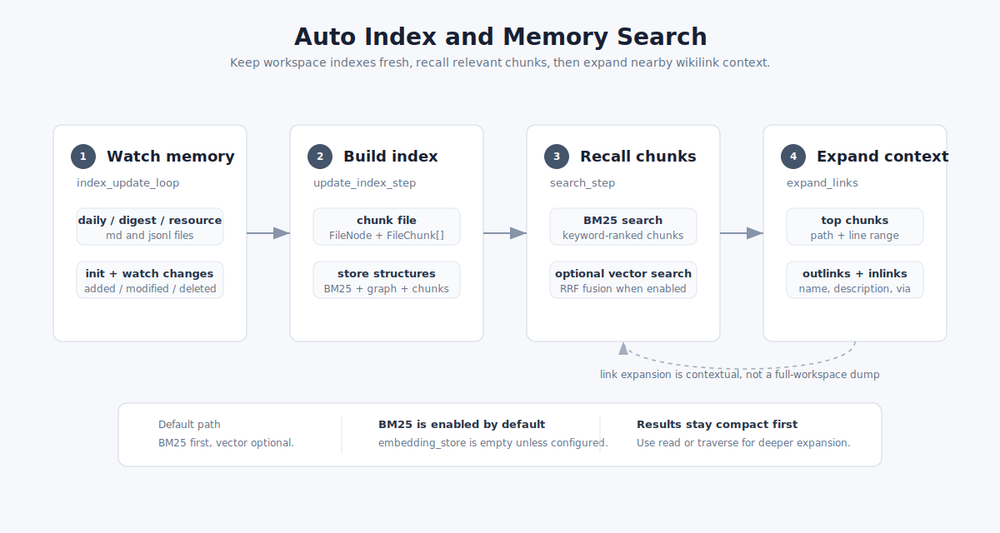
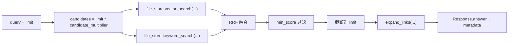

# Memory Search

Memory Search 是 ReMe 的记忆检索入口。它先把 `daily/`、`digest/`、`resource/` 里的文件持续构建成可搜索的 chunk 索引和
wikilink 图谱；查询时先召回最相关的片段，再沿着片段所在文件的双向链接展开上下文。

<p align="center">
  
</p>

文件分层、frontmatter、wikilink 和 chunking 的通用语义见 [Memory as File](./memory_as_file.md)。这里重点说明索引维护和查询执行。

```text
workspace files
  ├─ index_update_loop: 发现 added / modified / deleted
  ├─ update_index_step: 文件 -> FileNode + FileChunk[]
  ├─ file_store: 保存 chunk、BM25、可选 embedding、wikilink graph
  └─ search_step: BM25 / vector 召回 -> RRF 融合 -> link expansion
```

## 它搜索什么

默认配置里的 `index_update_loop` 监听三类记忆目录：

- `daily_dir`：Auto Memory 生成的每日工作记忆和 session 记忆卡片。
- `digest_dir`：长期沉淀后的 digest 节点。
- `resource_dir`：外部资源或导入资料。

默认后缀是 `md` 和 `jsonl`。其中 Markdown 用 `markdown` chunker，能解析 frontmatter、标题结构和 `[[wikilink]]`；`jsonl` 用
`default` chunker，按字节大小做重叠切块。

## 索引怎么构建

索引由后台 Job `index_update_loop` 维护，配置来自 `reme/config/default.yaml`：

```yaml
index_update_loop:
  backend: background
  watch_dirs: [ daily_dir, digest_dir, resource_dir ]
  watch_suffixes: [ md, jsonl ]
  steps:
    - backend: init_changes_step
      monitor_type: file_store
      monitor_name: default
      dispatch_steps: [ update_index_step ]
    - backend: watch_changes_step
      dispatch_steps: [ update_index_step ]
```

启动时先跑 `init_changes_step`。它扫描 watch 目录，把磁盘上的文件 mtime 和 `file_store` 里已有的 `FileNode.st_mtime`
对比，算出新增、修改、删除三类变化，然后把 `context["changes"]` 交给 `update_index_step`。

服务运行期间由 `watch_changes_step` 接手。它用 `watchfiles.awatch()` 监听同一批目录，按 quiet window 聚合文件事件，再用
`coalesce_changes()` 把同一路径上的重复事件压成一批稳定变化。

`update_index_step` 真正写索引：

1. 按后缀选择 file chunker。
2. 把文件解析成一个 `FileNode` 和多个 `FileChunk`。
3. 对新增或修改的文件，先删除旧 chunk，再 upsert 新 chunk。
4. 对删除的文件，从 `file_store`、`keyword_index` 和 `file_graph` 清掉对应记录。
5. 有变化时 dump 到 `metadata/`，让下次启动可以恢复。

Markdown chunker 会解析 YAML frontmatter、标题结构和 `[[...]]`，产出 `FileNode`、`FileChunk` 和 `FileLink`。更细的分块规则见
[Memory as File](./memory_as_file.md#memory-chunking)。

## file_store 里有什么

默认 `file_store.default` 是 `local`：

```yaml
file_store:
  default:
    backend: local
    embedding_store: ""
    keyword_index: default
    file_graph: default
```

它组合三类能力：

| 部件                      | 默认状态 | 作用                                   |
|-------------------------|------|--------------------------------------|
| `file_chunks`           | 启用   | 保存 `FileChunk` 文本、行号、分数、可选 embedding |
| `keyword_index.default` | 启用   | BM25 倒排索引，chunk id 是 doc id          |
| `file_graph.default`    | 启用   | 保存 `FileNode` 和 wikilink 边           |
| `embedding_store`       | 默认关闭 | 开启后为 chunk 生成 embedding，并支持向量召回      |

所以开箱搜索主要是 BM25 + 链接展开。把 `embedding_store: default` 打开后，`SearchStep` 会同时跑向量召回和关键词召回。

## 怎么搜索

`search` Job 也是在 `default.yaml` 中配置：

```yaml
search:
  backend: base
  description: "Hybrid workspace search (vector + BM25, RRF-fused)."
  parameters:
    query: string
    limit: integer
    min_score: number
  steps:
    - backend: search_step
      vector_weight: 0.7
      candidate_multiplier: 3.0
      expand_links: true
      max_links_per_direction: 10
```

调用时：

```bash
reme search query="最近关于索引的讨论" limit=5
```

`search_step` 的执行顺序是：



如果只有 BM25 有结果，就直接返回 BM25 排名；如果只有向量有结果，就直接返回向量排名；两边都有结果时，用 RRF 融合。RRF 不直接比较
BM25 分数和 cosine 分数，而是比较两个列表里的名次：

```text
fused_score = vector_weight / (60 + vector_rank)
            + keyword_weight / (60 + keyword_rank)
```

默认 `vector_weight=0.7`，所以启用 embedding 后语义召回权重更高；关键词仍能把精确词命中的 chunk 拉上来。

## BM25 怎么工作

`keyword_search()` 调用 `keyword_index.retrieve(query, limit)`。BM25 索引里每个 chunk 是一篇文档：

- `doc_id` 是 `FileChunk.id`。
- `content` 是 `FileChunk.text`。
- tokenizer 把文本切成 token。
- 倒排表记录 token 出现在哪些 chunk 里、每个 chunk 的词频是多少。
- 查询时只对 query token 命中的 posting list 打分，再返回分数最高的 chunk id。

当文件被修改时，`LocalFileStore.upsert()` 会先删除该文件旧 `chunk_ids` 对应的 BM25 doc，再添加新 chunk 文本。删除采用 lazy
delete，后续可通过 optimize 压缩索引。

## 渐进式展开怎么看

Memory Search 的“渐进式”不是一次把全库内容塞进结果，而是分三层展开：

1. 第一层是 chunk 召回：只返回最相关的 `limit` 个文本片段。
2. 第二层是文件定位：每个结果带 `path:start_line-end_line`，可以继续用 `read` 精读原文件。
3. 第三层是链接邻居：对命中文件调用 `expand_links()`，展开最多 `max_links_per_direction` 个 outlinks 和 inlinks。

展开的数据来自 `file_graph`，不是重新扫文件：

```text
命中 chunk
  -> chunk.path
  -> file_store.get_outlinks(path)
  -> file_store.get_inlinks(path)
  -> file_store.get_nodes(neighbor_paths)
  -> 渲染邻居的 path、name、description、predicate、anchor
```

这让搜索结果既保持短，又能看到“这条记忆连接到哪些长期节点、资源或其他 daily note”。如果某条结果值得继续追，可以用
`read path=...` 打开原文，或用 `traverse path=... depth=2` 沿 wikilink 图谱继续扩展。

## 返回结果长什么样

`SearchStep` 会把结果写到两个地方：

- `response.answer`：给人看的文本，每个命中块包含路径、行号、分数和 chunk 内容，后面跟 outlinks / inlinks。
- `response.metadata`：给程序看的结构化结果，包括 `results`、`link_expansion`、`counts`。

典型文本结构：

```text
========== daily/2026-06-20/session-a.md:12-28 [score=0.0317 keyword=4.8120] ==========
...命中的记忆片段...
  outlinks (2):
    -> digest/indexing.md  name="Indexing"  description="..."
      via predicate=related
  inlinks (1):
    <- daily/2026-06-19.md  name="..."
      via plain
```

`counts` 会告诉你本次向量、关键词各召回了多少候选，以及最终返回多少条。默认 embedding 关闭时，`vector` 通常是 `0`，`hybrid` 是
`false`。
