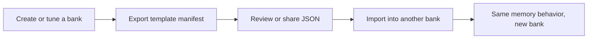

Every team that uses long-term memory eventually runs into the same problem: the first bank gets tuned carefully, then every new bank becomes a manual recreation job. [Hindsight 0.5.0](/blog/2026/04/07/version-0-5-0) adds a fix for that: the *Bank Templates Hub*.

<!-- truncate -->

## TL;DR

- Hindsight 0.5.0 adds a *Bank Templates Hub* for reusable memory bank setup.
- A template is a JSON manifest that captures bank config, mental models, and directives.
- You can browse starter templates at [hindsight.vectorize.io/templates](https://hindsight.vectorize.io/templates), then import them through the API or the Control Plane.
- You can also export an existing bank and reuse that setup elsewhere.
- The important caveat: templates capture *configuration*, not the bank's stored memories.

## The Problem

Most memory systems are easy to start and annoying to standardize.

The first time you configure a bank, you make real decisions. What should `retain_mission` optimize for? Should observations be enabled? Which mental models should refresh after consolidation? What directives make the agent reliably useful?

Those choices matter because they shape what the bank retains, how it summarizes, and what kind of context the agent gets back later.

Without a portable template format, teams usually fall back to one of three bad options:

- recreate the setup manually in the UI
- scatter JSON snippets across internal docs
- hard-code bank configuration into one integration and hope it stays in sync everywhere else

That works for one bank. It gets messy fast when you need the same memory behavior across staging, prod, customer-specific banks, or multiple agent frameworks.

## The Approach

Hindsight 0.5.0 turns bank setup into a reusable artifact.

A bank template is a declarative JSON manifest with three optional sections:

- `bank`, for per-bank config overrides
- `mental_models`, for the models you want created or updated
- `directives`, for instruction-level behavior you want attached to the bank

That means the memory behavior for an agent can now be treated like configuration-as-data, not tribal knowledge.

At a high level, the workflow looks like this:



The new Templates Hub adds a discoverable front end to that workflow. Instead of starting from an empty bank, you can begin with a known-good template and adjust from there.

## Implementation / Walkthrough

### 1. Browse the starter templates

The Templates Hub lives at [hindsight.vectorize.io/templates](https://hindsight.vectorize.io/templates).

In 0.5.0, the gallery ships with three starter templates:

- **Conversation**
- **Coding Agent**
- **Personal Assistant**

The gallery supports:

- category filters
- search by name/description
- integration badges
- manifest preview in a modal
- one-click JSON copy

That matters because templates are only useful if people can inspect them before importing them. The Hub does not hide the configuration behind a wizard. You can see the actual manifest that will be applied to the bank.

A template can be small or opinionated. For example, the built-in Coding Agent template includes a retain mission focused on technical decisions and project structure, plus mental models like `project-context` and `developer-preferences`.

### 2. Import a template with one API call

Once you have a manifest, importing it is straightforward.

Here is a minimal valid example for a coding-oriented bank:

```bash
curl -X POST "$HINDSIGHT_URL/v1/default/banks/project-memory/import" \
  -H "Content-Type: application/json" \
  -d '{
    "version": "1",
    "bank": {
      "retain_mission": "Extract technical decisions and their rationale, architectural choices, coding patterns and conventions, project structure facts, library/tool preferences, and recurring issues. Ignore transient debugging output and boilerplate.",
      "enable_observations": true,
      "observations_mission": "Track stable project facts: tech stack, team conventions, architecture patterns, and how the codebase evolves over time."
    },
    "mental_models": [
      {
        "id": "project-context",
        "name": "Project Context",
        "source_query": "What is the project'\''s tech stack, architecture, and key conventions? What are the main components and how do they fit together?",
        "max_tokens": 2048,
        "trigger": {
          "refresh_after_consolidation": true
        }
      }
    ]
  }'
```

This is the important shift in 0.5.0: configuring a bank no longer requires a sequence of separate setup steps. You can provision the setup as one manifest.

Per the [bank templates API docs](/developer/api/bank-templates), import behavior works like this:

- config fields in `bank` are applied as per-bank overrides
- mental models are matched by `id`
- directives are matched by `name`
- new entries are created, existing ones are updated

That gives you something close to idempotent bank setup, as long as you keep identifiers stable.

### 3. Import from the Control Plane too

If you do not want to call the API directly, the Control Plane also supports templates.

The bank creation dialog now includes an optional *Import from template* toggle, where you can paste the manifest JSON while creating the bank.

This is a good fit when:

- you are testing starter templates interactively
- non-backend teammates need to provision banks
- you want to inspect the manifest first, then create the bank from the UI

The important design choice is that the UI and API use the same manifest model. There is no separate "UI-only template format" to learn.

### 4. Export a working bank and reuse it elsewhere

The other half of the feature is export.

Once you have a bank behaving the way you want, you can export its template and reuse it for another bank:

```bash
curl "$HINDSIGHT_URL/v1/default/banks/source-bank/export" > template.json

curl -X POST "$HINDSIGHT_URL/v1/default/banks/new-bank/import" \
  -H "Content-Type: application/json" \
  -d @template.json
```

The Control Plane also exposes this flow from the bank settings page via *Actions > Export Template*.

This is where Templates Hub becomes operationally useful, not just convenient.

A few concrete use cases:

- stamp the same support-agent memory policy across many customer banks
- move a good staging setup into production without rebuilding it by hand
- ship a recommended bank baseline alongside a framework integration
- share a working manifest between teams without sharing the underlying bank data

### 5. Validate before applying

Hindsight also supports dry-run validation for imports:

```bash
curl -X POST "$HINDSIGHT_URL/v1/default/banks/my-bank/import?dry_run=true" \
  -H "Content-Type: application/json" \
  -d @template.json
```

That matters when templates are being generated or edited programmatically.

There is also a schema endpoint:

```bash
curl "$HINDSIGHT_URL/v1/bank-template-schema"
```

Between `dry_run=true` and the JSON Schema, you have enough structure to build template tooling into CI, admin panels, or integration packages.

## Why the Hub is more useful than copy-paste snippets

The Hub is not just a nicer place to paste JSON.

It adds three things that ad hoc snippets usually lack:

1. **Discoverability.** Teams can start from a real template gallery instead of a blank bank.
2. **Inspectability.** You can preview the exact manifest before applying it.
3. **Portability.** Exported templates can move between banks without dragging along unrelated server defaults.

That last point is subtle and important.

According to the [bank templates docs](/developer/api/bank-templates), export only includes config fields that were explicitly set as per-bank overrides. It does *not* export the fully resolved config that includes server or tenant defaults.

That makes templates more portable. It also means you should think of them as reusable overlays, not byte-for-byte environment snapshots.

## Pitfalls & Edge Cases

### 1. Templates do not move memories

A template copies the bank's setup, not its retained content.

If you export a bank and import it elsewhere, you get the same missions, mental models, and directives. You do *not* get the old bank's facts, observations, or document corpus.

That is usually what you want. If your goal is bank migration, templates are only one part of the story.

### 2. Stable identifiers matter

Mental models are matched by `id`. Directives are matched by `name`.

If you casually rename those values between template versions, Hindsight will treat them as new entries instead of updates. For teams that plan to evolve templates over time, identifier discipline matters.

### 3. Export is intentionally partial

Exported templates only include explicit per-bank overrides. If a bank relies on server-wide defaults, those inherited defaults are *not* serialized into the manifest.

That is good for portability, but it means imports may not be identical across environments unless the underlying defaults are aligned.

### 4. Mental model generation is asynchronous

Import can provision the bank setup immediately, but mental model content generation happens asynchronously.

So if you import a template and query the bank right away, the structural configuration may exist before every generated mental model has fully refreshed.

### 5. A starter template is still a starter template

The built-in templates are good defaults, not universal truth.

A coding agent working on production incident response probably wants different retain behavior from a coding tutor. A personal assistant for one person may need a much tighter mission than a general conversation bot.

Use the Hub to get the first 80 percent right, then tune the bank for the actual workload.

## Tradeoffs & Alternatives

Templates are not the only way to standardize agent memory behavior.

### Manual bank configuration

Good for:

- one-off experiments
- quick local testing
- teams that only manage a handful of banks

Weaknesses:

- easy to drift
- hard to review
- hard to reproduce across environments

### Hard-coding configuration in an integration

Good for:

- opinionated SDK wrappers
- tightly controlled internal platforms

Weaknesses:

- less visible to operators
- harder to export and share
- often tied to one framework's lifecycle

### Bank templates

Good for:

- repeatable setup across many banks
- platform teams that want a standard baseline
- integrations that need a recommended default memory policy
- sharing bank behavior without sharing bank data

Weaknesses:

- still requires identifier discipline
- does not replace data migration
- may need per-environment tuning after import

If you only have one throwaway bank, templates may be overkill. If you have multiple agents, multiple environments, or multiple teams, they become much more compelling.

## Recap

The Bank Templates Hub in Hindsight 0.5.0 solves a real operational problem: memory behavior is too important to rebuild manually every time.

The core idea is simple:

- define bank behavior as a manifest
- browse or export that manifest
- import it anywhere you need the same setup

That turns bank configuration into something portable, reviewable, and reusable.

For teams building agents seriously, that is the difference between "we have one well-tuned bank" and "we have a repeatable memory configuration strategy."

## Next steps

- **Use Hindsight Cloud:** Skip self-hosting with a [free account](https://ui.hindsight.vectorize.io/signup)
- **Browse the starter gallery:** [hindsight.vectorize.io/templates](https://hindsight.vectorize.io/templates)
- **Read the API docs:** [Bank templates reference](/developer/api/bank-templates)
- **See what else is in 0.5.0:** [What's new in Hindsight 0.5.0](/blog/2026/04/07/version-0-5-0)
- **Explore framework integrations:** [Agno](/sdks/integrations/agno), [AutoGen](/sdks/integrations/autogen), [LangGraph](/sdks/integrations/langgraph), [Pydantic AI](/sdks/integrations/pydantic-ai), [CrewAI](/sdks/integrations/crewai)
