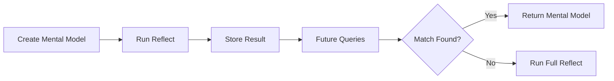

# Mental Models

User-curated summaries that provide high-quality, pre-computed answers for common queries.

{/* Import raw source files */}

## What Are Mental Models?

Mental models are **saved reflect responses** that you curate for your memory bank. When you create a mental model, Hindsight runs a reflect operation with your source query and stores the result. During future reflect calls, these pre-computed summaries are checked first — providing faster, more consistent answers.



### Why Use Mental Models?

| Benefit | Description |
|---------|-------------|
| **Consistency** | Same answer every time for common questions |
| **Speed** | Pre-computed responses are returned instantly |
| **Quality** | Manually curated summaries you've reviewed |
| **Control** | Define exactly how key topics should be answered |

### Hierarchical Retrieval

During reflect, the agent checks sources in priority order:

1. **Mental Models** — User-curated summaries (highest priority)
2. **Observations** — Consolidated knowledge
3. **Raw Facts** — Ground truth memories

Mental models are checked first because they represent your explicitly curated knowledge.

---

## Create a Mental Model

Creating a mental model runs a reflect operation in the background and saves the result:

### Python

```python
# Create a mental model (runs reflect in background)
result = client.create_mental_model(
    bank_id=BANK_ID,
    name="Team Communication Preferences",
    source_query="How does the team prefer to communicate?",
    tags=["team", "communication"]
)

# Returns an operation_id - check operations endpoint for completion
print(f"Operation ID: {result.operation_id}")
```

### Node.js

```javascript
// Create a mental model (runs reflect in background)
const result = await client.createMentalModel(
    BANK_ID,
    'Team Communication Preferences',
    'How does the team prefer to communicate?',
    { tags: ['team', 'communication'] },
);

// Returns an operation_id — check operations endpoint for completion
console.log(`Operation ID: ${result.operation_id}`);
```

### CLI

```bash
# Create a mental model (runs reflect in background)
hindsight mental-model create "$BANK_ID" \
  "Team Communication Preferences" \
  "How does the team prefer to communicate?"
```

### Go

```go
# Section 'create-mental-model' not found in api/mental-models.go
```

### Parameters

| Parameter | Type | Required | Description |
|-----------|------|----------|-------------|
| `name` | string | Yes | Human-readable name for the mental model |
| `source_query` | string | Yes | The query to run to generate content |
| `id` | string | No | Custom ID for the mental model (alphanumeric lowercase with hyphens). Auto-generated if omitted. |
| `tags` | list | No | Tags that scope the model during reflect **and** filter source memories during refresh. Defaults to `all_strict` matching, so only memories carrying every listed tag are read. See [Tags and Visibility](#tags-and-visibility). |
| `max_tokens` | int | No | Maximum tokens for the mental model content |
| `trigger` | object | No | Trigger settings (see [Automatic Refresh](#automatic-refresh)) |

---

## Create with Custom ID

Assign a stable, human-readable ID to a mental model so you can retrieve or update it by name instead of relying on the auto-generated UUID:

### Python

```python
# Create a mental model with a specific custom ID
result_with_id = client.create_mental_model(
    bank_id=BANK_ID,
    name="Communication Policy",
    source_query="What are the team's communication guidelines?",
    id="communication-policy"
)

print(f"Created with custom ID: {result_with_id.operation_id}")
```

### Node.js

```javascript
// Create a mental model with a specific custom ID
const resultWithId = await client.createMentalModel(
    BANK_ID,
    'Communication Policy',
    "What are the team's communication guidelines?",
    { id: 'communication-policy' },
);

console.log(`Created with custom ID: ${resultWithId.operation_id}`);
```

### CLI

```bash
# Create a mental model with a specific custom ID
hindsight mental-model create "$BANK_ID" \
  "Communication Policy" \
  "What are the team's communication guidelines?" \
  --id communication-policy
```

### Go

```go
# Section 'create-mental-model-with-id' not found in api/mental-models.go
```

> **💡 Tip**
> 
Custom IDs must be lowercase alphanumeric and may contain hyphens (e.g. `team-policies`, `q4-status`). If a mental model with that ID already exists, the request is rejected.
---

## Automatic Refresh

Mental models can be configured to **automatically refresh** when observations are updated. This keeps them in sync with the latest knowledge without manual intervention.

### Trigger Settings

| Setting | Type | Default | Description |
|---------|------|---------|-------------|
| `mode` | `"full"` \| `"delta"` | `"full"` | Refresh strategy. See [Refresh Mode](#refresh-mode) below. |
| `refresh_after_consolidation` | bool | false | Automatically refresh after observations consolidation |

When `refresh_after_consolidation` is enabled, the mental model will be re-generated every time the bank's observations are consolidated — ensuring it always reflects the latest synthesized knowledge.

### Refresh Mode

Two strategies are available for how a refresh produces the new content:

- **`full`** *(default)* — every refresh regenerates the entire content from scratch. Simple and predictable: the LLM synthesises a fresh document from the retrieved memories. Best when the document is short, when you want every refresh to potentially restructure the output, or when you're not yet sure what the final shape should be.

- **`delta`** — refresh emits a list of typed *operations* (add a section, append a bullet, replace a block, remove a stale paragraph) against the document's existing structure, then renders the result. Sections that aren't targeted by any operation are copied through **byte-identical** — no paraphrasing, no whitespace drift, no list-style normalisation. Best for long-lived "playbook"–style mental models where you want stability across refreshes and only the genuinely changed parts to move.

Delta mode falls back to a full regeneration automatically in two cases:
1. The mental model has no existing content yet (nothing to anchor edits on).
2. The `source_query` has changed since the last refresh (the topic has shifted; the existing structure may no longer apply).

If the LLM call fails or returns an empty answer, the existing content is preserved — refreshes never overwrite a populated document with an empty one.

| Use Case | Recommended Mode | Why |
|----------|-----------------|-----|
| Skill / playbook docs | `delta` | Sections live for many refreshes; only specific rules change |
| Onboarding summaries | `delta` | Adding new team members shouldn't restructure the doc |
| Real-time dashboards | `full` | Each refresh is a fresh snapshot |
| Short FAQ summaries | `full` | Whole-document regeneration is cheap and unambiguous |

### Python

```python
# Create a mental model with automatic refresh enabled
result = client.create_mental_model(
    bank_id=BANK_ID,
    name="Project Status",
    source_query="What is the current project status?",
    trigger={"refresh_after_consolidation": True}
)

# This mental model will automatically refresh when observations are updated
print(f"Operation ID: {result.operation_id}")
```

### Node.js

```javascript
// Create a mental model with automatic refresh enabled
const result2 = await client.createMentalModel(
    BANK_ID,
    'Project Status',
    'What is the current project status?',
    { trigger: { refreshAfterConsolidation: true } },
);

// This mental model will automatically refresh when observations are updated
console.log(`Operation ID: ${result2.operation_id}`);
```

### CLI

```bash
# Create a mental model and get its ID for subsequent operations
hindsight mental-model create "$BANK_ID" \
  "Project Status" \
  "What is the current project status?"
```

### Go

```go
# Section 'create-mental-model-with-trigger' not found in api/mental-models.go
```

### When to Use Automatic Refresh

| Use Case | Automatic Refresh | Why |
|----------|-------------------|-----|
| **Real-time dashboards** | ✅ Enabled | Status should always be current |
| **Policy summaries** | ❌ Disabled | Policies change infrequently, manual refresh preferred |
| **User preferences** | ✅ Enabled | Preferences evolve with new interactions |
| **FAQ answers** | ❌ Disabled | Answers are curated, should be reviewed before updating |

> **💡 Tip**
> 
Enable automatic refresh for mental models that need to stay current. Disable it for curated content where you want to review changes before they go live.
---

## List Mental Models

### Python

```python
# List all mental models in a bank
mental_models = client.list_mental_models(bank_id=BANK_ID)

for mental_model in mental_models.items:
    print(f"- {mental_model.name}: {mental_model.source_query}")
```

### Node.js

```javascript
// List all mental models in a bank
const mentalModels = await client.listMentalModels(BANK_ID);

for (const mm of mentalModels.items) {
    console.log(`- ${mm.name}: ${mm.source_query}`);
}
```

### CLI

```bash
# List all mental models in a bank
hindsight mental-model list "$BANK_ID"
```

### Go

```go
# Section 'list-mental-models' not found in api/mental-models.go
```

---

## Get a Mental Model

### Python

```python
# Section 'get-mental-model' not found in api/mental-models.py
```

### Node.js

```javascript
// Get a specific mental model
const mentalModel = await client.getMentalModel(BANK_ID, mentalModelId);

console.log(`Name: ${mentalModel.name}`);
console.log(`Content: ${mentalModel.content}`);
console.log(`Last refreshed: ${mentalModel.last_refreshed_at}`);
```

### CLI

```bash
# Section 'get-mental-model' not found in api/mental-models.sh
```

### Go

```go
# Section 'get-mental-model' not found in api/mental-models.go
```

### Detail Levels

Both **List** and **Get** endpoints accept an optional `detail` query parameter that controls how much data is returned. This is useful for reducing response size, especially in agent boot flows or MCP clients where context budget is limited.

| Level | Fields Returned | Use Case |
|-------|----------------|----------|
| `metadata` | `id`, `bank_id`, `name`, `tags`, `last_refreshed_at`, `created_at` | Inventory — "what models exist?" |
| `content` | All metadata fields + `source_query`, `content`, `max_tokens`, `trigger` | Agent boot — "what do the models say?" |
| `full` (default) | All fields including `reflect_response` | Deep inspection — "what evidence backs this model?" |

```bash
# List only names and tags (smallest response)
curl "$BASE_URL/v1/default/banks/$BANK_ID/mental-models?detail=metadata"

# List with content but without provenance chains
curl "$BASE_URL/v1/default/banks/$BANK_ID/mental-models?detail=content"

# Get full detail (default behavior)
curl "$BASE_URL/v1/default/banks/$BANK_ID/mental-models/$MODEL_ID?detail=full"
```

The `detail` parameter is also available in the MCP tools:

```json
{"bank_id": "my-bank", "detail": "metadata"}
```

> **💡 Tip**
> 
Use `detail=content` for agent orientation flows. It includes everything the agent needs to understand the models without the heavyweight `reflect_response` provenance chains, which can exceed 200KB for banks with many models.
### Response Fields

| Field | Type | Detail Level | Description |
|-------|------|-------------|-------------|
| `id` | string | metadata | Unique mental model ID |
| `bank_id` | string | metadata | Memory bank ID |
| `name` | string | metadata | Human-readable name |
| `tags` | list | metadata | Tags for filtering |
| `last_refreshed_at` | string | metadata | When the mental model was last updated |
| `created_at` | string | metadata | When the mental model was created |
| `source_query` | string | content | The query used to generate content |
| `content` | string | content | The generated mental model text |
| `max_tokens` | int | content | Maximum tokens for the mental model content |
| `trigger` | object | content | Trigger settings (see [Automatic Refresh](#automatic-refresh)) |
| `reflect_response` | object | full | Full reflect response including `based_on` provenance facts |

---

## Refresh a Mental Model

Re-run the source query to update the mental model with current knowledge:

### Python

```python
# Section 'refresh-mental-model' not found in api/mental-models.py
```

### Node.js

```javascript
// Refresh a mental model to update with current knowledge
const refreshResult = await client.refreshMentalModel(BANK_ID, mentalModelId);

console.log(`Refresh operation ID: ${refreshResult.operation_id}`);
```

### CLI

```bash
# Section 'refresh-mental-model' not found in api/mental-models.sh
```

### Go

```go
# Section 'refresh-mental-model' not found in api/mental-models.go
```

Refreshing is useful when:
- New memories have been retained that affect the topic
- Observations have been updated
- You want to ensure the mental model reflects current knowledge

---

## Clear a Mental Model

Clear a mental model's content so the next refresh performs a **full re-synthesis** from scratch, regardless of the model's trigger mode.

This is useful for delta-mode models that have accumulated drift over many incremental refreshes. Over time, small inaccuracies can compound as each delta refresh only sees new facts since the last. Clearing and then refreshing produces a clean baseline from all facts.

### Python

```python
# Section 'clear-mental-model' not found in api/mental-models.py
```

### Node.js

```javascript
// Clear a mental model's content, then refresh for a full re-synthesis
await client.clearMentalModel(BANK_ID, mentalModelId);

// Trigger a fresh full rebuild
const fullRefreshResult = await client.refreshMentalModel(BANK_ID, mentalModelId);

console.log(`Full refresh operation ID: ${fullRefreshResult.operation_id}`);
```

### CLI

```bash
# Section 'clear-mental-model' not found in api/mental-models.sh
```

### Go

```go
# Section 'clear-mental-model' not found in api/mental-models.go
```

The clear operation is synchronous and resets the content to an empty string. The model's configuration (name, source query, trigger settings) is preserved. Since the content is now empty, the next `/refresh` call will always perform a full regeneration — even if the model's trigger mode is set to `delta`.

> **💡 Tip**
> 
For long-lived delta-mode mental models, consider scheduling a periodic clear + refresh (e.g. every 48 hours) to keep the content accurate while still benefiting from incremental delta updates in between.
---

## Update a Mental Model

Update the mental model's name:

### Python

```python
# Section 'update-mental-model' not found in api/mental-models.py
```

### Node.js

```javascript
// Update a mental model's metadata
const updated = await client.updateMentalModel(BANK_ID, mentalModelId, {
    name: 'Updated Team Communication Preferences',
    trigger: { refresh_after_consolidation: true },
});

console.log(`Updated name: ${updated.name}`);
```

### CLI

```bash
# Section 'update-mental-model' not found in api/mental-models.sh
```

### Go

```go
# Section 'update-mental-model' not found in api/mental-models.go
```

---

## Delete a Mental Model

### Python

```python
# Section 'delete-mental-model' not found in api/mental-models.py
```

### Node.js

```javascript
// Delete a mental model
await client.deleteMentalModel(BANK_ID, mentalModelId);
```

### CLI

```bash
# Section 'delete-mental-model' not found in api/mental-models.sh
```

### Go

```go
# Section 'delete-mental-model' not found in api/mental-models.go
```

---

## Tags and Visibility

Mental models support the same tag system as memories. When you assign tags to a mental model, those tags control both **which memories it reads** during refresh and **when it is surfaced** during reflect.

### How tags affect mental model refresh

> **⚠️ Warning**
> 
Adding tags to a mental model narrows the pool of source memories its refresh can read from. If no memories carry those tags yet, refresh will return empty content (e.g. `"I cannot find any information…"`) even though direct `reflect` on the same query works. Backfill tags on the relevant memories first, or override the default via `trigger.tags_match` / `trigger.tag_groups`.
When a mental model is refreshed (manually or automatically), it runs an internal reflect call to regenerate its content. If the mental model has tags, that reflect call uses `all_strict` tag matching — meaning it will only read memories that carry **all** of the mental model's tags. Untagged memories are excluded.

```
Mental model tags: ["user:alice"]

During refresh, it reads:
  ✅ "Alice prefers async communication"     — has "user:alice"
  ✅ "Team uses Slack for announcements"      — has "user:alice" (plus other tags)
  ❌ "Company policy: no meetings on Fridays" — untagged, excluded
  ❌ "Bob dislikes long meetings"             — no "user:alice" tag
```

This means a mental model tagged `["user:alice"]` will also pick up memories tagged `["user:alice", "team"]` — extra tags on a memory don't disqualify it. Only the mental model's own tags are required to be present.

### How tags affect mental model lookup during reflect

When you call `reflect` with tags, those same tags are used to filter which mental models the agent can see. A mental model is visible only if its tags overlap with the tags on the reflect request.

For more details on tag matching modes (`any`, `any_strict`, `all`, `all_strict`) and worked examples, see the [Recall tags reference](./recall#tags).

### Listing mental model tags

`GET /v1/default/banks/{bank_id}/tags` accepts a `source` query parameter that selects which tag space to enumerate:

- `source=memories` *(default)* — tags attached to memory units.
- `source=mental_models` — tags attached to mental models in this bank.

Use the `mental_models` source to populate autocomplete or filter UIs over mental-model tags, distinct from the (typically larger) memory tag set.

---

## History

Every time a mental model's content changes (via refresh or manual update), the previous version is saved with a timestamp. You can retrieve the full change log with the history endpoint:

### Python

```python
# Section 'get-mental-model-history' not found in api/mental-models.py
```

### Node.js

```javascript
// Get the change history of a mental model
const history = await client.getMentalModelHistory(BANK_ID, mentalModelId);

for (const entry of history) {
    console.log(`Changed at: ${entry.changed_at}`);
    console.log(`Previous content: ${entry.previous_content}`);
}
```

### CLI

```bash
# Section 'get-mental-model-history' not found in api/mental-models.sh
```

### Go

```go
# Section 'get-mental-model-history' not found in api/mental-models.go
```

### Response

The endpoint returns a list of history entries, most recent first:

| Field | Type | Description |
|-------|------|-------------|
| `previous_content` | string \| null | The content before this change (`null` if not available) |
| `changed_at` | string | ISO 8601 timestamp of when the change occurred |

Each entry captures the **content before the change** and when it happened. The current content is returned by the standard [Get a Mental Model](#get-a-mental-model) endpoint.

> **📝 Note**
> 
History tracking is enabled by default. Set `HINDSIGHT_API_ENABLE_MENTAL_MODEL_HISTORY=false` to disable it.
---

## Use Cases

| Use Case | Example |
|----------|---------|
| **FAQ Answers** | Pre-compute answers to common customer questions |
| **Onboarding Summaries** | "What should new team members know?" |
| **Status Reports** | "What's the current project status?" refreshed weekly |
| **Policy Summaries** | "What are our security policies?" |

---

## Next Steps

- [**Reflect**](./reflect) — How the agentic loop uses mental models
- [**Observations**](../observations.md) — How knowledge is consolidated
- [**Operations**](./operations) — Track async mental model creation
