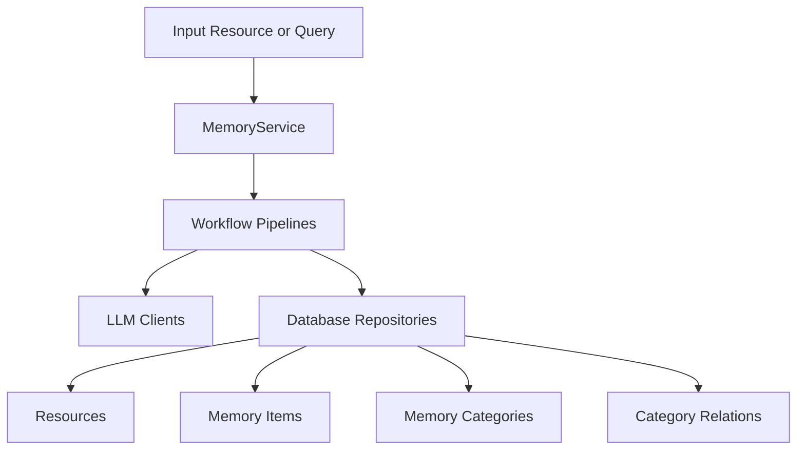

# memU Architecture

## Purpose and scope

This document describes the self-hosted `memu` Python package architecture as implemented in this repository.

The repository also describes a hosted Cloud product in `README.md`, but this document focuses on the local `MemoryService` runtime and its code paths.

## System overview

memU implements structured agent memory with four persistent record types:

- `Resource`: raw source artifacts (conversation/document/image/video/audio)
- `MemoryItem`: extracted atomic memories with embeddings
- `MemoryCategory`: grouped topic summaries
- `CategoryItem`: item-category relation edges

At runtime, `MemoryService` orchestrates ingestion, retrieval, and manual CRUD over these layers.



## Core runtime components

### `MemoryService` as composition root

`src/memu/app/service.py` constructs and owns:

- typed configs (`LLMProfilesConfig`, `DatabaseConfig`, `MemorizeConfig`, `RetrieveConfig`, `UserConfig`)
- storage backend (`build_database(...)`)
- resource filesystem fetcher (`LocalFS`)
- LLM client cache and wrappers
- workflow and LLM interceptor registries
- workflow runner (`local` by default, pluggable)
- named workflow pipelines via `PipelineManager`

Public APIs are assembled by mixins:

- `MemorizeMixin`: `memorize(...)`
- `RetrieveMixin`: `retrieve(...)`
- `CRUDMixin`: list/clear/create/update/delete memory operations

### Workflow engine

All major operations execute as workflows (`WorkflowStep`) with:

- explicit required/produced state keys
- declared capability tags (`llm`, `vector`, `db`, `io`, `vision`)
- per-step config (for profile selection)

`PipelineManager` validates step dependencies at registration/mutation time and supports runtime pipeline revisioning (`config_step`, `insert_before/after`, `replace_step`, `remove_step`).

`WorkflowRunner` is a protocol; default `LocalWorkflowRunner` executes sequentially with `run_steps(...)`.

### Interception and observability hooks

Two interceptor systems exist:

- workflow step interceptors: before/after/on_error around each step
- LLM call interceptors: before/after/on_error around `chat/summarize/vision/embed/transcribe`

LLM wrappers also extract best-effort usage metadata from raw provider responses.

## Ingestion architecture (`memorize`)

`memorize(...)` executes the `memorize` pipeline:

1. `ingest_resource`: fetch local/remote resource into `blob_config.resources_dir` via `LocalFS`
2. `preprocess_multimodal`: modality-specific preprocessing for conversation/document/audio (text-oriented path) and image/video (vision-oriented path)
3. `extract_items`: per-memory-type LLM extraction into structured entries
4. `dedupe_merge`: placeholder stage (currently pass-through)
5. `categorize_items`: persist resource + memory items + item-category relations and embeddings
6. `persist_index`: update category summaries; optionally persist item references
7. `build_response`: return resource(s), items, categories, relations

Category bootstrap is lazy and scoped: categories are initialized when needed with embeddings, and mapped by normalized category name.

## Retrieval architecture (`retrieve`)

`retrieve(...)` chooses one of two pipelines from config:

- `retrieve_rag` (embedding-driven ranking)
- `retrieve_llm` (LLM-driven ranking)

Both use the same staged pattern:

1. route intention + optional query rewrite
2. category recall
3. sufficiency check (optional)
4. item recall
5. sufficiency check (optional)
6. resource recall
7. response build

Key behavior:

- `where` filters are validated against `user_model` fields before querying
- RAG path uses vector similarity (and optional salience ranking for items)
- LLM path ranks IDs from formatted category/item/resource context
- each stage can stop early if sufficiency check decides context is enough

## Data and storage architecture

### Repository contracts

Storage is abstracted through a `Database` protocol with four repositories:

- `ResourceRepo`
- `MemoryItemRepo`
- `MemoryCategoryRepo`
- `CategoryItemRepo`

### Backends

`build_database(...)` selects backend by `database_config.metadata_store.provider`:

- `inmemory`: in-process dict/list state
- `sqlite`: SQLModel persistence, embeddings stored as JSON text, brute-force cosine search
- `postgres`: SQLModel persistence with pgvector support (when enabled), local fallback ranking when needed

For Postgres, startup runs migration bootstrap and attempts `CREATE EXTENSION IF NOT EXISTS vector` in `ddl_mode="create"`.

### Scope model propagation

`UserConfig.model` is merged into record/table models so scope fields (for example `user_id`) become first-class columns/attributes across resources, items, categories, and relations.

This is why `where` filters and `user_data` writes are consistently available across APIs.

## LLM/provider architecture

LLM access is profile-based (`llm_profiles`):

- `default` profile for chat-like tasks
- `embedding` profile for embedding tasks (auto-derived from default if not set)

Per-step profile routing happens through step config (`chat_llm_profile`, `embed_llm_profile`, or `llm_profile`).

Client backends (selected per profile via `client_backend`):

- `sdk`: official OpenAI SDK wrapper
- `anthropic`: official Anthropic/Claude SDK wrapper
- `httpx`: provider-adapted HTTP backend (OpenAI, Claude, Grok, DeepSeek, Kimi, MiniMax, Doubao, OpenRouter — see `memu.llm.backends`)
- `lazyllm_backend`: LazyLLM adapter

### VLM (vision-language) architecture

Image/video understanding uses a dedicated `memu.vlm` package, a sibling of
`memu.llm` mirroring its layout (`backends/`, `*_client.py`, `gateway.py`),
scoped to the multimodal `vision` capability. Only providers whose first-party
API offers native image understanding are included (`memu.vlm.backends`:
OpenAI, Claude, Grok, Kimi, MiniMax, Doubao, OpenRouter); text-only providers
such as DeepSeek are intentionally excluded.

VLM profiles are **derived** from the LLM profiles (`vlm_config_from_llm`): each
VLM client reuses the matching LLM profile's provider, credentials, and
`client_backend`, swapping only the model for that provider's latest VLM
(`memu.vlm.VLM_PROVIDER_DEFAULTS`), falling back to the LLM chat model when the
provider has no known VLM. This makes vision work with zero extra configuration.

During `preprocess_multimodal`, `MemoryService` routes by modality: `image` and
`video` use the VLM client (`_get_vlm_client`, profile from
`memorize_config.vlm_profile`), while `conversation`/`document`/`audio` use the
chat LLM client. VLM clients are cached per profile and wrapped by the same
`LLMClientWrapper`, so interceptors and usage metadata behave identically.

### Embedding (vectorization) architecture

Vectorization uses a dedicated `memu.embedding` package, a sibling of `memu.llm`
and `memu.vlm` mirroring their layout (`backends/`, `*_client.py`/`openai_sdk.py`,
`gateway.py`, `defaults.py`), scoped to the `embed` capability used by vector
search. `memu.embedding.backends` covers OpenAI, Jina, Voyage, Doubao and
OpenRouter; the HTTP client falls back to an OpenAI-compatible backend for any
other provider.

Embedding is **fully decoupled** from the text/chat clients: `OpenAIClient`,
`HTTPLLMClient` and `AnthropicClient` no longer expose `embed()` (the HTTP chat
client also dropped its inline embedding backends). All vectorization — query
embedding, category/item embedding, RAG ranking — flows through
`_get_step_embedding_client` / `_get_embedding_client`, which build dedicated
`memu.embedding` clients. (`LazyLLMClient` remains multi-capability, as it is the
embedding transport for the `lazyllm_backend`.)

Embedding profiles (`EmbeddingConfig`) are **derived** from the LLM profiles
(`embedding_config_from_llm`) by default, reusing each profile's provider,
credentials and transport. The LLM profile's `embed_model`/`embed_batch_size`
remain only as a backward-compat bridge for this derivation; prefer passing an
explicit `embedding_profiles` to `MemoryService` to point vectorization at a
dedicated embedding provider (e.g. `jina`/`voyage`) independently of the chat
provider. Embedding clients are built via `build_embedding_client`
(`client_backend`: `sdk`/`httpx`/`lazyllm_backend`; `anthropic` raises, as Claude
has no embeddings API), cached per profile, and wrapped by the same
`LLMClientWrapper`, so interceptors and usage metadata behave identically.
`_get_step_embedding_client` resolves the profile from step config
(`embed_llm_profile`, default `embedding`).

## Integration surfaces

- `memu.integrations.langgraph`: LangChain/LangGraph tool adapter (`save_memory`, `search_memory`)

## Memory file system export (`memu.memory_fs`)

`MemoryService.export_memory_files(...)` renders the structured store into the
markdown tree described in the README. Every source first becomes a **multimodal
description** (the modality-agnostic caption/text from preprocessing); that
description is the shared trunk. The output splits each root index from a sibling
payload directory:

```txt
<output_dir>/
├── INDEX.md                     ← index of the raw files under resource/
├── MEMORY.md                    ← overview + index of memory/
├── SKILL.md                     ← index of the skills under skill/
├── resource/
│   └── <file_name>              ← one copied raw source file (verbatim bytes)
├── memory/
│   └── <slug>.md                ← one MemoryCategory (description + summary)
└── skill/
    └── <skill_name>/SKILL.md    ← one synthesized skill per folder
```

- `resource/` holds the raw source files copied verbatim out of the blob store
  (`Resource.local_path`); `INDEX.md` indexes them (name, modality, description,
  link), so an agent knows which raw resources exist.
- `memory/<slug>.md` is the living memory split one file per `MemoryCategory`
  (its description + summary); `MEMORY.md` is an overview that links to each one.
- `skill/<name>/SKILL.md` is a reusable skill synthesized from the descriptions
  (a sibling of `MEMORY.md`, never derived from extracted skill-type memory
  items); the root `SKILL.md` indexes the tree.

### Synthesis mode

The `skill/` tree is always synthesized from the per-source descriptions by an LLM
(`memu.memory_fs.MemorySynthesizer`, prompts in `memu.prompts.memory_fs`) — one
pass extracts skills as a JSON array of `{name, body}` objects, each written as its
own `skill/<name>/SKILL.md` doc. It is never derived from extracted skill-type
memory items.

`MEMORY.md` is rendered deterministically by default: an overview that links to the
per-category `memory/<slug>.md` files (themselves deterministic from category
description + summary). When `memory_files_config.synthesize=True`, the `MEMORY.md`
body is instead synthesized from all descriptions in one LLM pass.

`INDEX.md`, the `resource/` copies, and `memory/<slug>.md` stay deterministic in
both modes. Synthesis uses the `synthesis_llm_profile` profile and leaves the
existing memorize/extract pipeline untouched.

### Initialize vs. incremental update

Synthesis is stateful and mirrors the "submit the changed part of the file system"
model. `MemoryService._build_memory_files(where, changed=...)` decides between two
paths:

- **Initialization** (no prior tree on disk, or `changed is None`): scan all
  in-scope sources, turn each into its multimodal description, and synthesize the
  `skill/` tree (and, when `synthesize=True`, the `MEMORY.md` body) from scratch
  (`MemorySynthesizer.synthesize` / `synthesize_skills`).
- **Incremental update** (a tree already exists and a changed set is supplied):
  read the existing skill bodies (and `MEMORY.md` body) back off disk and merge
  only the changed sources' descriptions into them (`MemorySynthesizer.update` /
  `update_skills`, prompts `MEMORY_UPDATE_PROMPT` / `SKILL_UPDATE_PROMPT`). Skills
  are upserted by slug, so untouched skills survive.

`INDEX.md`, `resource/`, and `memory/` are always recomputed from the current
store, so they need no LLM merge. `export_memory_files(user=...)` always takes the
initialization path (full rebuild). `memorize_workspace(...)` drives this builder
after each folder sync — passing the just-created resources as the changed set, or
forcing a full rebuild when files were modified/deleted. That refresh is
best-effort: an export failure is logged and never fails the sync, since the
structured memory is already persisted. The single-file `memorize(...)` entry point
does **not** drive the exporter; it is left entirely untouched.

The exporter is read-only against the database and disabled by default
(`memory_files_config.enabled`). Diff detection is handled by a sidecar manifest
(`.memufs_manifest.json`) that stores per-file content hashes, so each export
only rewrites artifacts whose rendered content changed (and prunes stale skill
files/dirs) — no database schema change is required. Rendered content avoids
volatile values so an unchanged store re-exports as a no-op. Exports are
serialized through a per-service lock.

## Current constraints and tradeoffs

- workflow state is dict-based, so step contracts are validated by key names rather than static types
- SQLite/inmemory vector search is brute-force (portable but less scalable)
- category update quality and extraction quality are prompt/LLM dependent
- some extension hooks exist as placeholders (for example dedupe/merge stage)

## Related ADRs

- `docs/adr/0001-workflow-pipeline-architecture.md`
- `docs/adr/0002-pluggable-storage-and-vector-strategy.md`
- `docs/adr/0003-user-scope-in-data-model.md`
